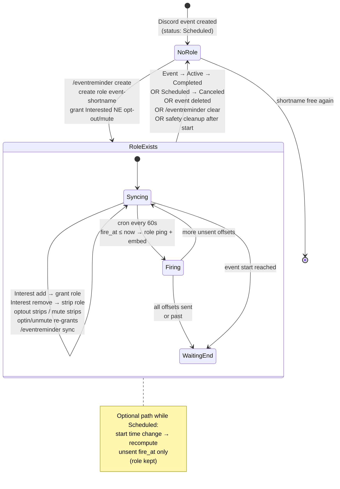
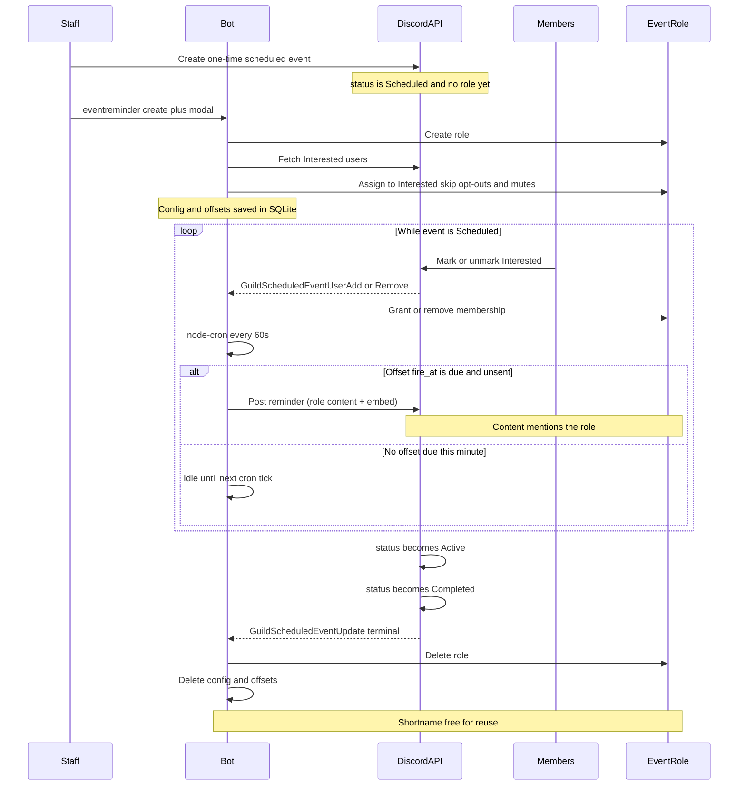
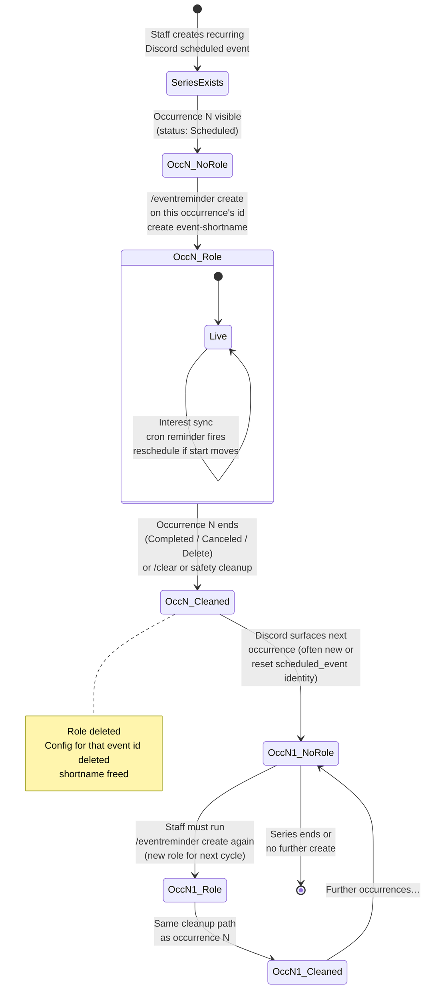
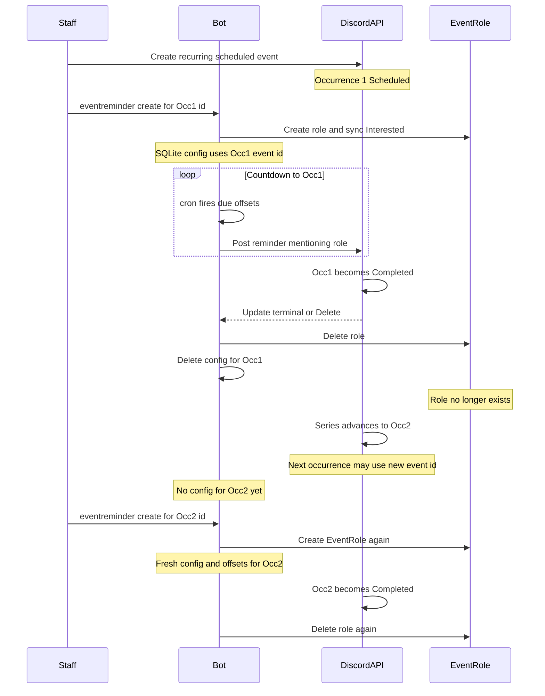

# Scheduled Event Reminders

Pre-event reminder pings for Discord **Guild Scheduled Events**. Only members who marked **Interested** are notified (via a dedicated `event-<shortname>` role). Users can opt out of **all** reminder pings per guild, or **mute** a single linked event.

## How it works

1. An authorized user runs `/eventreminder create` and picks a scheduled event.
2. A modal configures shortname (auto-suggested from the event title, with a `-2`/`-3` suffix if taken), reminder offsets, optional channel override, and embed description.
3. The bot creates role `event-<shortname>`, grants it to currently Interested users (minus guild opt-outs and per-event mutes), and keeps the role in sync as interest changes.
4. At each offset before start, the bot posts **one message**: role mention in content + an **embed** with event details in the notify channel.
5. When the event completes/cancels (or on `/eventreminder clear`), the bot deletes the role and config (and any mute rows for that event) so shortnames can be reused.

## Role lifecycle (with the Discord event)

Configs are keyed by Discord’s `scheduled_event_id`. The bot-managed role `event-<shortname>` lives only while that config is active. Terminal Discord statuses (**Completed**, **Canceled**), event **delete**, manual **clear**, or ticker safety cleanup all run the same path: **delete the Discord role + delete the DB config** (shortname freed for reuse).

### One-time event

**Timeline view (one-time):**

### Recurring event (series)

Discord can attach a **recurrence rule** to a scheduled event. The bot still binds reminders to **one** `scheduled_event_id` (one occurrence object at a time). It does **not** automatically re-attach when Discord advances the series to a new occurrence/event id.

**Timeline view (recurring, two occurrences):**

| | One-time | Recurring (current MVP) |
|--|----------|-------------------------|
| Role created | On `/eventreminder create` for that event id | Same, **per occurrence you configure** |
| Role while live | Synced to Interested ∩ ¬opt-out ∩ ¬mute | Same |
| Reminder messages | Offsets before that start (embed + role ping) | Offsets before **that** occurrence’s start |
| Role deleted | Complete / cancel / delete / clear / safety | Same when **that** occurrence is terminal |
| Next occurrence | N/A | **No automatic re-link** — run create again |

## Permissions

| Action | Who |
|--------|-----|
| Create / edit / clear / sync for an event | **Manage Guild** **or** that scheduled event’s **creator** |
| Set default notify channel | **Staff gate** (Manage Server or any staff role) |
| Opt out / opt in / mute / unmute / status | Everyone |

Bot needs: **Manage Roles** (role above `event-*`), **Send Messages** (and ability to mention the role by ID) in the notify channel. Enable the **Guild Scheduled Events** intent in the Developer Portal.

## Commands

| Command | Description |
|---------|-------------|
| `/eventreminder create event: [persistent]` | Open configure modal for a scheduled event. `persistent` (default no) keeps the role + config alive across recurring occurrences |
| `/eventreminder edit event:` | Re-open modal for an existing config |
| `/eventreminder list` | Active configs, offsets, next fire |
| `/eventreminder clear event:` | Stop reminders, delete role + DB rows |
| `/eventreminder sync event:` | Re-fetch Interested users and reconcile roles |
| `/eventreminder setchannel [channel]` | Guild default notify channel |
| `/eventreminder optout` | Opt out of all reminder roles/pings in this guild |
| `/eventreminder optin` | Re-enable; re-grant roles for events you are still Interested in (skips muted) |
| `/eventreminder mute event:` | Mute one linked event (strip that role; block future grants) |
| `/eventreminder unmute event:` | Clear mute; re-grant if still Interested and not guild-opted-out |
| `/eventreminder status` | Guild opt-out, muted events, and event roles you hold |

## Modal fields

| Field | Purpose |
|-------|---------|
| Shortname | Role suffix → `event-<shortname>` (`[a-z0-9-]`). **Create** prefills a slug of the event title; if taken, suggests `title-2`, `title-3`, … |
| Offsets (multi-select) | Presets: 1 week, 1 day, 1 hour, 30 min, 15 min, 5 min (defaults: 1d, 1h, 15m) |
| Extra custom offsets | Freeform `2h, 10m` (`(\d+)(m\|h\|d)`) |
| Channel override | Optional; empty uses guild default |
| Custom embed description | Optional body for the reminder **embed**. Leave empty for the default (`Starts {starts_in}`) |

**Recurring ("persistent")** is **not** a modal field (Discord caps modals at 5 fields). Set it with the `persistent` option on `/eventreminder create`, or toggle it anytime with the **♾️ Recurring: on/off** button on the create/edit confirmation. When **on**, the `event-*` role and config survive an occurrence completing and are only removed by `/eventreminder clear`. Edit submissions leave the current recurring state untouched.

### Placeholders (embed description)

| Token | Meaning |
|-------|---------|
| `{event}` | Event name |
| `{location}` | Voice/stage channel mention or external location text |
| `{starts_in}` | Relative Discord timestamp (`<t:unix:R>`) |
| `{starts_at}` | Full Discord timestamp (`<t:unix:F>`) |
| `{url}` | `https://discord.com/events/{guildId}/{eventId}` |
| `{description}` | Event description (trimmed, max ~300 chars) |
| `{offset}` | Human offset for this fire (e.g. `1 hour`) |
| `{role}` | Role mention text (does **not** ping inside the embed) |

**`{location}`:** if the scheduled event is hosted in a voice/stage channel, expands to a channel mention (`<#id>`). For external events, expands to the external location text. Empty when unset. Trailing ` in ` clauses are dropped when location is empty.

### Delivery shape

Every due offset posts:

1. **Content:** `<@&role>` (this is what notifies role holders)
2. **Embed:** title = event name, optional event URL, description (custom or default), fields for Starts / Location / Reminder offset, cover image when available

Role mentions inside embed bodies do **not** notify in Discord — the content line is required.

Offsets already in the past relative to the event start are skipped. Max **8** offsets; max lookback **30 days**.

## Opt-out and mute

| Mode | Command | Scope |
|------|---------|--------|
| Guild opt-out | `/eventreminder optout` / `optin` | All events in this guild |
| Per-event mute | `/eventreminder mute` / `unmute` | One linked config |

- **Guild opt-out always wins:** muting/unmuting does not restore roles while guild-opted-out; use `optin` first.
- Mute strips that event’s reminder role and blocks future grants for that `scheduled_event_id`.
- Unmute re-grants only if you are still **Interested** and not guild-opted-out.
- Mute rows are deleted when the event config is cleared (complete / cancel / delete / `/clear`).

## Delivery & cleanup

- Background **node-cron** job every **60 seconds** (`* * * * *`) posts due offsets and runs safety cleanup (same dependency as XP decay).
- Gateway: interest add/remove, event update (reschedule or terminal), event delete.
- Reschedule: unsent `fire_at` values recomputed when the event start time changes.

## Database

Tables: `event_reminder_configs`, `event_reminder_offsets`, `event_reminder_optouts`, `event_reminder_event_optouts` (per-event mutes).  
Guild setting: `event_reminder_channel_id`.

See [database.md](database.md) and [architecture.md](architecture.md).
