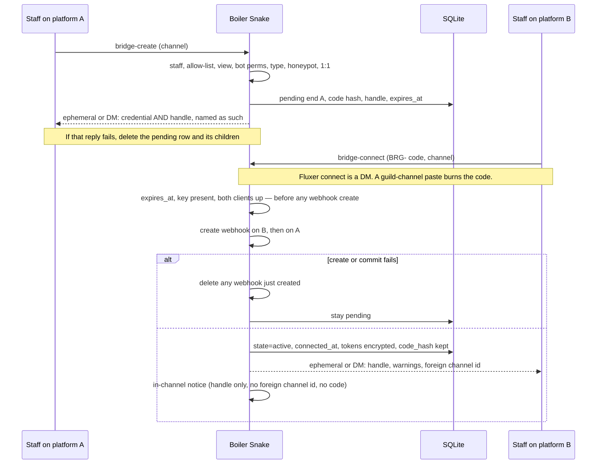
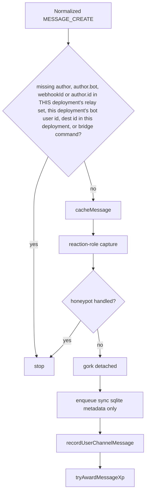
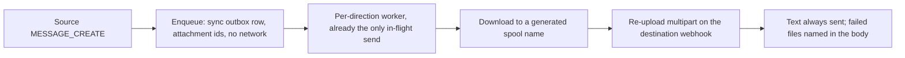

# 10. Channel bridge (Discord ↔ Fluxer)

| | |
|---|---|
| Author | (placeholder) |
| Date | 2026-09-25 |
| Status | **Draft** — no code |
| Roadmap feature | 10 |
| Intended path | `roadmap/bridge.md` |
| Depends on | [fluxer.md](fluxer.md) Phases 2 and 3 (community keys, then send/receive with attachments). This feature does not start a Fluxer client and does not live under `src/platform/`. |

This is a first draft, in the same sense as the endpoint spec: nothing here is implemented. Decisions in [Key Decisions](#key-decisions) are locked for this draft. A Phase 0 fact that contradicts a lock revises this file before code works around it. A text-only relay is not an acceptable revision.

---

## Overview

Boiler Snake will copy **live** messages between exactly two channels: one Discord channel and one channel on a specific Fluxer instance. Staff standing on either service run **bridge-create** against a channel they can see. The product sentence is “create returns a bridge id, connect takes that id.” This draft **splits that id on purpose** (Key Decision 6): the create reply names a one-time connect credential (`BRG-…`) and a separate non-secret handle (`b_…`). Connect accepts only the credential and rejects the handle. After connect, new eligible messages flow both ways, including files. A build that can set `state=active` already copies files; there is no text-only cut on `main`.

The bot stays one process with N platform clients, as in [fluxer.md](fluxer.md) §9.4–§9.6. The bridge is not a second service and not part of the platform adapter. It is a feature module (`src/features/bridge/`) that calls both clients through a small outbound port. Discord stays slash commands. Fluxer stays prefix commands (`FLUXER_COMMAND_PREFIX`, proposed default `!` in [fluxer.md](fluxer.md) §9.10.1). Both surfaces call the same service.

There is no webhook sender in the repo today. Leaderboard PNGs, honeypot warnings, and warn exports are bot-authored `AttachmentBuilder` uploads (`src/features/xp/index.js`, `src/features/honeypot/index.js`, `src/features/warnings/handlers.js`). Ticket archive download (`src/features/tickets/assets.js`) is the only “fetch bytes, don’t trust the remote URL forever” precedent, and it is anonymous, transcript-scoped, and not a relay. The bridge adds the first webhook execute path. It does not retarget those callers.

---

## Background & Motivation

[fluxer.md](fluxer.md) §9.1 and §9.9 say the endpoint work is **not** a relay: a Discord guild and a Fluxer guild are never the same community, snowflakes are unique only inside one deployment, and messages are not copied. That non-goal is right for the adapter. It is the wrong place to stop if operators need one shared conversation across the two networks.

Pain if this is folded into the adapter:

- The adapter’s job is “the same feature pipelines on N clients” (XP, staff, tickets). A relay has a pairing capability, a media pipeline, and a loop hazard those features do not have.
- Fluxer has no slash commands, no components, and no ephemerals (§9.2). A bridge command that assumes `CommandInteraction` will not run there.
- Bare `guild_id` / `channel_id` keys collide across deployments (§9.5). A bridge stored that way can attach the wrong community the first time two instances mint the same snowflake.

Pain if media is deferred:

- The product owner’s v1 bar is that attachments cross. A text-only cut would ship the thing this draft is not allowed to ship.
- Fluxer attachment URLs are signed and expire (12–24 hours, re-signed on read). They are anonymously fetchable until `ex`, and they are not stable. Hotlinking one into Discord is not a media plan.

What exists today that the design has to fit:

- `onMessageCreate` in `src/bot/pipelines.js` returns immediately when `message.author?.bot` is set, then runs cache → reaction-role capture → honeypot → gork (detached) → `recordUserChannelMessage` → `tryAwardMessageXp`. Bot and webhook posts already earn no XP and do not increment user-activity counters.
- Staff gates are `requireStaff` (Manage Guild **or** any `staff_roles` row) versus Manage Guild only (`src/core/permissions.js`, `src/core/commandVisibility.js`). Staff-tier slash commands set `defaultMemberPermissions` to Manage Guild; `/staff syncpermissions` later allows staff roles to see them. Handlers remain the security check.
- Services return `{ ok: false, error }` and do not reply to Discord. User-facing errors name the cause (`AGENTS.md`). `MSG_DENIED` is `You don't have permission to use this.` (`src/core/theme.js`). `safeErrorReply` / `MSG_GENERIC_ERROR` stay the router’s last resort only.
- Migrations are idempotent modules in `src/db/migrations/`, registered in order in `src/db/migrate.js`. Shipped ids run through `033_gork_summarize_input_tokens`. **`031` is already named by the gork STE design** ([gork.md](gork.md) §7.20, [index.md](index.md) §8). This draft does not reserve a number.
- Feature shape is `src/features/<name>/` with `name`, `commands`, `handlers`, optional `start`, wired from `src/features/index.js` and `src/features/load.js`. Cross-feature message ordering stays in `src/bot/pipelines.js`, not in a feature’s private listener.

---

## Goals & Non-Goals

### Goals

- One Discord channel paired with one Fluxer channel on one instance. Create on either side. Connect only on the other platform.
- 1:1: a channel is in at most one bridge; a bridge has exactly two ends; a second create, a connect onto a taken channel, and a second connect of the same code all fail with a specific error.
- Bidirectional copy of **new** eligible messages after `connected_at`. No history backfill.
- Media in v1: images, video, audio, and general files are downloaded in the worker from media URLs with no bot credential, refreshed via the API origin if the URL is missing or rejected, and re-uploaded. A file that cannot be copied does not drop the text.
- Readers can tell who spoke on the other side (display name and handle). Discord user ids and Fluxer user ids are never treated as the same person.
- Relayed posts do not mass-ping, do not award XP, and do not increment user-activity counters.
- Loop-free. A relayed post must not be copied back. This is a correctness requirement with a concrete filter, not a dedupe hope.
- Discord-only `npm test` stays green. No `@fluxerjs/core` import from this feature. The endpoint spec’s Phase 0 still gates that dependency.

### Non-goals

- Message history import or backfill. The bot does not need Read Message History for v1.
- Threads. Fluxer has no thread type ([fluxer.md](fluxer.md) §9.2). Discord threads are not valid ends, and parent-channel messages are not expanded into thread transcripts.
- Voice and LiveKit audio. Fluxer voice channels are also text channels; they are still not valid ends. Bridging them would look like a voice feature. Music stays Discord-only.
- Reaction mirroring.
- Edit and delete mirroring (explicitly deferred; see [10.5](#105-what-is-copied)).
- Native sticker objects and custom-emoji image reupload (text stand-in only; see [10.7](#107-media)).
- A web UI for pairing, and any linking of Discord and Fluxer user accounts ([fluxer.md](fluxer.md) §9.10.4 stays).
- Discord↔Discord, Fluxer↔Fluxer, or federation between Fluxer instances.
- Using the bridge as an XP duplicator or an activity-counter duplicator.
- Malware scanning of re-uploaded bytes.
- Implementing any of this under `src/platform/` or by pointing `discord.js` at a Fluxer host.

---

## Relationship to the endpoint spec

[fluxer.md](fluxer.md) §9.9 points channel bridging at this file. Bridging is out of scope for the platform adapter and must not be implemented under `src/platform/`. §9.1’s table row says the adapter does not copy messages.

This file is that feature. The adapter still does not copy messages, still does not know about pairing codes, and still does not gain a relay pipeline. The bridge feature is a consumer of the adapter:

| Endpoint spec delivers | Bridge consumes |
|---|---|
| Phase 2 `communities` keyed by `(platform, instance_key, external_guild_id)` | Both ends store `community_id`, never a bare snowflake |
| Phase 3 client map, plus the bridge contract in [10.3](#103-identity-communities-and-blocking-dependency) (normalized message shape, multipart send, `fetchSourceMessage`). Phase 3’s own done-when — XP, a cooldown, a public prefix command — is **not** this row. | Inbound enqueue and outbound upload |
| Phase 3/4 staff check: Manage Guild **or** `staff_roles`, Fluxer masks as big integers | The same gate on prefix and slash. Bridge does not ship a weaker Fluxer gate |
| §9.10.2 sensitive-output policy (proposed: DM, else refuse) | Delivery of the pairing code on Fluxer |
| §9.10.1 prefix | `!bridge` only as the default of `FLUXER_COMMAND_PREFIX` |

The bridge feature **must not** construct a Fluxer `Client`, call `GET /.well-known/fluxer`, or add `@fluxerjs/core`. If the Fluxer client for an instance is absent, connect fails with the specific error in [10.2](#102-commands). The cross-links live in [fluxer.md](fluxer.md) §9.1 and §9.9 and in the feature row in [index.md](index.md).

Identity reminder from §9.5, binding here: a bridge row’s ends are `(community_id, channel_id)`. Channel snowflakes are unique only inside that community. User snowflakes copied into attribution text are display-only.

---

## Proposed Design

### 10.1 Pairing contract

```
Staff on platform A, in a channel they can view
        → bridge-create
        → pending row
        → reply names BOTH values: connect credential BRG-… and handle b_…
Staff on platform B (the other platform), in a channel they can view
        → bridge-connect with the BRG- credential only (Fluxer: DM, not the channel)
        → expires_at checked here, key checked here, then both webhooks, then state = active
Later messages
        → pipeline drops relay echoes before gork/XP
        → sync outbox row (ids and sizes, no download)
        → worker downloads, then uploads
```

“One service at a time” means each command runs on the platform where the staff member is standing (Discord slash, or that Fluxer instance’s prefix). It does **not** mean a second process. There is no web pairing console.

| Rule | Behavior |
|---|---|
| Shape | End A is the create side. End B is the connect side. One end is `platform=discord`, `instance_key=discord`. The other is `platform=fluxer` and that community’s `instance_key` (the discovery origin, e.g. `https://fluxer.app`). |
| Who may connect | Possession of the pairing code **plus** staff permission and View Channel in the destination channel. The same human does not have to administer both guilds. The code is the capability. |
| Not the same platform | Connect on the platform that created the code fails. The code stays valid. |
| 1:1 | DB uniqueness on `(community_id, channel_id)` across ends. A second create, a connect onto an occupied channel, and a connect of an already-active code all fail. |
| Direction | Both directions after connect. There is no one-way bridge in v1. |
| Lifetime of the code | 30 minutes from create. Connect itself rejects a pending row whose `expires_at` is in the past, even if the sweeper has not deleted it yet. The sweeper is garbage collection of **pending** rows only. It never deletes an `active` or `broken` bridge. Single use. Shown once; not recoverable. |
| Two values, not one id | The contract’s “bridge id” is split. The connect credential is the `BRG-` code. The handle is `b_` + 8 Crockford characters. Notices, status, list, and logs say `Bridge {handle}`. Connect rejects the handle in either case. See Key Decision 6. |

**Why 30 minutes.** Long enough to switch apps and paste. Short enough that a screenshot in a public channel dies before the next standup. A standing invite is the wrong tool; staff create again.

**Code format.** 128 bits from `crypto.randomBytes`, Crockford base32 (alphabet `0123456789ABCDEFGHJKMNPQRSTVWXYZ`, no I, L, O, U). Display form: `BRG-XXXX-XXXX-XXXX-XXXX-XXXX-XX` (prefix + 26 characters). Canonical form for storage and compare: uppercase, hyphens and spaces removed, `BRG` prefix removed. The service stores **only** `SHA-256(canonical)` (32 bytes). Compare with `crypto.timingSafeEqual` on the raw digest. 128 bits does not need a pepper to resist offline guessing; the hash is so a database read, a log, or an `admin_audit` row cannot replay the code. The raw code exists only in the create reply and in the connecter's input.

Well-formed codes that do not match increment a failure counter. Strings outside the alphabet do not: staff typos must not lock the community out.

**Handle (`b_…`).** Independent random id, not derived from the code, so posting it leaks nothing about the capability. Display and storage are lowercase: `b_` plus 8 characters from the Crockford alphabet in lowercase. Collision retry on insert. The create reply names it **bridge handle**, not “the code,” and says connect will reject it. Notices, status, list, and logs use this handle as `Bridge {publicId}`.

**Recognizing a handle.** Trim, strip spaces, lowercase, then test `^b_[0-9a-hjkmnp-tv-z]{8}$`. `B_7K2M9QXP` and `b_7k2m9qxp` are the same handle and take the public-id error. They are not run through the code hasher and they are not “unknown code.” Do this before the alphabet check on the `BRG-` code.



### 10.2 Commands

The operations are **bridge-create** and **bridge-connect**. Supporting operations are disconnect, status, and list. They are not substitutes for create/connect.

Discord follows this repo’s slash style: one top-level command, subcommands, `setDefaultMemberPermissions(ManageGuild)`, handler calls `requireStaff`. A hyphenated top-level name (`/bridge-create`) would be alien next to `/setcommandchannel` and `/ticket`. Fluxer has no slash commands ([fluxer.md](fluxer.md) §9.2); the same verbs are argv after the configured prefix.

| Operation | Discord | Fluxer (prefix default `!`) |
|---|---|---|
| bridge-create | `/bridge create` optional `channel` (default: the channel the command runs in) | `{prefix}bridge create [channel]` in the guild channel. The credential comes back by DM, not in the channel. |
| bridge-connect | `/bridge connect` required `code`, optional `channel`. Ephemeral. The slash invocation is not a public message. | **DM only:** `{prefix}bridge connect <code> <channel>`. The channel argument is required because a DM has no current channel. A guild-channel paste is not connect (see below). |
| disconnect | `/bridge disconnect` optional `bridge` (handle) or `channel` | `{prefix}bridge disconnect [handle \| channel]` in the guild channel. The line has no credential. |
| status | `/bridge status` optional handle or channel. Ephemeral, may include the foreign channel id and instance origin. | DM. If the DM fails, the in-channel reply has the handle and state only — no foreign channel id, no instance origin. |
| list | `/bridge list` ephemeral, same detail as status | Same as status: DM, or an in-channel list of handles and states with no foreign ids and no origins. |

Channel arguments accept a Discord channel option, a raw snowflake, or a `<#snowflake>` mention. Fluxer mention syntax that Phase 0 records is accepted in addition; the service still receives `(community, channel id)` only.

**Command channels.** The allow-list is where the command is **typed**, not which channel becomes a bridge end. Today’s router calls `commandsAllowed` on `interaction.channelId` only (`src/commands/router.js`, `src/core/permissions.js`), never on an option channel. The service takes `invocationChannelId` and `targetChannelId` separately. `commandChannelsPermit(community, invocationChannelId)` applies only to the invocation. The target is checked for view, bot permissions, type, honeypot, and 1:1, and is **not** required to be on the allow-list. `/bridge create channel:#general` typed in an allowed channel succeeds when `#general` is absent from the list. Fluxer must not call `commandsAllowed(interaction)`.

- Empty allow-list for that community → everywhere. There is **no** `/setcommandchannel` lockout exception for bridge.
- `invocationChannelId` null (Fluxer DM connect) → skip the allow-list. The target is still checked.
- Discord community: `listAllowedCommandChannels(external_guild_id)` — today’s signature in `src/db/repositories/commandChannels.js`. Pass the Discord snowflake, not `communities.id`.
- Fluxer community: the same decision once `allowed_command_channels` is keyed by `community_id` (Fluxer Phase 2 repository work). Until that column exists, **do not** pass a Fluxer snowflake into `listAllowedCommandChannels` (it can collide with a Discord guild id). The Fluxer command PR is blocked on that community-scoped read. An empty Fluxer list still means everywhere.

Staff who cannot type in the target channel run the command from an allowed channel and pass the channel argument (on Fluxer connect, that is the DM form, which has no invocation guild channel). Discord’s router check stays on the invocation channel. The service checks the invocation again and must not also require the target to be an allow-list channel.

**Fluxer connect does not accept the credential in a guild channel.** Fluxer has no ephemerals ([fluxer.md](fluxer.md) §9.2). `{prefix}bridge connect <code>` typed in a channel is an ordinary human message: members can read it, `cacheMessage` would keep the body for an hour (`src/features/logs/auditLog.js`), and gork’s context would see it. “Not relayed” is not “not leaked.” The bot does not need Manage Messages to connect, so delete is not the mitigation.

- **One dispatcher.** `dispatchFluxerBridgeCommand` in `src/platform/fluxer/commands.js` is a function. It is not a second `MESSAGE_CREATE` listener. The guild pipeline gate is the only guild caller: it recognizes a `bridge` line, skips cache, gork, activity, XP, and enqueue, and calls that function once. The DM path (no guild, so it never enters `onMessageCreate`) calls the **same** function. A test asserts one guild `MESSAGE_CREATE` produces one service call, not two pending rows.
- Accepted path: DM the bot `{prefix}bridge connect <code> <channel>`. That call is `via: "dm"`. It does not touch `cacheMessage`, gork, activity, or enqueue.
- Guild-channel paste: not a successful connect, and **not staff-gated**. Anyone can publish the credential, so anyone’s paste must be able to burn it. It does **not** increment `bridge_connect_attempts` (that counter is only for DM and Discord connect attempts; a public miss must not lock the community out). Burn uses the same transaction and the same child-then-parent order as disconnect ([Data Model](#data-model-changes)): delete `bridge_message_links`, `bridge_outbox`, and `bridge_ends` for that bridge id, then `DELETE FROM bridges WHERE id = ? AND state = 'pending'` (matched on the code hash). Commit only when that pending delete changed one row. If it changed zero rows, roll the transaction back (children of an `active` bridge stay) and do not report a burn. After rollback, if the row is `active`, reply with the already-used sentence. If the row is gone, reply with the unknown/expired sentence. On commit, reply without echoing the code: `That connect command was posted in the channel, so the pairing code is burned and was not used. Create a new one with {cmd} create, then DM me {cmd} connect <code> <channel>.` Two autocommit statements are wrong here: foreign keys are off, so a parent delete that is not followed by the child delete leaves `UNIQUE (community_id, channel_id)` held by an end whose bridge row is gone, and that channel cannot be bridged again. Then try to delete that Fluxer message. Manage Messages is **not** a required bit for create or connect. If the message delete fails, append `I could not delete your message: {reason}.` (`missing Manage Messages` when that is the reason).
- Test: a fixture of that guild command line never appears in a relay payload, in the message-log cache, or in a gork prompt. A second test runs the paste while `activateBridge` is between webhook create and commit and asserts exactly one winner.

**Gate.** Every subcommand is **staff-tier**, not Manage Guild-only, not senior-only, not public.

- Not public: a member who can see a channel must not be able to exfiltrate it.
- Not Manage Guild-only: YouTube, Twitch, and GitHub notification commands are already staff-tier channel configuration. Bridge is the same class. Manage Guild-only is reserved for lockout and minting (`/setcommandchannel`, `/grantxp`, staff-role mutation, `/honeypot exempt`, `/staff syncpermissions`). Forcing Manage Guild on both ends would ignore `staff_roles`, which is the gate the rest of the bot grew.
- Not senior-only: senior means ticket overwrites and `/userinfo` Activity (`AGENTS.md`). Bridging does not grant those.
- Slash visibility: add `bridge: staff` to `COMMAND_VISIBILITY` in `src/core/commandVisibility.js`. Picker default is Manage Guild; after OAuth sync, staff roles can see `/bridge`. The handler still calls `requireStaff`. Denial text stays `You don't have permission to use this.`
- Fluxer: the prefix command hits the same service only once the Fluxer staff helper matches Discord (Manage Guild **or** `staff_roles`, big-integer masks, [fluxer.md](fluxer.md) §9.7 Phase 4). Until that helper exists, the Fluxer command is not registered. Do not ship Manage Guild-only on Fluxer and staff-tier on Discord.

**Replies.** All Discord `/bridge` replies are ephemeral (`replyEphemeral`). The connect credential is never a public message, a follow-up, an audit embed, or a Fluxer guild-channel message. On Fluxer, create’s credential follows the endpoint spec’s sensitive-output policy (§9.10.2): DM. If that DM fails, the pending row and its children are **deleted** and the channel reply is the delivery error only — the code is not in it. Discord status and list may include the foreign channel id and the instance origin, because they are ephemeral. Fluxer status and list are DMs for the same reason the connect notice must not publish the other channel: an in-channel status would undo that. If the status/list DM fails, the in-channel fallback is handles and states only (`I couldn't DM the other end's details ({reason}).`). Never the credential, never a webhook token, never a foreign channel id, never an instance origin, in a Fluxer channel.

`BRIDGE_ENABLED=0` rejects every subcommand with `Bridges are turned off on this process (BRIDGE_ENABLED=0).` Default when unset is on. This is the kill switch (see [Rollout](#rollout-plan)).

#### Error strings

The service returns `{ ok: false, error }` where `error` is the sentence below. `{cmd}` is `/bridge` or `{prefix}bridge`. Handlers reply with that sentence and do not substitute a generic. SQLite `UNIQUE` failures are mapped to the channel-taken sentence, not leaked as `UNIQUE constraint failed`.

| Case | Sentence |
|---|---|
| Not staff | `You don't have permission to use this.` |
| Kill switch | `Bridges are turned off on this process (BRIDGE_ENABLED=0).` |
| Channel already an end | `This channel is already in bridge {publicId}. Disconnect it with {cmd} disconnect before creating another.` |
| Pending already | `This channel already has a pending bridge ({publicId}) that expires at {iso} UTC. The pairing code cannot be shown again. Disconnect it with {cmd} disconnect, or wait until it expires.` |
| Bad type (thread, voice, forum, category, DM, Fluxer voice, link, notes) | `Bridges only support a guild text channel. Threads, voice, forums, categories, DMs, and Fluxer voice channels can't be bridged.` |
| Invoker lacks View Channel | `You can't view that channel, so you can't bridge it.` |
| Bot missing permissions | `I can't bridge this channel: the bot is missing {comma-separated names}. Grant them on the bot role and try again.` |
| Honeypot | `That channel is a honeypot. Honeypot channels can't be bridged.` |
| Handle passed to connect (either case, after lowercasing) | `That is the bridge handle {publicId}, not the connect credential. Connect will not accept it. Use the BRG- code from create.` |
| Alphabet garbage | `That bridge code has characters a code can't contain. Paste the BRG- code again, with or without the dashes.` |
| Unknown or expired | `That bridge code is expired or unknown. Codes last 30 minutes, work once, and cannot be shown again. Create a new one with {cmd} create.` |
| Already connected | `That bridge code was already used to connect bridge {publicId}.` |
| Same platform | `A bridge is one Discord channel and one Fluxer channel. This code was created on {Discord\|Fluxer}; run {cmd} connect on the other platform.` |
| Destination channel taken | `That channel is already in bridge {publicId}. Pick a different channel, or disconnect that bridge first.` |
| Too many misses | `Too many failed bridge connect attempts in this community. Wait 10 minutes and try again.` |
| Fluxer client absent | `This process has no Fluxer client for {instanceKey}, so that end can't be checked or written. Fix the Fluxer endpoint and try again.` |
| Discord client absent | `This process has no Discord client, so the Discord end can't be checked or written. Start the bot with DISCORD_TOKEN and try again.` |
| Key missing | `Set BRIDGE_TOKEN_KEY (32 bytes, base64) before connecting a bridge. Webhook tokens are not stored in plaintext.` |
| Fluxer MFA | `Fluxer refused to create the bridge webhook: TWO_FACTOR_REQUIRED. On an MFA-elevated community the bot was not exempt from Manage Webhooks. Bridge not connected.` |
| Webhook cap, channel (`MAX_WEBHOOKS_PER_CHANNEL`) | `The bridge webhook was refused: this channel is at its webhook limit ({detail}). Remove a webhook and run {cmd} connect again. Bridge not connected.` |
| Webhook cap, community (`MAX_WEBHOOKS_PER_GUILD`) | `The bridge webhook was refused: this community is at its webhook limit ({detail}). Remove a webhook and run {cmd} connect again. Bridge not connected.` |
| Connect credential pasted in a Fluxer channel | `That connect command was posted in the channel, so the pairing code is burned and was not used. Create a new one with {cmd} create, then DM me {cmd} connect <code> <channel>.` plus the delete-failure sentence when delete fails. The reply does not contain the code. This path does not increment the connect-failure counter. |
| Connect lost the pending row | `That bridge code was no longer pending when connect finished (it was burned or already used). Webhooks created for this attempt were deleted. Bridge not connected. Create a new code with {cmd} create.` |
| DM failed (create rolled back) | `I couldn't DM you the pairing code ({reason}). Nothing was saved, and the code was not posted in this channel. Allow a DM from this bot, or create the bridge from Discord.` |
| Status/list DM failed (Fluxer) | `I couldn't DM the bridge details ({reason}). This channel's bridges: {handles and states only}.` |
| Disconnect, none | `This channel isn't in a bridge. Use {cmd} list to see bridges in this community.` |
| List, none | `This community has no bridges.` |
| Save failed | `Could not save the bridge: {err.message}.` |

Connect does not consume the code on permission errors, same-platform, client-absent, or key-missing. Those are retryable. Unknown, expired, and already-used are terminal for that input. Same-platform does not increment the failure counter (the caller holds a real code and is on the wrong app). Well-formed misses do.

Failure counter: 5 well-formed misses per destination `community_id` per 10 minutes, then the wait sentence. A successful connect resets it. Check the counter before revealing whether a hash matched, once the caller is already over the limit. The counter applies to Discord `/bridge connect` and to Fluxer **DM** connect only. A guild-channel paste never increments it, whether the code matched, missed, or lost the race to `activateBridge`.

Create success (secret channel only):

`Bridge handle {publicId}. Connect will not accept that handle. Connect credential, shown once, expires {iso} UTC: {displayCode}. On Discord the other side runs /bridge connect with the credential. On Fluxer they DM the bot: {prefix}bridge connect <credential> <channel>. The credential is the capability. Do not post it in a channel. The handle is safe to post.`

Connect success (ephemeral or DM), plus any warning lines from [10.9](#109-permissions-nsfw-and-private-channels):

`Connected bridge {publicId}. This channel is paired with {platform} ({instanceKey}) channel {channelId}. The connect credential is spent. The handle is not a credential. People in either channel will be able to read what the other side posts. Stop it with {cmd} disconnect.`

That success text is ephemeral on Discord and a DM on Fluxer. It is the one place the foreign channel id and instance origin are shown to the connecting staff member. The in-channel notice does not repeat them.

#### Worked checks (1:1)

| Attempt | Result |
|---|---|
| Create in a channel that is end A or end B of any row | Channel-taken error. No new code. |
| Create while a pending row exists for that channel | Pending error. Old code is not re-displayed. |
| Connect a code whose row is `active` | Already-used, names `publicId`. |
| Connect onto a channel that is already an end | Destination-taken. Code stays pending. |
| Connect on the same platform as create | Same-platform. Code stays pending. |
| Two connects racing one code | One transaction wins `pending → active`. The other sees already-used. |

### 10.3 Identity, communities, and blocking dependency

Do not key ends on bare snowflakes. [fluxer.md](fluxer.md) §9.5 is the model: `communities.id` is the bot’s primary key; uniqueness is `(platform, instance_key, external_guild_id)`.

This feature’s schema PR is blocked on **Fluxer Phase 2** (`communities`, and command-channel reads that can take a `community_id`). The bridge does not open its own gateway socket.

**Phase 3’s own done-when is not this feature’s done-when.** [fluxer.md](fluxer.md) §9.7 Phase 3 is done when a gateway double can award XP, hit a cooldown, and answer a public prefix command. That checklist does not require attachment URLs, spoiler flags, `webhook_id`, snapshots, or stickers. The Fluxer bridge PR is blocked until the normalizer emits the shape below and a multipart send plus a fetch-by-message helper exist, **even if XP already works**, plus the Fluxer staff gate from Phase 4 (or the slice of it that implements the same check).

Enqueue never looks up a bridge by `message.guild.id` alone. It resolves `(platform, instanceKey, externalGuildId)` to `communities.id` first, then looks up `(communityId, channelId)`.

```js
// Normalized guild message. Both adapters produce this before the pipeline.
{
  platform,            // "discord" | "fluxer"
  instanceKey,         // "discord" or the Fluxer discovery origin
  communityId,         // communities.id — required, already resolved
  externalGuildId,
  channelId,
  messageId,
  author: { id, bot, username, displayName }, // bot may be missing or false on a partial
  webhookId,           // null when the payload has none. Fluxer webhook authors use author.id === webhook id, not the bot user id
  type,                // "default" | "reply" | "other"
  content,
  mentions: [{ id, display }],
  mentionChannels: [{ id, name }],  // Fluxer mention_channels; Discord <#id> names when known
  attachments: [{ id, filename, size, contentType, flags, url, proxyUrl }],
  stickers: [{ id, name }],
  snapshots: [{ content, attachments, stickers, mentionChannels }],
  createdAtMs
}
```

**Audit is not community-scoped today.** `recordSlashAudit` writes `admin_audit.guild_id` as a bare snowflake (`src/db/migrations/029_admin_audit.js`). `logConfigChange(client, guildId, …)` takes a discord.js client (`src/features/logs/auditLog.js`). A Fluxer snowflake in either API can collide with a Discord guild id.

- Discord commands: `recordSlashAudit` with `guildId` = the Discord **external** snowflake, and `logConfigChange` with that same id and the Discord client. `details` may include `communityId` (internal integer) and `publicId`. Never the credential, the hash, or a webhook token.
- Fluxer commands: do **not** call `recordSlashAudit` or `logConfigChange`. Log `[bridge] audit action=… publicId=… communityId=… channelId=…` until `admin_audit` has a `community_id`. This feature does not add that column.

**Honeypot.** `isHoneypotChannel(guildId, channelId)` compares `honeypot_channels.guild_id` (`src/db/repositories/honeypot.js`). Passing `communities.id` or a Fluxer snowflake into it silently misses or collides.

- Discord end: `isHoneypotChannel(community.external_guild_id, channelId)`.
- Fluxer end: call a community-scoped helper `(communityId, channelId)` **only if honeypot has one**. Do not pass `communities.id` or a Fluxer snowflake into `isHoneypotChannel`. Until honeypot is ported there is no Fluxer honeypot row to refuse; returning false is correct. Do not query the Discord table “just in case.”

Until Phase 2 has merged, there is no `community_id` to reference. Do not land a bridge table keyed by Discord snowflake “for now.”

### 10.4 Pipeline placement

The loop gate is the **first** check in `onMessageCreate`, before `cacheMessage`, reaction-role capture, honeypot, gork, activity, and XP. Today the early return is only `if (message.author?.bot) return` (`src/bot/pipelines.js`). `tryAwardMessageXp` repeats that bot check (`src/features/xp/index.js`). `recordUserChannelMessage` skips only a missing author or `author.bot` (`src/features/userActivity/service.js`). Gork is detached and also keys off `author.bot`. A partial payload can omit `bot` and `webhook_id` together. Filters that live inside enqueue run too late: gork has already started, and activity and XP still run because enqueue does not return early.

Return immediately (no cache, no gork, no XP, no activity, no enqueue) when any of these hold:

| Gate | Why it has to be first |
|---|---|
| No author object | A partial with no author is not a human message. Do not award XP. |
| `author.bot` is true | Existing bot/webhook behavior, including a Fluxer webhook author (`bot: true`, and `author.id` equal to the **webhook** id, not the bot user id). |
| `webhookId` **or** `author.id` is in the relay-webhook set **for this message’s `(platform, instanceKey)`** | The set is a map, not one process-wide collection of snowflakes. Each key is a deployment. The values are `bridge_ends.webhook_id` joined through `communities` to that deployment only. Compare either field only to that slice. A Fluxer webhook author puts the webhook id in `author.id`, and a partial can omit `webhookId` while still carrying that author id. After restart the destination-id set is empty; this row is what still catches the echo. Reload the map from `bridge_ends` at loop start and update the one deployment’s slice on connect, disconnect, and webhook recreate. A flat set is forbidden: [fluxer.md](fluxer.md) §9.5 says snowflakes are unique only inside one deployment, and a human `author.id` on Discord can equal a webhook id on Fluxer. That human must still earn XP. |
| `author.id` is the bot user id **of this message’s `(platform, instanceKey)`** | Bot-authored notices for that deployment. Not the other deployments’ bot user ids, and not the relay-webhook map. It does **not** by itself match Fluxer relay posts. |
| `(platform, instanceKey, messageId)` is in the destination-id map (TTL 10 minutes) | Same partition. A message id is not unique across deployments. Partial that omits `bot`, `webhookId`, and a usable `author.id`, and only while this process still remembers the execute. Insert each execute id under that deployment **before** yielding to the gateway. Not reloaded from SQLite. |
| Content parses as a `bridge` command on Fluxer | Human author. Still must not be cached or given to gork. Call `dispatchFluxerBridgeCommand` once from this gate, then return. Do not also register that function as its own message listener. See [10.2](#102-commands). |

Enqueue of a real human message stays **after** honeypot and **before** activity and XP, and it does not return early. Honeypot-handled messages are not copied. Source humans still earn XP once, on the source platform only. Gork still sees that human message; gork’s reply is bot-authored and dies on the gate above. The regression fixture that locks the restart case has the relay webhook id **only** on `author.id`, `author.bot` absent, `webhookId` absent, an empty destination-id map, and the same `(platform, instanceKey)` as that webhook’s end. It must not reach gork, activity, XP, or enqueue. A second fixture is a human message on a **different** deployment whose `author.id` equals that webhook id: it must still earn XP. A fixture that is only `author.bot: true`, or that only sets `webhookId`, does not lock the restart case.



Enqueue is synchronous SQLite and must not await the network. It does not download files. The pipeline wrapper stays synchronous; an async enqueue would escape the try/catch (`src/features/load.js` has the same sync-only shape):

```js
try {
  enqueueBridgeMessage(normalized);
} catch (e) {
  console.error("[bridge] enqueue failed:", e?.message || e);
}
```

`enqueueBridgeMessage` catches and returns `{ ok: false, error }` without throwing, so a bridge fault cannot skip XP for a human message that already passed the gate.

The sweeper and the relay worker are **not** tied to Discord `Events.ClientReady`. Today `startAllFeatures` runs there (`src/index.js`) and `assertRuntimeEnv` requires `DISCORD_TOKEN` (`src/config.js`). [fluxer.md](fluxer.md) §9.6 allows a process with no Discord client. Register `startBridgeLoops()` from platform boot once **any** configured client is ready, including Fluxer-only. Pending codes must expire and the outbox must have a consumer while Discord is down. Do not require `DISCORD_TOKEN` for the sweeper. One loop, guarded against a second `start`. Loop errors log `[bridge] worker failed:` and reschedule. They must not kill login.

Fluxer’s normalizer should set `author.bot` on webhook authors. The gate does not trust that it did.

### 10.5 What is copied

After `connected_at`, each new eligible message on either end is copied to the other. Compare the message snowflake time (epoch `1420070400000`, shift 22, the helper taking a platform argument as in [fluxer.md](fluxer.md) §9.5) to `connected_at`. Messages older than `connected_at - 2000 ms` are ignored so a resume burst is not a backfill. There is no history walk.

| Source | v1 |
|---|---|
| Human `DEFAULT` / Discord Default, and `REPLY` / Discord Reply | Copied |
| The bridge command itself (Fluxer prefix line that parses as `bridge`, guild channel or DM, whether or not the author is staff; Discord slash invocations are not channel messages) | Not copied. Also not cached and not passed to gork. Handled in the pipeline gate, before those steps. |
| This bot’s user id on that platform | Not copied |
| This bridge’s webhook id on that end | Not copied |
| Any other bot or webhook (`author.bot`, or a `webhook_id` that is not ours) | Not copied |
| System types (Fluxer types other than 0 and 19; Discord `message.system` or any other type) | Not copied |
| Poll-only or other non-default payloads | Not copied as native polls. If a default/reply message also carries a poll object, copy the text and files and append `Poll not copied (bridges don't carry polls).` |
| Fluxer `message_snapshots` (forwards) | Do not send a destination forward (a Fluxer webhook forward cannot also carry content, and a reply reference only resolves inside the webhook’s own channel). Append snapshot text as plain quotes and treat snapshot attachments as attachments of this message. One level; snapshots are flat. |
| Replies | No cross-platform `message_reference`. A one-line header: `↪ in reply to {display}: {snippet}`. Snippet is the neutralized referenced content, collapsed to one line, cut with `sliceSafe` at 80 code units. Empty reference content becomes `attachment`, `sticker`, or `voice message`. No source jump URL (a Discord message link embeds guild and channel ids). |
| Edits | **Deferred.** v1 does not propagate edits. |
| Deletes | **Deferred.** v1 does not propagate deletes. The destination copy remains. |

**Why edits and deletes wait.** They need a durable id map, webhook edit/delete rights, and a partial-failure policy for replacement files. The map is written in v1 (`bridge_message_links`, one row per destination execute, `part_index` included) so a later phase does not invent history. A single destination id per source message would not be that history: chunks and overflow file posts are separate executes. Acting on the map is not required to meet the v1 bar (live bidirectional posts with media). Staff who need a takedown delete on the destination themselves, or disconnect.

### 10.6 Loop prevention

A content hash is not a loop filter. Two people can say the same sentence.

A copied message is webhook-authored by the webhook this bot created for **that** end. The filter is the pipeline gate in [10.4](#104-pipeline-placement), not a second check inside enqueue. Enqueue assumes the gate already ran. Repeating the webhook-id test inside enqueue is fine as defense in depth and is not what keeps XP and gork off the echo.

Fluxer relay posts are not identified by the platform bot user id. The message object builds the webhook author with `author.id` equal to the webhook id. The bot-user-id row in the gate is only for notices this process posts as itself. The relay-webhook map for **this** `(platform, instanceKey)` is compared to `author.id`, including when `webhookId` is missing and the destination-id map is empty after a restart. Webhook ids from other deployments are not in that slice. That comparison is the same early return as the `webhookId` check, not a later enqueue filter.

The worker does not post into the source channel through the relay webhook. Operator notices (connected, disconnected, paused, queue full, poison, channel gone) are bot-authored and therefore hit the gate. Queue-full and paused notices are once per direction per incident ([10.10](#1010-ordering-failure-and-lifecycle)), not one per dropped message.

Webhook execute on Fluxer remembers a nonce for five minutes and returns the original message on reuse (verified 2026-09-25, webhook execute). Every Fluxer relay send sets `nonce` to the first 32 hex characters of `SHA-256(publicId + ":" + srcMessageId + ":" + partIndex)` and `wait=true` (the default is `wait=false`, which returns 204 and no id). A timeout retry inside five minutes does not double-post. Discord webhook execute has no equivalent idempotency. The worker retries a Discord send only when it did **not** receive a message id. A crash after Discord accepted the post and before the SQLite commit can duplicate that one message; the row is updated synchronously immediately after the response. That window is accepted and logged if a restart finds a row left in `sending`.

### 10.7 Attribution

**v1 is webhook-per-end**, not bot-authored quote posts.

Nothing sets `state=active` except `activateBridge`, and that function is not in a build that cannot also copy files. Order, with no webhook create before the checks that can fail closed:

1. Staff, allow-list on the **invocation** channel only, view and bot permissions and type and honeypot and 1:1 on the **target**, other platform, `expires_at > now` on a still-pending row (do not wait for the sweeper), rate limit. A guild paste is not this function.
2. Capture NSFW and `@everyone` View Channel flags for the warning lines. They do not block.
3. `BRIDGE_TOKEN_KEY` missing → the key-missing sentence. **No webhook create.** Code stays pending.
4. Either platform’s client absent → the absent-client sentence. **No webhook create.** Code stays pending.
5. Bot permission probe on both channels.
6. Create the webhook on B, then on A, named `Boiler Snake Bridge` (1–80 characters; both platforms allow 80). Discord: `channel.createWebhook`. Fluxer: `POST /v1/channels/{channel_id}/webhooks` (bot token, `MANAGE_WEBHOOKS` at guild and channel, rate 10/minute per channel). This await is where a guild paste can delete the pending row. Do not insert ends yet.
7. If either create fails, delete any webhook this attempt created (Fluxer token-delete is `DELETE /v1/webhooks/{id}/{token}` and does not need guild permissions) and leave the row pending if it is still pending. A retry must not leak slots up to `MAX_WEBHOOKS_PER_CHANNEL` or `MAX_WEBHOOKS_PER_GUILD`.
8. Compare-and-swap in one transaction: `UPDATE bridges SET state = 'active', connected_at = ? WHERE id = ? AND state = 'pending'`. Require `changes = 1`. Only then insert end B and keep `code_hash`. Foreign keys are off, so an `INSERT` into `bridge_ends` is not rejected just because the parent was deleted. The `changes` check is the guard.
9. If `changes = 0` or the commit throws, delete both webhooks created in this attempt and do **not** insert ends. Do not report success. `changes = 0` returns the lost-the-pending-row sentence. A thrown commit leaves the row pending when the transaction rolls back. “Leave it pending” applies only when the row is still there.

Connect itself does not succeed without both webhooks. Quote posts are not the v1 design.

Per message, execute with a username override: guild nickname if the source member object has one, otherwise username. If the nickname differs from the username, append ` (@username)` and cut to 80 with `sliceSafe`. Discriminators other than `0` / `0000` are not required in v1; the handle is the username. The override is the attribution **if** the gateway shows it. Execute docs say a supplied `username` replaces the author name on that message (verified 2026-09-25). The message-object section also says a webhook author is built from the **stored** webhook name. Those two sentences disagree about what `MESSAGE_CREATE` actually renders. Spike: confirm the gateway author username is the per-message override, not `Boiler Snake Bridge`. If it is the stored name, v1 attribution switches to the quote prefix on every relayed post (`**{display}** (@{handle} on {platform})` as the first line) and this section is revised before ship. Do not ship a success path whose body has no name while the visible author is the webhook. Until the spike lands, implement the override and do not also prefix the body (a double name is the failure mode if the spike passes).

Avatar: Fluxer execute fetches `avatar_url` and, if the fetch fails, still creates the message without the override (verified). Discord’s failure mode for a bad `avatar_url` was **not** re-verified for this draft. Policy:

- Discord → Fluxer: pass the source user’s Discord CDN avatar URL (https only). A failed fetch must not fail the message.
- Fluxer → Discord: **omit** `avatar_url` until a Phase 0 note records the Fluxer avatar URL template. Do not invent a host. Do not pass a URL taken from message text.
- If a Discord execute fails and the only suspect is the avatar URL, retry once without it. If that retry returns a message id, the send succeeded.

If execute returns 404 `UNKNOWN_WEBHOOK`, try once to recreate the webhook (bot still has Manage Webhooks). If recreate fails, send **that one** message as a bot-authored post whose first line is `**{display}** (@{handle} on {platform})` and whose rest is the body, log the webhook error, and set `last_error`. This is a degraded send, not a second product mode. Connect itself does not succeed without both webhooks; quote posts are not the v1 design.

Why webhooks rather than quotes: a quote prefix is easy to miss and burns the bot’s own send bucket and name. Webhook username/avatar is the usual bridge pattern, Fluxer documents per-message `username` and `avatar_url`, and Discord already supports the same execute shape. Fluxer webhook content limit is `max(guild max_message_length, 4000)` (default effective 4000). Discord content limit is 2000. Chunk with `sliceSafe` from `src/core/text.js` on the destination limit minus the reply header. Chunks of one source message are sent in order, all with the same username override, before the next source message. A continuation chunk starts with `(continued)`.

### 10.8 Media

Hotlinking the other platform’s CDN is not the strategy. Fluxer `url` and `proxy_url` are the same signed media URL, valid more than 12 and at most 24 hours, and null once the attachment expires (messages resource, checked 2026-09-25). Discord attachment URLs are also temporary. The destination must own the bytes.



**Enqueue does not download.** A download inside `onMessageCreate` would stall XP for up to 30 seconds per file. An async enqueue would let the worker observe a missing row and would throw outside the pipeline try/catch. The outbox row stores neutralized text, attachment ids, filenames, sizes, content types, flags, and the spoiler bit. It does not store a CDN URL and does not need one to retry.

**Download, in the worker**, before that direction’s upload, and only while this message is the in-flight send. Spool path: `{DATA_DIR}/bridge-spool/{publicId}/{srcMessageId}/{index}` where `{index}` is `0`, `1`, `2`, … and nothing else. `publicId` and `srcMessageId` must match `^[A-Za-z0-9_-]+$` or the file is refused. Resolve the path and reject it unless the resolved path stays inside that message’s directory, the same containment idea as `resolveAssetAbsolutePath` in `src/features/tickets/assets.js`. The remote filename is **not** a path segment. `path.join` would normalize `../../outside` out of the spool. The original filename is stored in `payload_json` and sent as the multipart `filename` after a length cap (120, same spirit as `sanitizeFilename` in that file). Do not write under `ticket-transcripts/`.

**Credentials.** Fluxer attachment `url` and `proxy_url` are the same signed media URL on the media host, anonymously fetchable until `ex` (verified). Discord CDN URLs are the same class. Fetch those URLs with **no** bot `Authorization` header. Do not follow a redirect that changes host (cap same-host redirects at 3). Refuse non-https. Refuse a resolved address that is loopback, link-local, or RFC1918. Timeout 30 seconds. Sending the bot token to the media host, or to a public redirect, discloses it.

If the media URL is null, expired, or returns 401/403/404, call `fetchSourceMessage(community, channelId, messageId)` on the **platform API origin** with the bot credential, take the fresh URL for that attachment id, and GET that URL with no credential. On restart, a missing spool file uses the same API read. If the source message is gone, park that file with the reason and still send the text. The attachment id alone is not enough; the port has to re-read the message.

**Upload.** Multipart webhook execute (`files[n]` + `payload_json`), `wait=true`. Preserve filename and content type. Fluxer direct-file execute uploads as the webhook’s **creating** account and re-checks that account’s View Channel, Send Messages, and Attach Files (verified). The bot must still hold those bits after connect; a later overwrite failure surfaces as a send error, not a silent drop.

**Ceilings** (pre-check before download; do not buffer a larger body):

| Destination | Per-file ceiling | Per-message file count |
|---|---|---|
| Fluxer bot credential | **52,428,800 bytes (50 MiB)**. Documented on attachment-upload: non-premium users 25 MiB, premium users 500 MiB, **bots clamped to 50 MiB**. | Default `max_attachments_per_message` = **10** |
| Discord | **20 MiB** (`20 * 1024 * 1024`) on every end. discord.js 14.16 exposes `attachmentSizeLimit` only on `BaseInteraction`, filled from the interaction’s `attachment_size_limit`. A webhook execute has no interaction, so connect must not store that field and expect the worker to see a boost ceiling. API reference “Uploading Files” (checked 2026-09-25): default 20 MiB, higher by server boost, not by the bot’s Nitro. Support FAQ (2026-09-14) lists boost level 2 at 50MB and level 3 at 100MB for members; do **not** hard-code that table. A later discord.js channel or guild field may raise the pre-check. Until it exists, 20 MiB is the ceiling, including on boosted servers. | 10 |

The effective ceiling is the destination’s. Overflow past 10 files is more execute calls, still inside the same source message’s FIFO slot, same username. A single file over the ceiling is not uploaded. The text is still sent, with a line:

`Attachment not copied: {filename} ({bytes} bytes) is over the destination limit of {limit} bytes.`

Any other per-file failure (HTTP status, timeout, spool cap, content blocked) uses:

`Attachment not copied: {filename}: {reason}.`

Partial success is a **successful** outbox row: do not retry the whole message or the files that already landed will duplicate. This is the partial-failure rule in `AGENTS.md`.

Spool caps: **500 MiB per bridge**, **2 GiB process-wide**. Outbox depth: **1000 messages per direction**. Hitting either cap does not enqueue that message and does not drop it quietly. The notice is **once per direction per incident**, not once per source message. Latch key `(publicId, direction, queue_full | spool_full)`. On the transition into the cap, one bot-authored message:

`Bridge {publicId} is not copying this direction: the outbound queue or spool is full ({detail}). Messages that arrive while it is full are not copied. This notice will not repeat until the bridge is copying again.`

Clear the latch only after that direction’s depth is under 1000 **and** the bridge’s spool is under 500 MiB. Do not emit the per-message sentence from enqueue. A stuck destination must not bury the source channel or burn the bot send bucket the webhook path was meant to spare.

**Spoilers.** Discord’s durable signal is the `SPOILER_` filename prefix. Fluxer’s is attachment flag `IS_SPOILER` (`1 << 3`). Discord → Fluxer: if the name starts with `SPOILER_`, strip that prefix and set the flag. Fluxer → Discord: if the flag is set, prefix `SPOILER_`. Text spoilers `||like this||` are passed through unchanged. If Phase 0 finds Fluxer does not render those bars, leave them anyway; do not strip user text.

**Voice messages.** Copy the audio bytes as a normal attachment. Do **not** set Fluxer `VOICE_MESSAGE` (`1 << 13`): that flag requires exactly one audio attachment, no content, a waveform, and a duration, and the default max duration is 1200 seconds. A caption (`Voice message`) has to be allowed, including when other files failed. Native waveform UI is deferred. The audio file is not deferred — it is an attachment.

**Embeds.** Copy author-supplied rich embeds (title, description, url, color, fields) within the destination’s embed limits (Fluxer default 10 embeds, title 256, description 4096). Strip image, thumbnail, video, and author-icon URLs out of the embed. Re-upload that media only when the URL is a source attachment URL already covered by the download rules; otherwise append `Embed media not copied: {filename or host} is not a source attachment.` Do not fetch arbitrary embed URLs (SSRF, and unfurls are the destination’s job). Automatic unfurls (Fluxer types other than `rich`; Discord link/image/article/video previews the user did not author) are not re-posted. The destination may unfurl URLs in the body itself.

**Stickers.** Not native, and not fetched, in v1. Fluxer’s sticker item on a message has `id`, `name`, `animated`, and optional `nsfw` — **no media URL** (verified 2026-09-25). Discord sticker ids are not valid on the other guild, and Lottie stickers are not a portable file. Append `Sticker: {name}` per sticker. The rest of the message still crosses. If a later spike finds a sticker media route, raster re-upload can be added without changing the pairing model; until that route is documented, do not guess a CDN path.

**Custom emoji.** Rewrite Discord `<a:name:id>` and `<:name:id>` (and the same shape on Fluxer if Phase 0 confirms it) to `:name:`. Do not download emoji bytes. Unicode emoji stays as Unicode. Fluxer `nsfw_emojis` does not change the rewrite.

**Explicit-media flag.** Fluxer `CONTAINS_EXPLICIT_MEDIA` (`1 << 4`) is preserved when the destination is Fluxer. Discord has no matching flag to set. Channel-level NSFW mismatch is the warning in [10.9](#109-permissions-nsfw-and-private-channels), not a per-file block.

### 10.9 Permissions, NSFW, and private channels

Checked at create (the local channel) and at connect (both channels, since both webhooks are created then).

| Needed | Why |
|---|---|
| Invoker: View Channel | They must be able to see the end they are authorizing. A channel option does not bypass this. |
| Bot: View Channel | See the live message and the attachment URLs. |
| Bot: Send Messages | Bot-authored notices, and the degraded quote fallback. |
| Bot: Attach Files | Media re-upload. Fluxer webhook multipart re-checks the creating account. |
| Bot: Embed Links | Rich embeds are not silently stripped. |
| Bot: Manage Webhooks | Create and repair the relay webhook. Fluxer: elevated permission, guild **and** channel. Discord: `MANAGE_WEBHOOKS`. |

Not required: Read Message History, Manage Messages, Mention Everyone. Manage Messages is only a best-effort delete of a Fluxer connect line that was pasted in a guild channel ([10.2](#102-commands)). Connect does not fail closed when that bit is missing, and a successful delete is not what burns the code — the burn already happened. Create/connect names every missing **required** bot bit in one sentence (the table in [10.2](#102-commands)).

**NSFW / age restriction.** If one end is NSFW or age-restricted and the other is not, connect still succeeds. The command reply includes:

`Warning: one end is age-restricted or NSFW and the other is not. Messages and files will be copied into the less restricted channel.`

Fluxer may also return `NSFW_CONTENT_AGE_RESTRICTED` for the bot account. That is a hard failure with the platform’s message in the error sentence, not a warning. Whether bots are exempt is a spike, same class as the MFA question in [fluxer.md](fluxer.md) §9.2.

**Private → public.** If one end denies `@everyone` View Channel and the other does not, connect still succeeds (the code is the capability; this draft does not add a second admin). The command reply includes:

`Warning: one end is hidden from @everyone and the other is not. People in the more open channel will be able to read messages from the restricted one.`

The in-channel bot notice on connect does **not** include the other channel’s name or id. It does say that the channel is bridged and, when either warning applies, that one side is less restricted. Members are about to see foreign posts under other people’s names; a silent bridge is a worse surprise. The notice is one message, bot-authored, not optional in v1.

**Honeypot.** Copying a trap channel, or into one, fights the honeypot feature. The call is the one in [10.3](#103-identity-communities-and-blocking-dependency): Discord external guild id into today’s `isHoneypotChannel`, Fluxer only through a community-scoped helper. Never pass `communities.id` or a Fluxer snowflake into `isHoneypotChannel`.

Ticket channels are **not** hard-refused. They get the private-channel warning when `@everyone` cannot view them.

### 10.10 Ordering, failure, and lifecycle

**FIFO per direction.** Two queues per bridge (`a_to_b`, `b_to_a`). One in-flight send per direction so message N+1 cannot pass N. Directions do not block each other. A process-wide cap of **4** concurrent executes keeps a handful of bridges from stampeding the Fluxer bucket (60 executes/minute/webhook, verified; about one message per second sustained before `429`). Discord buckets are respected via `429` / `Retry-After` inside discord.js; this draft does not hard-code Discord’s webhook numbers.

| Failure | What happens |
|---|---|
| HTTP 429 or Fluxer `SLOWMODE_RATE_LIMITED` (400, `Retry-After`, not a bucket; verified) | Stay at the head. Wait `Retry-After`, cap the wait at 60 seconds, retry. Does not count toward the poison limit. |
| Other errors | Backoff 1, 2, 4, 8, 16 seconds. After **5** attempts, park the row, set `last_error`, post a bot notice in the **source** channel: `Bridge {publicId} could not copy message {srcMessageId} after 5 attempts: {reason}. Later messages are still being copied.` Continue with the next message. |
| One direction failing | The other direction keeps running. |
| Five consecutive poison parks | Mark the direction degraded, keep the bridge `active`, keep retrying new messages. Status shows `last_error`. |
| Worker throw | Log `[bridge] worker failed:` with public id. Reschedule. Do not exit the process. |

Idle text relay, empty queue, both APIs healthy: aim for under 2 seconds from gateway event to destination message id. That is a design target, not a page. Media adds transfer time. Expected scale is tens of bridges on one SQLite file, not a public relay.

**Disconnect** destroys the whole bridge. Either community’s staff may run it, by handle or by the local channel. There is no “pause one direction” in v1. In one transaction the repository deletes `bridge_message_links`, `bridge_outbox`, and `bridge_ends`, then `bridges`. Do not rely on `ON DELETE CASCADE`. `src/db/connection.js` sets `journal_mode = WAL` and never `PRAGMA foreign_keys = ON`, and nothing else in the repo turns foreign keys on, so existing cascade clauses are not enforced. A delete of `bridges` alone would leave encrypted webhook tokens and outbox bodies behind. After the transaction, delete spool files and both webhooks best-effort. Webhook delete failure does not restore the row: `Disconnected bridge {publicId}, but the webhook on {side} could not be deleted: {reason}. Delete the webhook named "Boiler Snake Bridge" in that channel's webhook settings.` Bot notice in each channel that is still sendable: `Bridge {publicId} disconnected. Messages are no longer copied.` A test asserts that after disconnect no end row and no `webhook_token_enc` remain.

**Pending expiry.** Connect compares `expires_at` to now and returns the unknown/expired sentence for a pending row that is past due, whether or not the sweeper has run. The sweeper (`registerJob` in `src/core/scheduler.js`, every 60 seconds, started from `startBridgeLoops()` in [10.4](#104-pipeline-placement)) deletes **pending** rows past `expires_at`, using the same explicit child deletes. It does not delete `active` or `broken` rows, and it does not null `code_hash` on an active row. Active rows keep `code_hash` until disconnect so a replay still says already-used after the original 30 minutes. No webhook exists on a pending row, so expiry does not call either platform.

**`BRIDGE_ENABLED=0`.** Commands reject with the kill-switch sentence. The worker does not send. Enqueue does **not** insert new rows (a later re-enable must not burst a backlog of messages that were posted during the pause). Rows already in the outbox stay and send when the flag is back on. One notice per direction per incident, same latch as the queue cap, kind `paused`: `Bridge {publicId} is paused on this process (BRIDGE_ENABLED=0). Messages posted while it is paused are not copied.` Clear the latch when the flag is on again. Unset means on.

**Restart.** `bridges`, outbox, and encrypted tokens survive. The destination-id map is not reloaded and starts empty. The relay-webhook map **is** reloaded from `bridge_ends.webhook_id` joined to `communities.platform` and `communities.instance_key`, one set per deployment, not one process-wide set of snowflakes. The gate compares `webhookId` and `author.id` only to the message’s deployment ([10.4](#104-pipeline-placement)), which is how a Fluxer echo whose payload omitted `webhook_id` is still dropped after a restart without dropping a human on another deployment who happens to share that snowflake. Rows left in `sending` return to `pending`. A missing spool file is re-fetched via `fetchSourceMessage` ([10.8](#108-media)), not from a URL stored in the row. In-flight HTTP that Discord already accepted can duplicate (see [10.6](#106-loop-prevention)). Messages that never reached SQLite are gone. That is best-effort, not at-least-once history.

**Deleted channel.** On send/get 404 unknown channel, or a channel-delete event the platform adapter already exposes: set `state=broken`, stop that bridge’s workers, post once into the surviving end if sending still works: `Bridge {publicId} stopped: the other channel is gone ({reason}). Disconnect it with {cmd} disconnect.` Do not auto-delete the row. Broken bridges stay in `list` until staff disconnect. There is no 7-day reap of active or broken bridges in v1; a reap would hide an outage.

**Webhook deleted by a moderator.** One recreate attempt. If it fails, `last_error` is the platform message and sends use the degraded bot-authored path until recreate works or staff disconnect.

### 10.11 Mentions

A relay must not mass-ping the destination. `@alice` on Discord is not a Fluxer user, and the ids are not linked.

| Platform | What we send |
|---|---|
| Discord | `allowedMentions: { parse: [] }` — the same `NO_PING_MENTIONS` object already used by reaction roles and gork. |
| Fluxer webhook execute | `allowed_mentions: {}`. An omitted policy on **webhook** execute already suppresses mentions (verified; this is the opposite of Create Message). Send `{}` anyway. Also set message flag `SUPPRESS_NOTIFICATIONS` (`1 << 12`), which the messages resource defines as “do not generate ordinary mention notifications.” Do not use it as a reason to skip `allowed_mentions`. |
| Body text, both, including snapshot text | Replace `<@id>`, `<@!id>`, `<@&id>`, `<#id>`, and raw `@everyone` / `@here` before send. User tokens become `@display` when the source mention list has that id, else `@user`. Role tokens become `@role`. Channel tokens become `#{name}` when `mentionChannels` has that id, else `#channel`. Leave no `<#snowflake>` in the body: the same id can exist on the other deployment ([fluxer.md](fluxer.md) §9.5), and even a dangling token publishes the source channel id. `@everyone` and `@here` become `@\u200beveryone` and `@\u200bhere`. |

Both the API policy and the rewritten text are required. A future default change on either platform must not start pinging.

### 10.12 XP, activity, gork, logs

Relayed messages award **no** XP and do not increment `user_channel_message_daily`. That is true only because the gate in [10.4](#104-pipeline-placement) returns **before** gork, `recordUserChannelMessage`, and `tryAwardMessageXp`. Today those three only look at `author.bot` (and activity also bails on a missing author). A relay payload whose webhook id is only on `author.id`, with `author.bot` and `webhookId` absent and an empty destination-id set, must still be dropped. Source human messages still earn XP once, on the source community only.

The integration fixture that locks the restart case puts the relay webhook id only on `author.id`, leaves `author.bot` and `webhookId` unset, starts with an empty destination-id map, and uses the same `(platform, instanceKey)` as that end. Assert XP, the daily counter, gork, and enqueue are unchanged. A second fixture is a human on another deployment whose `author.id` equals that webhook id: XP is awarded. A third fixture is the Fluxer guild-channel connect line: absent from the message-log cache and from any gork prompt, it does not increment `bridge_connect_attempts`, and a crash between the child deletes and the parent delete cannot happen because they are one transaction that commits only when the pending delete changed one row.

Gork may answer the source human. That answer is not relayed. Gork must not answer the destination copy. `cacheMessage` already ignores `author.bot`, which is not sufficient for a partial; the gate is what keeps relay copies and bridge command lines out of the cache.

### 10.13 Module layout

```
src/features/bridge/
  index.js            feature exports: name, commands, handlers, start
  commands.js         SlashCommandBuilder /bridge
  handlers.js         Discord handlers; Fluxer prefix entry calls these services too
  service.js          create / connect / disconnect / status / list
  relay.js            eligibility, enqueue, worker, loop filter
  media.js            spool, ceilings, spoiler map, partial lines
  mentions.js         neutralize + allowed_mentions payload
  tokenCrypto.js      AES-256-GCM for webhook tokens (BRIDGE_TOKEN_KEY)
  discordOutbound.js  discord.js webhook create/execute/delete
  fluxerOutbound.js   calls platform HTTP helpers; no SDK import here
src/db/repositories/bridges.js
src/db/migrations/<next>_bridges.js
```

`service.js` does not import discord.js and does not reply. Outbound functions are injected so unit tests pass a fake peer. `handlers.js` is the only Discord-facing reply site. `dispatchFluxerBridgeCommand` lives in `src/platform/fluxer/commands.js` and calls `service.js`. It is not registered as its own `MESSAGE_CREATE` listener. The guild pipeline gate is its only guild caller; the DM adapter calls the same function. Bridge policy does not move into `src/platform/`.

`tokenCrypto.js` follows the AES-256-GCM envelope idea in `src/web/auth/tokens.js` but **not** that module’s key. Web admin session secrets and bridge webhook tokens do not share a key. `BRIDGE_TOKEN_KEY` is 32 bytes, base64, in `.env` only. Examples use the placeholder `YOUR_BRIDGE_TOKEN_KEY`. Rotating the key is out of v1: existing rows stop executing until staff disconnect and connect again. Missing key fails connect with the sentence in [10.2](#102-commands); create of a pending row does not need it (no webhook yet).

Audit: the split in [10.3](#103-identity-communities-and-blocking-dependency). Actions `bridge.create`, `bridge.connect`, `bridge.disconnect`. Discord uses `recordSlashAudit` and `logConfigChange` with the external Discord guild id. Fluxer uses the `[bridge] audit` log line only. `redactSensitive` strips keys matching `/token|secret|password|cookie/i` but **not** a field named `code`. Do not put the connect credential, the hash, or the webhook token in `details` or in the log line. Config embed text is `Bridge {publicId} connected` with no foreign channel id required. No message bodies.

---

## API / Interface Changes

### Slash command

New staff-tier command. No change to existing command behavior.

```js
new SlashCommandBuilder()
  .setName("bridge")
  .setDescription("Pair a channel here with one channel on Fluxer.")
  .setDefaultMemberPermissions(PermissionFlagsBits.ManageGuild)
  .addSubcommand(/* create, optional channel */)
  .addSubcommand(/* connect, required string code max 100, optional channel */)
  .addSubcommand(/* disconnect, optional string bridge, optional channel */)
  .addSubcommand(/* status, optional string bridge, optional channel */)
  .addSubcommand(/* list */);
```

`src/core/commandVisibility.js`: `bridge: TIERS.staff`. `test/command-visibility.test.js` fails if the map and the registry disagree; that test is part of the command PR.

### Service

```js
// All methods return this. They do not throw for expected failures.
// error is the user-facing sentence from §10.2.
// { ok: true, publicId, expiresAt?, code?, warnings?: string[] }
// { ok: false, error: string }

async function createBridge({ community, invocationChannelId, targetChannelId, actorUserId, surfaceCmd, clock }) {}
async function connectBridge({ community, invocationChannelId, targetChannelId, rawCode, actorUserId, surfaceCmd, clock, via }) {}
async function disconnectBridge({ community, invocationChannelId, targetChannelId, publicId, actorUserId, surfaceCmd }) {}
function statusBridge({ community, invocationChannelId, targetChannelId, publicId, surfaceCmd }) {}
function listBridges({ community, invocationChannelId }) {}
function commandChannelsPermit(community, invocationChannelId) {}
```

`invocationChannelId` is where the command was typed. `targetChannelId` is the bridge end (option channel, or the invocation channel when the option is omitted). `commandChannelsPermit` receives only the invocation. Null invocation (Fluxer DM) skips it. The target is never an allow-list input. `via` is `"dm"`, `"guild"`, or `"slash"`. `via: "guild"` is the paste path: compare-and-swap delete of a pending row, no `activateBridge`, no failure-counter increment. `via: "dm"` and `"slash"` call `activateBridge`. Discord’s router still checks the invocation channel; the service checks that same id again and does not require the target to be allow-listed.

`code` is returned only from `createBridge`, only in memory, only to the handler that delivers it. The handler drops it if delivery fails and calls `discardPending(publicId)`.

### Outbound port

```js
// send: one already-chunked payload. retryable=true for 429/slowmode/network.
// { ok: true, messageId } | { ok: false, error, retryable }

async function createRelayWebhook(community, channelId) {}
async function deleteRelayWebhook(end) {}
async function executeRelay(end, { content, username, avatarUrl, files, allowedMentions, flags, nonce }) {}
// API origin, bot credential. Returns fresh attachment URLs for ids. No media-host token.
async function fetchSourceMessage(community, channelId, messageId) {}
```

`executeRelay` on Fluxer must not send an `Origin` header. Fluxer refuses webhook execute from first-party web origins (`INVALID_API_ORIGIN`, verified). Node’s `fetch` does not set `Origin`; do not add one.

### Pipeline

`onMessageCreate` gains the enqueue call described in [10.4](#104-pipeline-placement). No new gateway listener is required for the happy path. Channel-delete handling may subscribe through the platform client the endpoint spec already owns, plus the send-path 404 fallback so a missing event does not strand a bridge.

### Configuration

```bash
# Optional. Unset = bridges enabled. "0" rejects commands, does not enqueue, does not send.
# Rows already in the outbox send again when this is turned back on.
BRIDGE_ENABLED=1

# Required only to connect (webhook tokens at rest). 32 bytes, base64.
# Placeholder only — never a real key in docs, tests, or commits.
BRIDGE_TOKEN_KEY=YOUR_BRIDGE_TOKEN_KEY
```

No new Discord intent. Message content on Discord is already required by the bot. Fluxer delivers content without an intent ([fluxer.md](fluxer.md) §9.2).

---

## Data Model Changes

Migration id: **the next free id when the PR is written**. Do not take `031` (gork STE). Do not squat a number in this draft. The migration is idempotent (`CREATE TABLE IF NOT EXISTS`, the house style in `src/db/migrate.js`). It runs only after the Phase 2 `communities` table exists; if `communities` is missing, `up` throws a clear error so a mis-ordered migration cannot create unscoped rows.

```sql
CREATE TABLE bridges (
  id INTEGER PRIMARY KEY,
  public_id TEXT NOT NULL UNIQUE,
  state TEXT NOT NULL,              -- pending | active | broken
  created_at INTEGER NOT NULL,      -- unix ms, db now()
  expires_at INTEGER,               -- connect rejects a pending row past this without waiting for the sweeper
  connected_at INTEGER,
  code_hash BLOB,                   -- SHA-256 of the canonical code; kept on active rows until disconnect
  created_by_user_id TEXT NOT NULL, -- external snowflake, scoped by end A community
  last_error TEXT,
  broken_reason TEXT
);

-- Foreign keys are NOT enforced: connection.js never sets PRAGMA foreign_keys = ON.
-- REFERENCES below documents intent. Disconnect deletes children explicitly.
CREATE TABLE bridge_ends (
  bridge_id INTEGER NOT NULL REFERENCES bridges(id),
  position TEXT NOT NULL CHECK (position IN ('a', 'b')),
  community_id INTEGER NOT NULL,    -- communities.id
  channel_id TEXT NOT NULL,         -- snowflake scoped by that community
  webhook_id TEXT,
  webhook_token_enc TEXT,           -- AES-256-GCM envelope; never plaintext
  upload_limit_bytes INTEGER,
  nsfw INTEGER NOT NULL DEFAULT 0,
  everyone_denied_view INTEGER NOT NULL DEFAULT 0,
  PRIMARY KEY (bridge_id, position),
  UNIQUE (community_id, channel_id) -- a channel is in at most one bridge
);

CREATE TABLE bridge_outbox (
  id INTEGER PRIMARY KEY,
  bridge_id INTEGER NOT NULL REFERENCES bridges(id),
  direction TEXT NOT NULL,          -- a_to_b | b_to_a
  src_message_id TEXT NOT NULL,
  enqueued_at INTEGER NOT NULL,
  state TEXT NOT NULL,              -- pending | sending | done | failed
  attempts INTEGER NOT NULL DEFAULT 0,
  payload_json TEXT NOT NULL,       -- metadata only; no CDN URL; no filesystem filename
  dest_message_id TEXT,             -- first destination execute only; full set is bridge_message_links
  last_error TEXT,
  UNIQUE (bridge_id, direction, src_message_id)
);

CREATE TABLE bridge_message_links (
  bridge_id INTEGER NOT NULL,
  src_community_id INTEGER NOT NULL,
  src_message_id TEXT NOT NULL,
  part_index INTEGER NOT NULL,      -- 0-based chunk or overflow-file execute
  dst_message_id TEXT NOT NULL,
  created_at INTEGER NOT NULL,
  PRIMARY KEY (bridge_id, src_community_id, src_message_id, part_index)
);

CREATE TABLE bridge_connect_attempts (
  community_id INTEGER PRIMARY KEY,
  window_started_at INTEGER NOT NULL,
  failures INTEGER NOT NULL
);
```

Pending bridges have only position `a`. `activateBridge` inserts `b` only in the transaction whose `UPDATE … WHERE state = 'pending'` changed one row. The unique `(community_id, channel_id)` constraint is what makes 1:1 true even if two creates race; the service maps the constraint failure to the channel-taken sentence. A paste burns with the same child-then-parent transaction as disconnect, and commits only when `DELETE FROM bridges WHERE id = ? AND state = 'pending'` changes one row. If that delete changes zero rows, the transaction rolls back. Neither path deletes or updates a row that is already `active`.

Disconnect, pending-expiry, and a guild-channel paste all delete, in one transaction: `bridge_message_links`, then `bridge_outbox`, then `bridge_ends`, then `bridges`. The paste’s parent delete is the `state = 'pending'` compare-and-swap; the other two delete by id after they have already decided the row is eligible. A test asserts no `webhook_token_enc` survives, including when the paste commits, and that a paste whose pending delete changes zero rows leaves the end row in place. Do not turn on `PRAGMA foreign_keys` in this migration. That would change every older `ON DELETE CASCADE` in the database and is a separate decision.

`payload_json` holds neutralized content, reply header, sticker names, rich-embed fields, and attachment descriptors `{ sourceAttachmentId, filename, contentType, spoiler, bytes, skipReason }`. The worker adds the spool index in memory, not a remote filename in the path. The JSON does not hold CDN URLs, webhook tokens, or the connect credential. Every execute, including continuations, inserts a `bridge_message_links` row with the next `part_index`. `dest_message_id` on the outbox is only the first part.

No `guild_settings` columns. Bridges are not a per-guild mode switch; a community with zero rows has zero behavior change.

Rollback of the app code leaves the tables in place. Do not drop them in a down migration in v1. Rows of a disabled feature are inert because the pipeline hook is gone.

---

## Alternatives Considered

### 1. Bot-authored quote posts instead of webhooks

Every relayed message is `**Ada** (@ada on Discord): …` sent as the bot.

- Pros: no Manage Webhooks, no token storage, no MFA spike, works if webhook create is broken.
- Cons: attribution is easy to miss; the bot’s send bucket is shared with notices and other features; Fluxer and Discord both already support webhook username overrides; operators expect a bridge to show the speaker as the author. Connect would still need Attach Files and Send Messages.
- **Rejected as the v1 design unless the gateway-username spike fails.** If `MESSAGE_CREATE` shows the stored webhook name instead of the per-message override, this alternative becomes the success-path attribution ([10.7](#107-attribution)). Until that spike, quote posts are only the one-message fallback when a webhook disappears after connect.

### 2. Hotlink the source CDN URL in the destination embed or attachment URL

- Pros: no spool disk, no re-upload bandwidth.
- Cons: Fluxer signed URLs expire inside a day and are re-signed on each read (verified). Discord URLs are temporary too. A destination embed that stores the source URL rots, and it leaks the source CDN path into the other network. Fluxer webhook JSON attachments do not upload bytes at all (verified: a JSON body attaches nothing). Multipart re-upload is the path that actually places a file.
- **Rejected** as the media strategy. Avatar override URLs are the documented exception on Fluxer execute, and a failed fetch still posts the message.

### 3. Text-only v1, media in a later phase

- Pros: smaller first PR, no spool, no size matrix.
- Cons: forbidden by the product contract. A later phase would also be the first time spoiler flags, voice messages, and partial failure show up, which is when the relay is already on.
- **Rejected.**

### 4. Mirror edits, deletes, and reactions in v1

- Pros: the destination stays a true mirror.
- Cons: not required for the pairing contract; needs the id map plus webhook edit/delete plus a reaction normalizer Fluxer emits as one object rather than `(reaction, user)` ([fluxer.md](fluxer.md) §9.7). Doubles the failure matrix before media is solid.
- **Deferred** with the id map written now so it stays possible.

### 5. A separate bridge process or a web pairing page

- Pros: isolation, a form that shows both channels at once.
- Cons: contradicts the one-process model in [fluxer.md](fluxer.md) §9.10.5, adds a UI Fluxer cannot embed as components, and weakens “the code is the capability” into an account-linking problem this draft forbids.
- **Rejected.**

### 6. Manage Guild-only commands

- Pros: fewer people can exfiltrate a channel.
- Cons: cuts out `staff_roles`, which is the bot’s staff gate everywhere else that configures a channel. Both ends already require staff who can view the local channel, and the code is single-use and short-lived.
- **Rejected.** Staff-tier, with the private-to-public warning instead of a harder role.

---

## Security & Privacy Considerations

The pairing code is a capability. Whoever holds it and is staff in some channel on the other platform can attach that channel. This draft does **not** require the same human to administer both guilds. That is the product contract. Mitigations are short life, single use, hash at rest, ephemeral/DM delivery, and a staff check on the destination — not a shared-admin proof.

| Threat | Severity | Mitigation |
|---|---|---|
| Code leaked in a screenshot or a public paste | High | 30-minute TTL, shown once, Discord ephemeral or Fluxer DM. A Fluxer guild-channel connect line burns the pending code, is not cached, and is not given to gork. Delete of that line is best-effort and is not the control. |
| Code written to logs, `admin_audit`, or `console.error` of the raw interaction | High | Log public id, community ids, channel ids, message ids. Never the code, the hash, the webhook token, or message bodies at info. Audit `details` omit `code`. Handlers must not log `interaction.options` wholesale. |
| Guessing | Low | 128-bit code. 5 well-formed misses / 10 minutes / destination community. `timingSafeEqual` on SHA-256 digests. Public id is not a substitute credential. |
| Replay | Medium | State flip is transactional. Second connect gets the already-used sentence. `code_hash` stays on the active row until disconnect, so a replay after 30 minutes is still already-used, not unknown. Expiry deletes only pending rows, and connect does not wait for that delete. |
| Connect by someone who cannot see the source | Accepted | They do not need to. They need staff + View Channel on the **destination**. Source staff chose to mint the code. |
| Private channel bridged into a public one, or NSFW into non-NSFW | High | Not blocked. Specific warning on the connect reply and a short in-channel notice. Documented so staff cannot claim the bot hid it. |
| Confused deputy: message text that says “also bridge #secret” | High | The worker only sends to the stored end. `<#id>` tokens are rewritten to `#name` or `#channel` before send, including snapshot text. No third end. |
| SSRF or token leak while downloading attachments | High | Media-host and CDN GETs send no bot credential and do not follow cross-host redirects. The bot credential is used only on the platform API origin (`fetchSourceMessage`). Download only URLs that came back from that message’s attachment objects. No fetches of arbitrary embed URLs. Block private and loopback addresses. Spool paths are generated indexes inside a resolved directory, never the remote filename. Avatar URLs, when sent, come from the user object’s CDN, not from the body. |
| Webhook token in SQLite | Medium | AES-256-GCM with `BRIDGE_TOKEN_KEY`. The database file is already secret (OAuth envelopes, XP, notes). Encryption matches `web_sessions` rather than raising a new bar the process cannot keep (the key is on the same host). |
| Fluxer `TWO_FACTOR_REQUIRED` on webhook create | Medium | Connect fails with the MFA sentence. No silent fallback to quote posts at connect time. Bots’ exemption is unconfirmed ([fluxer.md](fluxer.md) §9.2). |
| Malware in re-uploaded files | Medium | **v1 does not scan.** Bytes are copied opaquely. The bot does not execute them, extract macros, or pass them through an antivirus. Operators should treat the destination channel as having the same file trust as the source. Size ceilings are the only filter. |
| Relayed `@everyone` or a live `<#id>` | High | `allowed_mentions` empty plus the rewrite in [10.11](#1011-mentions). Test asserts the outgoing payload has no `<@`, `<#`, `@everyone`, or `@here`. |
| XP / activity / gork on a Fluxer echo after restart | Medium | Pipeline gate before cache, gork, activity, and XP. The relay-webhook map is partitioned by `(platform, instanceKey)`. `author.id` is compared only to that deployment’s webhook ids. A human on another deployment with the same snowflake still earns XP. |
| In-channel notice reveals that a bridge exists | Low | Intentional. It does not reveal the pairing code or the other channel id. |
| Staff of one side disconnects a bridge the other side still wants | Low | Either side may disconnect. The public notice tells the other channel. There is no hidden bridge. |

Fluxer content blocklists can reject a relayed body with `CONTENT_BLOCKED` (webhook page, verified). That is a normal poison/partial error with the platform code in the reason. Do not retry-bypass it.

---

## Observability

This repo has no metrics backend. Do not add one for v1. Visibility is logs, `admin_audit`, and `/bridge status`.

**Logs.** Prefix `[bridge]`. Include public id, both `community_id`s, both channel ids, source message id, and `err.message`. Examples:

- `[bridge] enqueue failed:`
- `[bridge] send failed: publicId=b_7k2m9qxp bridge=4 srcCommunity=10 dstCommunity=11 srcChannel=… dstChannel=… srcMessage=…`
- `[bridge] worker failed:`
- `[bridge] webhook recreate failed:`

Do not log the pairing code, webhook token, `Authorization` header, or message body. A media failure log names the filename and the reason, not the bytes.

**Status.** `last_error`, outbox depth per direction, `state`, other end’s platform and instance key and channel id. This is the operator view when a direction is degraded.

**Notices** (bot-authored). Connected, disconnected, poison park, and channel-gone are one each time they happen (poison is one per parked source message, after its own five attempts, not per retry). Queue-full, spool-full, and `BRIDGE_ENABLED=0` are one per direction per incident, latched until the condition clears. They are not one per skipped message. There is no pager.

**Audit.** Discord: `bridge.create` / `bridge.connect` / `bridge.disconnect` via `recordSlashAudit` and the config-change embed, keyed by the Discord external guild id, no credential. Fluxer: the `[bridge] audit` line only ([10.3](#103-identity-communities-and-blocking-dependency)). **Status** for operators who need the foreign channel id is the ephemeral Discord reply or the Fluxer DM, not the in-channel notice.

**Scheduler.** Expiry sweep logs a count when it deletes at least one pending row: `[bridge] expired pending bridges: {n}`. It does not log hashes.

**Worker health.** The relay loop’s last successful tick can be a `registerJob` snapshot (`lastTickAt`, `running`) so web admin ticker health (`src/web/data/tickerHealth.js`) can show it later. Wiring that into the web UI is not a v1 requirement; exposing the snapshot from `start` is enough so a follow-up does not have to rethread the loop.

---

## Rollout Plan

The feature is inert until staff create a bridge. The first merge that can set `state=active` also copies files, checks `expires_at` inside connect, checks `BRIDGE_TOKEN_KEY` before any webhook create, and returns the NSFW and private-channel warnings. A Discord-only process still cannot finish connect: the absent-client error returns **before** webhook create. There is no release where relay is text-only.

| Stage | What operators see | Rollback |
|---|---|---|
| Docs PR | Roadmap only | Revert the doc commit |
| Schema + sweeper, no command | No user-facing change. Sweeper deletes only pending rows and only once `startBridgeLoops()` is wired | Leave the tables |
| Activation PR (Discord command, webhooks, media, gate, warnings) | `/bridge` exists. Connect fails closed with no Fluxer client, without creating webhooks. Tests can activate with fakes and assert files copy | `BRIDGE_ENABLED=0` rejects commands, does not enqueue, does not send. Outbox rows already stored send again when the flag is on. No backfill of messages skipped during the pause |
| Fluxer prefix PR | DM connect, in-channel paste burns the code, real Fluxer execute | Same flag. Prefix registration stays conditional on the staff gate and the normalized message shape |

`BRIDGE_ENABLED` is read at command time, at enqueue, and at the top of each worker iteration. It is not a per-community flag.

Rollback does not require a down migration. Do not delete spool files in a way that blocks process exit; the worker’s `finally` already unlinks after send, and a disabled worker may leave spool files until the next successful start or disconnect. A start-time pass may delete spool directories whose `publicId` has no row.

User-facing docs under `docs/` wait until the command and the relay have shipped, per [fluxer.md](fluxer.md) §9.7 Phase 6. Those pages must not relative-link outside `docs/`. Link to this roadmap file with an absolute GitHub URL. Run `npm run docs:build` in that PR.

Order relative to the endpoint work:

1. Fluxer Phase 2 merged (communities).
2. Bridge schema can merge (no command, no `state=active`).
3. Activation PR can merge against Discord plus a fake peer. It still cannot go active in production without a Fluxer client, and it does not ship a text-only relay.
4. Fluxer Phase 3 has the normalized message shape and multipart send/fetch, not merely XP. Staff gate exists. Command-channel reads accept `community_id`.
5. Bridge Fluxer prefix + real Fluxer execute merge. Platform boot calls `startBridgeLoops()` even when Discord is not configured.
6. Docs site page.

Do not start Phase 3 work inside a bridge PR.

---

## Open Questions

No product fork is left open that blocks v1. The locks are in [Key Decisions](#key-decisions).

These are measurements. If one of them comes back false, revise this draft before coding around it. Do not drop media to make a spike pass. The Discord upload-ceiling question is closed, not a spike: discord.js 14.16 has `attachmentSizeLimit` only on interactions, so the pre-check is 20 MiB ([10.8](#108-media)).

| Spike | What changes if it comes back false |
|---|---|
| Are Fluxer **bots** exempt from `TWO_FACTOR_REQUIRED` on `MANAGE_WEBHOOKS`? | Nothing in the design. Connect already fails with the MFA sentence. |
| Does multipart **webhook execute** use the same 50 MiB bot clamp as `POST /v1/channels/{id}/attachments`? | Lower the constant. The skip-line behavior stays. The 50 MiB figure is the upload-declaration clamp, not a separate execute measurement. |
| What is the Fluxer avatar URL template, and does Discord accept it as webhook `avatar_url`? | Until known, Fluxer → Discord omits the avatar. |
| Does gateway `MESSAGE_CREATE` show the per-message `username` override, or the stored webhook name `Boiler Snake Bridge`? | If it shows the stored name, the quote prefix becomes v1 attribution on every relayed post, not a fallback ([10.7](#107-attribution)). Do not ship nameless bodies. |
| Fluxer channel-mention syntax beyond `<#snowflake>`. | The parser gains a pattern. The service does not change. |
| Does a bot account hit `NSFW_CONTENT_AGE_RESTRICTED` on an age-restricted Fluxer channel? | If yes, that error is already a hard failure sentence. |

Endpoint-spec open decision §9.10.2 (DM versus in-channel for sensitive output) is **their** decision. This feature follows whatever that decision is when Fluxer create ships. If they abandon DMs, the bridge create path on Fluxer still must not print the code in the channel; the fallback remains “delivery failed, pending row rolled back.” The Fluxer **connect** credential is never posted in a guild channel even if that policy changes; that path is a DM by this spec, not by §9.10.2.

---

## References

- Endpoint spec (platform model, non-goal this file replaces, phases, prefix, sensitive output): [fluxer.md](fluxer.md) §9.1, §9.2, §9.4, §9.5, §9.7, §9.9, §9.10, §9.11. Research baseline in that file: 2026-09-24.
- Roadmap index and the “do not squat migration 031” note: [index.md](index.md) feature 9 and §8 Fluxer bullet.
- Gork STE owns migration `031`: [gork.md](gork.md) §7.20.
- Error handling, staff gates, command channels, docs-site link rule: `AGENTS.md`.
- Message pipeline: `src/bot/pipelines.js` (`onMessageCreate`). Entry: `src/index.js`. Boot today is Discord `ClientReady` only.
- Slash registry and router: `src/commands/registry.js`, `src/commands/router.js`, `src/core/commandVisibility.js`, `src/core/permissions.js` (`commandsAllowed` is Discord-shaped).
- Denial copy: `src/core/theme.js` (`MSG_DENIED`). Code-point cuts: `src/core/text.js` (`sliceSafe`).
- No-ping precedent: `NO_PING_MENTIONS` in `src/features/reactionRoles/service.js` and `src/features/gork/sanitize.js`.
- Bot-authored attachments today (not webhooks): `src/features/xp/index.js`, `src/features/honeypot/index.js`, `src/features/warnings/handlers.js`.
- Download-to-disk precedent (do not reuse the transcript directory): `src/features/tickets/assets.js` (`sanitizeFilename`, `resolveAssetAbsolutePath`).
- Honeypot channel check: `isHoneypotChannel` in `src/db/repositories/honeypot.js`. Foreign keys are off: `src/db/connection.js`.
- Audit: `src/core/auditTrail.js`, `src/db/migrations/029_admin_audit.js` (`guild_id` is a bare snowflake), `src/features/logs/auditLog.js`.
- Message cache TTL: `src/features/logs/auditLog.js` (`MESSAGE_CACHE_TTL_MS`).
- Scheduler: `src/core/scheduler.js`. Migrations: `src/db/migrate.js` (through `033`).
- discord.js 14.16 `attachmentSizeLimit` is on `BaseInteraction` only (`node_modules/discord.js/src/structures/BaseInteraction.js`).
- Fluxer messages (attachments, signed URLs, flags, spoilers, voice messages, allowed mentions, 50 MiB bot clamp on upload declarations, sticker items have no URL): <https://docs.fluxer.app/http-api/messages/> — re-read 2026-09-25.
- Fluxer webhooks (`MANAGE_WEBHOOKS`, MFA, create route, execute `username` / `avatar_url` / multipart / nonce / `wait`, 60/minute execute, `MAX_WEBHOOKS_PER_GUILD` and `MAX_WEBHOOKS_PER_CHANNEL`, token returned in full): <https://docs.fluxer.app/http-api/webhooks/> — re-read 2026-09-25.
- Discord uploading files (default 20 MiB, boost may raise it, `attachment_size_limit` on interactions): <https://docs.discord.com/developers/reference> — checked 2026-09-25.
- Discord boost upload notes (level 2 / level 3 member caps; not used as a hard-coded table): <https://support.discord.com/hc/en-us/articles/360028038352-Server-Boosting-FAQ> — checked 2026-09-25.

---

## Key Decisions

1. **Separate feature, not part of `src/platform/`.** The adapter’s non-goal stays “the adapter does not relay.” Pairing, spool, and webhooks are product code in `src/features/bridge/`. Rationale: the endpoint spec is already a multi-phase port; folding a capability token and a media pipeline into it would make Phase 3 unbounded.

2. **Cross-platform 1:1 only.** One Discord channel and one Fluxer channel on one instance. Same-platform connect is a specific error and does not burn the code. Rationale: Discord↔Discord and Fluxer↔Fluxer are different products (federation, snowflake scope) and were called out as non-goals.

3. **The pairing code is the capability.** Staff + View Channel on the destination is the other check. The same person need not run both guilds. Private-to-public and NSFW mismatch warn and do not block. Rationale: that is the contract the product owner specified; a shared-admin proof would reject the handoff the code exists for.

4. **Staff-tier for every `/bridge` subcommand**, on both platforms, including list and status. Not Manage Guild-only, not senior, not public. Rationale: matches channel-configuration commands; senior is ticket/activity; public would exfiltrate; splitting list into a public command would enumerate bridges.

5. **Surface spelling.** Operations stay bridge-create and bridge-connect. Discord is `/bridge create|connect|disconnect|status|list`. Fluxer is `{FLUXER_COMMAND_PREFIX}bridge …` (default `!`). One service. Rationale: house slash style is subcommands; Fluxer has no slash commands.

6. **The contract’s single bridge id is split on purpose.** Create’s reply names both values in those words: the connect credential (`BRG-`, 128 bits, SHA-256 at rest, 30 minutes, shown once, accepted by bridge-connect) and the bridge handle (`b_` + 8 lowercase Crockford characters, not a secret, rejected by connect in either case). Notices, status, list, and logs say `Bridge {handle}`. This is a departure from “create returns one id and connect takes that same id.” The handle has to be safe to post in the channel after connect; the credential must not be. One id cannot be both. Operators who paste the handle get the handle error, not a connected bridge. Rationale for the credential itself: sequential ids are guessable; storing it raw makes every backup a capability; 30 minutes covers an app switch and not a leaked screenshot’s whole day. Connect enforces expiry itself. The sweeper only garbage-collects pending rows. Active rows keep the hash until disconnect.

7. **Webhook-per-end attribution**, username `{nick} (@handle)` cut to 80, **if** the gateway shows that override. Quote posts are the success-path attribution if the spike in [10.7](#107-attribution) says the visible author is the stored webhook name. Otherwise quote posts are only the one-message fallback when a webhook vanishes after connect. Rationale: both platforms’ execute docs support a username override; a body with no name fails the “who said this” bar if the gateway ignores the override. Fluxer avatar fetch failure still posts (verified), so avatars are best-effort and never load-bearing.

8. **Download and re-upload media, in the worker, not in the pipeline.** Enqueue writes attachment ids only. CDN fetches carry no bot token. Spool names are generated indexes. No CDN hotlink for files. Spoilers mapped. Voice messages copied as audio without the voice-message flag. Oversize and failed files are named in the body; text still crosses. Discord pre-check is 20 MiB until discord.js exposes a channel or guild ceiling; the interaction field does not count. Stickers and custom emoji are text, not files, because Fluxer sticker items have no URL. Rationale: signed Fluxer URLs expire; a download on the gateway event stalls XP; a text-only cut is forbidden; native stickers are not portable on the documented object.

9. **Edits, deletes, reactions, threads, history, and voice are out of v1.** The id map stores every destination execute (`part_index`), not only the first. Rationale: live bidirectional posts with files meet the contract; a one-column map would not be history for a later edit/delete phase.

10. **The loop gate is the first line of the pipeline**, before cache, gork, activity, and XP: missing author, `author.bot`, `webhookId` or `author.id` in the relay-webhook map **for this `(platform, instanceKey)`**, that deployment’s bot user id, or a destination message id stored under the same pair. Not a content hash, not a process-wide snowflake set, and not a check that lives only inside enqueue. Fluxer webhook `author.id` is the webhook id, not the bot user id, so the reloaded slice has to be compared to `author.id` or a restart with an empty destination-id map copies the echo. A flat set would also drop a human whose id collides with another deployment’s webhook ([fluxer.md](fluxer.md) §9.5). Fluxer sends use a deterministic nonce and `wait=true`. Rationale: a partial can omit `bot` and `webhook_id` and still reach XP if the gate is late or only looks at `webhookId`. The nonce is verified platform behavior and makes Fluxer retries safe.

11. **Other bots are not relayed. System messages are not relayed. Bridge command lines are not relayed.** Rationale: matches the existing `author.bot` early-return and prevents a pair of bridges from ping-ponging.

12. **No XP, no user-activity credit, and no gork on relayed posts, including when `author.bot` is missing.** Source humans still earn XP once. Bridge command lines are excluded from cache and gork even though the author is human. Rationale: copies are bot/webhook posts; counting them would double XP across communities that are not the same guild. The bot flag is not a reliable signal on a partial.

13. **Mentions are disarmed twice, and channel mentions are included.** Empty allowed-mentions plus rewritten user, role, everyone, and `<#id>` tokens, including snapshot text. Rationale: Fluxer webhook default is already suppress, Discord default is not; a copied channel snowflake can resolve on the other deployment.

14. **Per-direction FIFO, poison after 5, rate limits wait at the head, the other direction keeps going.** Visible source notice, never a silent drop. Rationale: `AGENTS.md` partial-failure and specific-error rules. One bad attachment must not stall the opposite direction or the process.

15. **Disconnect removes both ends.** Pending codes expire without webhooks. Broken bridges stay listed until staff disconnect. Rationale: a half-bridge still leaks in the direction that remains; auto-delete would hide the outage.

16. **Honeypot channels are refused.** Ticket channels are not specially refused. Rationale: honeypot is a trap; tickets are ordinary private channels and the private-to-public warning covers them.

17. **Blocked on Fluxer Phase 2 (schema, community-scoped command channels) and on a Phase 3 that emits the normalized message and can multipart-send and re-fetch, not on “XP works.”** Does not boot a client. Audit and honeypot keep today’s Discord snowflake signatures and do not get a Fluxer snowflake shoved into them. The sweeper and worker start from platform boot, not from Discord `ClientReady` alone. Rationale: without `communities`, ends would be bare snowflakes, which §9.5 already rejected. Phase 3’s written done-when does not include attachment metadata.

18. **Migration number is chosen at implementation time, and it is not 031.** Rationale: gork STE already named 031; this repo does not reserve ids in drafts.

---

## PR Plan

Each PR is its own branch off `main`, reviewable alone, and keeps `npm test` green without a Fluxer token and without `@fluxerjs/core`. Do not push to `main`. Migration ids are chosen when that PR is opened; they are not `031`. Release-please ships `main`, so no merged PR may set `state=active` without webhook rollback, media copy, connect-time expiry, the key check, and the NSFW / private-channel warnings. There is no placeholder sentence about attachments being disabled.

### PR 1 — docs: add the channel bridge as roadmap feature 10

- **Files:** `roadmap/bridge.md` (this document); `roadmap/fluxer.md` §9.1 table and §9.9; `roadmap/index.md` feature index and §8.
- **Depends on:** none. No code.
- **Description:** Land the spec. In `roadmap/fluxer.md` §9.1, replace the “No bridging / this is not a relay” row with a row that says the **adapter** does not copy messages, and that channel bridging is [bridge.md](bridge.md), not part of that spec. In §9.9, replace the bullet “Bridging or mirroring a Discord channel into a Fluxer channel” with a bullet that bridging is out of scope **for the adapter** and is specified in `roadmap/bridge.md` (feature 10), and that it must not be implemented under `src/platform/`. In `roadmap/index.md`, add feature 10 pointing at `bridge.md` with status Draft, and a one-line §8 bullet that links here without restating the design. Do not add a `docs/` page yet.

### PR 2 — feat(bridge): schema, explicit deletes, expiry predicate

- **Files:** `src/db/migrations/<next>_bridges.js`, `src/db/migrate.js`, `src/db/repositories/bridges.js`, `src/db/index.js` re-exports, `src/features/bridge/codes.js` (canonical `BRG-` form, handle lowercasing, SHA-256, `timingSafeEqual`), `src/features/bridge/expire.js`, `test/bridge-repo.test.js`.
- **Depends on:** Fluxer Phase 2 (`communities` exists). Not on a Fluxer client.
- **Description:** Tables from [Data Model](#data-model-changes), including `part_index`. Repository deletes children then the parent in one transaction. No method sets `state=active`. Sweeper deletes only pending rows past `expires_at`. Unit tests: a pending row past `expires_at` is expired even while it still exists; an active row is not deleted by the sweeper; after delete, no `webhook_token_enc` remains; handle `B_7K2M9QXP` canonicalizes to the lowercase form. No slash command. `startBridgeLoops()` is exported and tested, not yet the only boot path.

### PR 3 — feat(bridge): Discord command, activation, and media together

- **Files:** `src/features/bridge/` (`service.js`, `commands.js`, `handlers.js`, `index.js`, `relay.js`, `media.js`, `mentions.js`, `tokenCrypto.js`, `discordOutbound.js`); `src/features/index.js`; `src/bot/pipelines.js`; `src/core/commandVisibility.js`; `AGENTS.md` feature list (one line); `test/command-visibility.test.js`; `test/bridge-activate.test.js`; `test/bridge-media.test.js`; `test/bridge-relay.test.js`; `test/integration/message-pipeline.test.js` (or a sibling).
- **Depends on:** PR 2.
- **Description:** This is the first build that can set `state=active`, and only with the full transaction in [10.7](#107-attribution): key and both clients checked **before** webhook create, `UPDATE … WHERE state = 'pending'` must change one row or the webhooks from this attempt are deleted and no end is inserted, `code_hash` kept, NSFW and `@everyone` warnings on the success reply, media downloaded in the worker. Allow-list checks `invocationChannelId` only. Discord `/bridge` with all five subcommands, ephemeral replies, `requireStaff`, `commandChannelsPermit` via `listAllowedCommandChannels(external_guild_id)` on the invocation. Create reply names the handle and the credential separately. Pipeline gate from [10.4](#104-pipeline-placement) before cache and gork. `author.id` is compared only to the relay-webhook ids of the message’s `(platform, instanceKey)`. A human on another deployment with the same snowflake still earns XP. Enqueue writes metadata only. Mention rewrite includes `<#id>`. Queue and pause notices are latched. `BRIDGE_ENABLED=0` does not enqueue. Production connect with no Fluxer client returns the absent-client sentence and does not create a webhook. Tests use a fake peer and a local HTTP fixture: missing key does not call create; `changes = 0` deletes webhooks and inserts no end; oversize file is named and the row is `done`; redirect to another host is not followed and sends no `Authorization`; spool path `../` is rejected; XP/activity/gork stay quiet when the webhook id is only on `author.id`, `author.bot` is unset, `webhookId` is unset, and the destination-id set is empty; `/bridge create` from an allowed channel targeting a channel not on the list succeeds. No “media relay is not enabled” copy.

### PR 4 — feat(bridge): Fluxer prefix, DM connect, real Fluxer I/O

- **Files:** `src/features/bridge/fluxerOutbound.js`; prefix dispatch in `src/platform/fluxer/commands.js` (call the service; do not move bridge policy into the adapter); the platform boot call to `startBridgeLoops()` when any client is ready, including Fluxer-only (`src/index.js` or `src/platform/boot.js`, whichever Phase 3 actually boots); tests on the Phase 3 gateway double.
- **Depends on:** PR 3. Also on the bridge contract in [10.3](#103-identity-communities-and-blocking-dependency): normalized message shape, multipart send, `fetchSourceMessage`, Fluxer staff gate, and command-channel reads by `community_id`. Not on “XP already works.” Does not add `@fluxerjs/core` if Phase 3 already did. Does not start a client.
- **Description:** One function, `dispatchFluxerBridgeCommand`, called from the guild pipeline gate and from the DM adapter. It is not its own `MESSAGE_CREATE` listener. Create’s credential is DM’d; DM failure rolls the pending row back. Connect is accepted only as a DM (`via: "dm"`). A guild-channel paste deletes children then the pending parent in one transaction and commits only when that delete changes one row; it does not increment `bridge_connect_attempts`, skips cache and gork, and best-effort deletes the message. If `activateBridge` is in the webhook await, exactly one of the paste and the `UPDATE … WHERE state = 'pending'` wins; the loser does not leave an end row or an orphan webhook. Status and list are DMs; the in-channel fallback has handles and states only. Allow-list uses the invocation channel, not the target. Fluxer execute: multipart files, `wait=true`, empty `allowed_mentions`, `SUPPRESS_NOTIFICATIONS`, deterministic nonce, no `Origin` header, no bot token on the media host. Webhook errors map `TWO_FACTOR_REQUIRED`, `MAX_WEBHOOKS_PER_CHANNEL`, and `MAX_WEBHOOKS_PER_GUILD` to the sentences in [10.2](#102-commands). Fluxer audit is the log line, not `admin_audit`. Honeypot uses a community-scoped helper or, if honeypot is not ported, does not call `isHoneypotChannel`. Inbound messages hit the pipeline gate when the webhook id is only on `author.id`.

### PR 5 — feat(bridge): channel-delete and restart recovery

- **Files:** `src/features/bridge/relay.js`, `test/bridge-lifecycle.test.js`.
- **Depends on:** PR 3 at minimum; PR 4 for a real Fluxer channel-delete event.
- **Description:** 404 or a channel-delete event sets `state=broken` and posts one notice. One webhook recreate attempt. Restart returns `sending` rows to `pending` and re-fetches a missing spool file via `fetchSourceMessage`. Disconnect’s child-delete test already landed in PR 2; this PR asserts a deleted destination does not throw out of the pipeline. Sweeper behavior does not change (still pending-only).

### PR 6 — docs: operator page for bridges

- **Files:** `docs/bridge.md` (or a section the docs index already uses), `docs/` nav, absolute GitHub links to `roadmap/bridge.md` and `roadmap/fluxer.md`. No relative links outside `docs/`.
- **Depends on:** PR 4 (the behavior the page describes has shipped).
- **Description:** Staff-facing how-to: the handle versus the `BRG-` credential, Fluxer connect by DM, the 30-minute code, media that crosses, what is not copied, the private-channel warning, `BRIDGE_TOKEN_KEY`, `BRIDGE_ENABLED`. Run `npm run docs:build` and fix dead links. No secrets, no sample tokens that look real.
