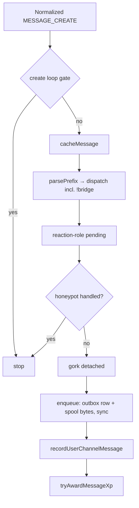
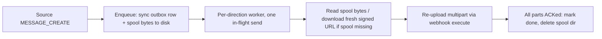

# 10. Channel bridge (Discord ↔ Fluxer)

> **Tracking moved to GitHub Issues (2026-10-09).** Open work for this feature lives in [GitHub issues labeled `bridge`](https://github.com/metalsp0rk/boiler-snake/issues/labels/bridge), ordered by [milestones](https://github.com/metalsp0rk/boiler-snake/milestones). This file stays the **design record** — locked decisions, schemas, and history here remain authoritative. Do not add new tracking items here; open an issue instead (see [index.md](index.md)). Spike follow-ups (B1/B12/B14) and ticker-health wiring live in the `Fluxer/Bridge live verification` milestone.

| | |
|---|---|
| Author | Boiler Snake |
| Date | 2026-10-01 (v2 rework; supersedes the 2026-09-25 v1 draft, which is preserved in git history) |
| Status | **Shipped — PRs 1–8 landed 2026-10-01 → 2026-10-02 (v1.31.0)**. Implementation lives in `src/features/bridge/` (+ adapter deltas in `src/platform/`); operator guide is `docs/bridge.md`. Phase 0 (§10.14) executed live 2026-10-02 — 11 PASS / 3 DOC, no PENDING, KD 21 closed. Still open: the three docs-only spike follow-ups (B1 needs a run against an mfa_level-1 community; B12 needs the CDN avatar template captured from a live client — Fluxer→Discord relay omits avatars until recorded; B14 needs a human capture of `#name` chip serialization) and wiring the relay worker into the web ticker-health UI (§ Observability). Originally drafted as v2 (2026-10-01) against the shipped Fluxer adapter (`src/platform/`, v1.30.0 / v1.30.1). |
| Roadmap feature | 10 |
| Depends on | Shipped: `communities` + `assertCommunityId` (migration 034), `src/platform/` adapters, Fluxer prefix dispatch, K2 DM outbound (`sendDm`), `@fluxerjs/core@3.1.0`. Bridge-owned adapter work (DM ingestion, `fetchMessage`, webhook lifecycle) is enumerated in §10.3 and lands in bridge PR 3. |

This document is the implementation spec. Decisions in [Key Decisions](#key-decisions) are locked for this draft. A spike (Bridge Phase 0, §10.14) that contradicts a lock revises this file before code works around it. A text-only relay is not an acceptable revision.

## What changed in v2 (2026-10-01)

1. **Re-anchored to shipped code.** Every reference to the 2026-09-25 draft's `fluxer.md §9.x` numbering is remapped to the shipped spec (K1–K11, PR plan) and to real paths under `src/platform/`. The old "blocked on Fluxer Phases 2/3/4" framing is obsolete — all of it shipped in v1.30.0/v1.30.1. Migration id is **035** (034 = `communities` shipped; never 031, owned by gork STE).
2. **Per-bridge direction mode** (new KD 19): `both | a_to_b | b_to_a`, chosen at create, immutable after connect.
3. **Edits and deletes are in v1** (replaces v1-draft deferral): source-side edits PATCH the linked destination copies in place; source-side deletes delete all linked parts; **forward-only** (destination-side edits/deletes never propagate back).
4. **At-least-once delivery** (replaces best-effort): attachment bytes are spooled to disk **at enqueue**; outbox rows and spool files are retained until every destination execute ACKs; restart replays from disk.
5. **Webhook create is not gated by `elevated_permissions`** (new KD 20); MFA surfaces as a connect-time failure.
6. **Fluxer DM ingestion** (new KD 24): the adapter gains a general normalized-DM inbound path. The pairing credential is delivered to Fluxer staff by **outbound DM** (the shipped K2 `sendDm` path) and **connect is answered by DM**. DMs are never bridge ends and DM traffic is never relayed. The v1-draft guild-channel "burn on paste" path is retained as the fallback for a code pasted in a guild channel.
7. **Prefix-dispatch integration**: `bridge` is registered as a `handlerApi: "context"` command so the shipped Fluxer prefix dispatcher (`src/platform/fluxer/commands.js` + `dispatch.js`) routes `!bridge …` in guild channels. The v1-draft custom guild dispatcher is dropped — with the shipped dispatcher in place it would double-dispatch.
8. **Real `admin_audit` rows on both platforms** (KD 23): `admin_audit` is community-scoped since 034; the v1-draft log-line-only restriction for Fluxer is lifted.
9. **Bridge Phase 0 spikes** (§10.14) are settled by a script **before the activation PR** ships; the results table lives in this file.
10. **Stacked PR plan with gated activation** (KD 22): relay is not wired to send until the activation PR; "no release with text-only relay" holds by construction.
11. Content fidelity, loop gate, mention disarm, poison handling, pairing contract mechanics: **v1-draft rules retained** where not superseded above.

---

## Overview

Boiler Snake copies **live** messages between exactly two channels: one Discord channel and one channel on a specific Fluxer instance. Staff on either service run **bridge-create** against a channel they can see. Create replies name a one-time **connect credential** (`BRG-…`) and a separate non-secret **handle** (`b_…`). Connect consumes the credential. After connect, new eligible messages flow in the bridge's configured direction, with files, and source-side edits/deletes follow the copies. A build that can set `state=active` also copies files and relays edits/deletes; there is no text-only or create-only cut on `main`.

The bot stays one process with N platform clients. The bridge is not a second service. It is a feature module (`src/features/bridge/`) that calls both platforms through a small outbound port. Discord stays slash commands; Fluxer stays prefix commands (K1, default `!`). Both surfaces call the same service.

There is no webhook code in `src/` today. The bridge adds the first webhook create/execute/patch/delete path, owned by the platform layer (§10.3); bridge policy never lives in `src/platform/`.

## Background & Motivation

The shipped adapter's non-goal is "the adapter does not relay": a Discord guild and a Fluxer guild are never the same community, snowflakes are unique only inside one deployment, and messages are not copied. That is right for the adapter and is the starting point, not the stop point, for operators who need one shared conversation.

Pain if this is folded into the adapter: a relay has a pairing capability, a media pipeline, an at-least-once spool, edit/delete relay, and loop hazards that the adapter's features do not. `src/platform/` stays policy-free; the bridge is product code.

Pain if media is deferred: Fluxer attachment URLs are signed and expire (12–24 h, re-signed on read). Hotlinking one into Discord is not a media plan. The product bar is that files cross in v1.

Pain if edits/deletes are deferred (the v1-draft position, reversed in v2): a moderation takedown on the source leaves the copy live on the destination indefinitely. For an "operators trust the copy" product, forward-only delete relay is the minimum credible behavior, and the id map (`bridge_message_links`) is needed for it. Edits ride the same map and the same webhook-token mechanism, so they ship together.

What exists today that the design fits:

- `onMessageCreate` in `src/bot/pipelines.js`: Fluxer-aware pipeline order (cache → `parsePrefix` → reaction-role pending → honeypot → 5a dispatch / 5b gork + activity + XP). Bot/webhook posts earn no XP and no activity counters.
- Staff gates are `requireStaff` / `requireStaffFromContext` (Manage Guild **or** any `staff_roles` row) in `src/core/permissions.js`; Fluxer masks are computed bigints (`src/platform/fluxer/permissions.js`, shipped PR 8).
- `src/platform/fluxer/commands.js` is the shipped prefix **parser**; `dispatch.js` is the shipped dispatcher. Registry handlers opt into `CommandContext` via `handlerApi: "context"` (`src/features/load.js`, `src/commands/registry.js`).
- `commandsAllowedFromIds(commandName, communityId, channelId, isAdmin)` and `commandsAllowedFromContext(ctx)` are shipped.
- `snowflakeTimeMs(id, platform)` is shipped (`src/platform/snowflake.js`).
- Audit is community-scoped: `recordSlashAudit` accepts `entry.communityId` (`src/core/auditTrail.js`); `admin_audit` is keyed by `community_id` since 034.
- `isHoneypotChannel(communityId, channelId)` is community-scoped (`src/db/repositories/honeypot.js`).
- `test/helpers/fluxer.js` (`createFluxerFixture`) is the gateway/REST double used by shipped Fluxer tests.
- Foreign keys are **off** (`src/db/connection.js` sets only WAL; better-sqlite3's default is off at the driver level here — treat cascade as documentation).

## Goals & Non-Goals

### Goals

- One Discord channel paired with one Fluxer channel on one instance. Create on either side. Connect on the other platform.
- 1:1: a channel is in at most one bridge; a bridge has exactly two ends; a second create, a connect onto a taken channel, and a second connect of the same credential all fail with a specific error.
- Per-bridge direction: both ways, create-side→connect-side, or connect-side→create-side. Chosen at create; immutable.
- Bidirectional-by-direction copy of **new** eligible messages after `connected_at`, **plus** source-side edit and delete relay, at-least-once: a message accepted into the outbox is copied unless the bridge is disconnected/broken/paused, surviving process restarts via the on-disk spool.
- Media in v1: images, video, audio, and general files are spooled at enqueue, downloaded at send time from media URLs with no bot credential, refreshed via the platform API origin when a URL is missing or rejected, and re-uploaded. A file that cannot be copied does not drop the text.
- Readers can tell who spoke on the other side (display name and handle). Discord user ids and Fluxer user ids are never treated as the same person.
- Relayed posts do not mass-ping, do not award XP, do not increment user-activity counters, and are not gork context.
- Loop-free. A relayed post (and its edits/deletes) must not be copied back. A correctness requirement with a concrete filter, not a dedupe hope.
- Discord-only `npm test` stays green. No `@fluxerjs/core` import from feature code.

### Non-goals

- Message history import or backfill. The bot needs no Read Message History for v1.
- **DM bridging.** DMs are never bridge ends; DM traffic is never relayed. The only DM traffic is the pairing credential (§10.1).
- Threads. Fluxer has no thread type; Discord threads are not valid ends; thread messages are not relayed.
- Voice and LiveKit audio as ends. Fluxer voice channels are text-capable; they are still not valid ends.
- Reaction mirroring.
- Destination-side edit/delete propagation (forward-only, KD 9).
- Native sticker objects and custom-emoji image re-upload (text stand-ins; §10.8).
- A web UI for pairing, and any linking of Discord and Fluxer user accounts. *(The linking half is superseded by [account-linking.md](account-linking.md), 2026-10 — user-driven account linking with mirror sync, built on this spec's pairing-code pattern. It is a feature module, not a bridge feature: the web-UI non-goal stands, and this rejection remains bridge design history.)*
- Discord↔Discord, Fluxer↔Fluxer, or federation between Fluxer instances.
- Using the bridge as an XP or activity-counter duplicator.
- Malware scanning of re-uploaded bytes.
- Bridge **policy** under `src/platform/`. Adapter plumbing (ingest, fetch, webhook calls) is adapter code; the policy decisions live in `src/features/bridge/`.

## Relationship to the endpoint spec

The shipped adapter (`src/platform/`) does not copy messages and does not know about pairing codes. The bridge consumes it:

| Shipped (v1.30.x) | Bridge consumes |
|---|---|
| `communities` keyed by `(platform, instance_key, external_guild_id)`; `ensureCommunity` / `getCommunityByExternal` / `getCommunityById` | Both ends store `community_id`, never a bare snowflake |
| Normalized gateway events (`src/platform/fluxer/normalize.js`), `OutboundClient` (`fetchUser`, `fetchMember`, `sendChannel`, `sendDm`, `fetchMessages`) | Inbound enqueue; credential delivery by DM; media refresh via API origin |
| Prefix parser + dispatcher, `handlerApi: "context"` registry | `!bridge …` guild path (§10.2) |
| Staff gates: `requireStaffFromContext`, computed bigint masks | The same gate on prefix and slash. No weaker Fluxer gate |
| K2 sensitive-output policy (DM; on failure, error text only, never the body) | Delivery of the pairing code on Fluxer |
| K1 prefix (default `!`) | `!bridge` |
| `src/db/migrations/034_communities.js` (community-scoped `admin_audit`, `honeypot_channels`, `allowed_command_channels`) | Real audit rows and honeypot checks on both platforms |

Bridge-owned **adapter deltas** (PR 3, §10.3): normalized **inbound DM** events, `fetchMessage(community, channelId, messageId)` (fetch-by-id), and webhook lifecycle helpers for both platforms. None of these carry bridge policy.

Identity, binding: bridge ends are `(community_id, channel_id)`. Channel and user snowflakes are unique only inside one deployment; ids copied into attribution text are display-only.

## Key Decisions

KD 1–8, 10–13, 15–16 carry the v1-draft decisions forward unchanged; 9 is reversed by KD 9 (edits/deletes in v1); 14 is superseded by KD 14 (at-least-once); 17–18 are restated against shipped code; 19–24 are new in v2.

| # | Decision | Rationale |
|---|----------|-----------|
| 1 | **Separate feature, not `src/platform/` policy.** Pairing, spool, webhooks, relay policy live in `src/features/bridge/`. Adapter plumbing (DM ingest, fetch-by-id, webhook HTTP) is adapter-owned (§10.3). | The adapter stays a platform port; relay is product. |
| 2 | **Cross-platform 1:1 only.** One Discord channel and one Fluxer channel. Same-platform connect is a specific error and does not consume the code. | Discord↔Discord and Fluxer↔Fluxer are different products. |
| 3 | **The pairing code is the capability.** Staff + View Channel on the destination is the other check. The same person need not administer both guilds. NSFW / private mismatches warn, never block. | Contract; a shared-admin proof rejects the handoff the code exists for. |
| 4 | **Staff-tier for every `/bridge` subcommand**, both platforms, including list and status. | Matches channel-configuration commands; public would exfiltrate. |
| 5 | **Surface spelling.** `/bridge create\|connect\|disconnect\|status\|list`; `{prefix}bridge …`. One service. | House slash style; Fluxer has no slash. |
| 6 | **The bridge id is split**: connect credential `BRG-…` (secret, single-use) vs handle `b_…` (safe to post). Notices, status, list, logs use the handle. Connect rejects the handle. | One id cannot be both "safe to post" and "capability". |
| 7 | **Webhook-per-end attribution**, per-message `username`/`avatar_url` override, **if** Bridge Phase 0 probe B2 passes. If it fails, quote-prefix becomes the success-path attribution and this section is revised. Quote posts remain the one-message fallback when a webhook vanishes after connect. | Both platforms' docs support the override; a nameless body is unacceptable. Spike settles it. |
| 8 | **Media: spool at enqueue, download+re-upload in the worker.** No CDN hotlink. Spool names are generated indexes. Ceilings 50 MiB (Fluxer) / 20 MiB (Discord). Oversize/failed files are named in the body; text always crosses. | Signed URLs expire; enqueue must not hit the network; at-least-once needs the bytes. |
| 9 | **Edits and deletes are relayed in v1, forward-only.** Source-side edits PATCH linked destination parts in place (webhook token). Source-side deletes delete all linked parts. Destination-side edits/deletes are never relayed. v1 relays content/attachment changes only. | A takedown that doesn't propagate leaves stale content; forward-only kills the echo; full bidirectional mirror needs editor-attribution the gate events don't carry. |
| 10 | **The loop gate is the first line of the pipeline** for MESSAGE_CREATE, **and a paired echo gate** for MESSAGE_UPDATE / MESSAGE_DELETE: a destination-side update/delete for a message id in `bridge_message_links.dst_message_id` (partitioned by `(platform, instanceKey)`) is dropped. Not a content hash, not a process-wide snowflake set. | Copied messages are webhook-authored by this bridge's webhook; a partial can omit `author.bot`/`webhookId`. Without the update/delete echo gate, a destination moderation edit re-relays as a new source edit. |
| 11 | **Other bots, system messages, and bridge command lines are not relayed.** | Prevents bridge-pair ping-pong; command lines must not leak into cache/gork. |
| 12 | **No XP, no user-activity credit, no gork on relayed posts**, including when `author.bot` is missing. DM traffic is never relayed and DMs earn no XP (they never enter the guild pipeline). | Copies are webhook posts; counting them double-counts XP across communities. |
| 13 | **Mentions disarmed twice**: empty `allowed_mentions` + rewritten body tokens (`<@id>`, `<@!id>`, `<@&id>`, `<#id>`, `@everyone`, `@here`), including snapshot text. | A copied channel snowflake can resolve on the other deployment; platform defaults differ. |
| 14 | **Per-direction FIFO, at-least-once.** One in-flight send per direction. Outbox row + spool bytes persist until every destination part ACKs. Poison parks after 5 attempts with a visible source notice. | A visible, durable copy beats a fast, lossy one. |
| 15 | **Disconnect removes both ends** (and the spool). Broken bridges stay listed until staff disconnect. | A half-bridge leaks; auto-delete hides an outage. |
| 16 | **Honeypot channels are refused** on both ends. Ticket channels are not specially refused (the private-channel warning covers them). | Honeypot is a trap; tickets are ordinary private channels. |
| 17 | **Dependencies are the shipped adapter v1.30.1**, not "Fluxer phases". The bridge's own adapter deltas are §10.3. | The v1-draft blocking model is obsolete. |
| 18 | **Migration id 035 at PR time** — next free id; never 031. | 034 shipped as `communities`; this repo does not squat ids. |
| 19 | **Direction is chosen at create and immutable**: `both` (default) \| `a_to_b` (create side → connect side) \| `b_to_a`. Changing direction means disconnect + re-pair. | A mutable direction invites surprise for the far side and state-machine churn; the common needs are set-once. |
| 20 | **Webhook create is NOT gated by `elevated_permissions`.** `TWO_FACTOR_REQUIRED` on webhook create is a connect-time failure with the specific sentence; no silent fallback at connect. | Webhook management is not in the K8 elevated set (roles, channels, bans); K8's flag is the K8 list. MFA exposure is recorded by spike B1. |
| 21 | **Bridge Phase 0 (§10.14) gates the activation PR.** Schema, adapter-delta, service, media, and edit/delete PRs may merge before the spike runs; the activation PR (relay wired + default-on) requires recorded results, because attribution, webhook PATCH/DELETE support, MFA, and the 50 MiB clamp decide design branches. | Same pattern that worked for the Fluxer Phase 0 spike. |
| 22 | **Stacked PRs, gated activation.** The relay worker is not registered and `BRIDGE_ENABLED` is not introduced until the activation PR. Before it, commands can create/connect (against fakes in tests) but nothing sends. | Keeps "no release with text-only relay" true while allowing small reviewable PRs. |
| 23 | **Real `admin_audit` rows on both platforms** (`bridge.create` / `bridge.connect` / `bridge.disconnect`), keyed by `community_id`, never containing the credential, hash, token, or message bodies. | `admin_audit` is community-scoped since 034; the v1-draft asymmetry has no remaining reason. |
| 24 | **General normalized DMs.** The adapter normalizes inbound DMs (no guild) into a standard DM shape and exposes an opt-in routing hook; the bridge is the first consumer. DMs are never bridge ends; DM traffic is never relayed. | The pairing credential must never appear in a guild channel (K2 reasoning, v1 draft §10.2); a general shape avoids a bridge-only special case. |

## Proposed Design

### 10.1 Pairing contract

```
Staff on platform A, in a channel they can view
        → bridge-create
        → pending row; credential delivered to the invoker
          (Discord: ephemeral; Fluxer: outbound DM)
Staff on platform B (the other platform)
        → bridge-connect with the BRG- credential
          (Discord: slash, ephemeral; Fluxer: DM to the bot)
        → expires_at checked, credential hashed + compared, both clients up,
          staff + view + perms on the target — all before any webhook create
        → webhooks B then A; compare-and-swap pending → active
Later messages (per direction, KD 19)
        → pipeline gate drops relay echoes before gork/XP
        → sync enqueue: outbox row + spool bytes (no network)
        → worker downloads (spool), uploads, ACKs, deletes spool
```

"One service at a time" means each command runs on the platform where the staff member is standing (Discord slash, that Fluxer instance's prefix, Fluxer DM for connect). It does not mean a second process. There is no web pairing console.

| Rule | Behavior |
|---|---|
| Shape | End A is the create side; end B is the connect side. One end is `platform=discord, instance_key=discord`; the other is `platform=fluxer` with that community's `instance_key`. |
| Who may connect | Possession of the pairing code **plus** staff permission and View Channel in the destination channel. The code is the capability. |
| Not the same platform | Connect on the platform that created the code fails. The code stays pending. |
| 1:1 | DB uniqueness on `(community_id, channel_id)` across ends. A second create, a connect onto an occupied channel, and a re-connect of an active code all fail with specific sentences. |
| Direction | Set at create: `both` (default), `a_to_b`, `b_to_a` (`a` = create side). Immutable after connect (KD 19). |
| Lifetime of the code | 30 minutes from create. Connect rejects a pending row past `expires_at` even before the sweeper runs. The sweeper garbage-collects **pending** rows only; never `active`/`broken`. Single use. Shown once; not recoverable. |
| Two values, not one id | The connect credential is the `BRG-` code. The handle is `b_` + 8 Crockford characters. Notices, status, list, and logs say `Bridge {handle}`. Connect rejects the handle in either case. |

**Code format** (unchanged from v1 draft): 128 bits from `crypto.randomBytes`, Crockford base32, display `BRG-XXXX-XXXX-XXXX-XXXX-XXXX-XX`. Canonical storage form: uppercase, hyphens/spaces/`BRG` stripped. Stored as `SHA-256(canonical)` (32 bytes), compared with `crypto.timingSafeEqual`. The raw code exists only in create's delivery (ephemeral reply / DM) and in the connector's input. Well-formed codes that don't match increment a per-destination-community failure counter (5 per 10 minutes); alphabet garbage does not.

**Handle.** Independent random id: `b_` + 8 lowercase Crockford characters; collision retry. Recognized by `^b_[0-9a-hjkmnp-tv-z]{8}$` after trim/lowercase. Handles are never run through the code hasher.

**Credential delivery on Fluxer (KD 24, the "DM strategy").** Create on Fluxer replies **in the guild channel** with an ack that names the handle and says the credential was sent by DM — **never the code itself**. The code goes to the invoker via the shipped `outbound.sendDm(userId, payload)` path (K2). Mechanics, all shipped: `POST /v1/users/@me/channels {recipient_id}` (idempotent, type 1) then send. Phase 0 (fluxer) recorded that opening a DM with a **non-existent** recipient returns 200 — recipient validity is provable only at send time; surface send-time codes (`CANNOT_SEND_TO_USER`). If the DM send fails, the pending row and its children are deleted and the channel reply is the delivery error only (K2).

**Connect on Fluxer is a DM.** `!bridge connect <code> <channel>` sent to the bot's DM channel. It arrives via the new DM ingestion (§10.3) with `via: "dm"`; the channel argument is required (a DM has no current channel). It never touches `cacheMessage`, gork, activity, XP, or the guild pipeline.

**Guild-channel connect (fallback burn path, retained).** A staff member typing `!bridge connect <code>` into a guild channel is **not** a successful connect and is **not staff-gated** (anyone's paste must be able to burn it). The dispatcher routes the line to the bridge service with `via: "guild"`; the service burns the code: in one transaction, delete `bridge_src_snapshots`, `bridge_message_links`, `bridge_outbox`, and `bridge_ends`, then `DELETE FROM bridges WHERE id = ? AND state = 'pending'` (matched on the code hash); commit only when that delete changed exactly one row; on zero rows roll back (the bridge is `active`) and reply with the already-used sentence. The reply never echoes the code: `That connect command was posted in the channel, so the pairing code is burned and was not used. Create a new one with {cmd} create, then DM me {cmd} connect <code> <channel>.` Best-effort delete of the posted message; on failure append `I could not delete your message: {reason}.` This path does not increment the connect-failure counter.

```mermaid
sequenceDiagram
  participant StaffA as Staff on platform A
  participant Bot as Boiler Snake
  participant DB as SQLite
  participant StaffB as Staff on platform B

  StaffA->>Bot: bridge-create (channel, direction)
  Bot->>Bot: staff, allow-list (invocation), view, bot perms, type, honeypot, 1:1, direction parse
  Bot->>DB: pending end A, code hash, handle, direction, expires_at
  Bot-->>StaffA: credential + handle (Discord ephemeral / Fluxer DM; ack line in channel on Fluxer)
  Note over Bot,StaffA: If that delivery fails, delete the pending row and its children

  StaffB->>Bot: bridge-connect (BRG- code, channel)
  Note over StaffB,Bot: Fluxer connect is a DM. A guild-channel paste burns the code.
  Bot->>Bot: expires_at, code hash match, clients up, staff+view+perms, direction — before any webhook create
  Bot->>Bot: create webhook on B, then on A
  alt create or commit fails
    Bot->>Bot: delete any webhook this attempt created
    Bot->>DB: stay pending
  else
    Bot->>DB: state=active, connected_at, tokens encrypted, code_hash kept
    Bot-->>StaffB: ephemeral/DM: handle, direction, warnings, foreign channel id
    Bot->>Bot: in-channel notice (handle + direction only, no foreign id, no code)
  end
```

### 10.2 Commands

The operations are **bridge-create** and **bridge-connect**. Supporting operations are disconnect, status, and list. Discord is one top-level slash command `/bridge` with subcommands, `setDefaultMemberPermissions(ManageGuild)`, handlers call `requireStaff`. Fluxer is `{prefix}bridge <verb> …` through the **shipped prefix dispatcher**: `bridge` is registered in the command registry (it is Discord slash JSON; the Fluxer parser types options against it) with `handlerApi: "context"`, so `!bridge …` in a guild channel dispatches to the context handlers. No custom guild listener.

| Operation | Discord | Fluxer (prefix default `!`) |
|---|---|---|
| bridge-create | `/bridge create` optional `channel`, optional `direction` (`both` — default — \| `to-fluxer` \| `from-fluxer`; names are from the create side's view, stored normalized) | `!bridge create [channel] [direction]` in the guild channel. Ack line in channel; credential **by DM**. Direction names are platform-relative: from Fluxer create, `both` (default) \| `to-discord` \| `from-discord`. |
| bridge-connect | `/bridge connect` required `code`, optional `channel`. Ephemeral. | **DM only**: `!bridge connect <code> <channel>`. Guild-channel form burns (KD 24, §10.1). |
| disconnect | `/bridge disconnect` optional `bridge` (handle) or `channel` | `!bridge disconnect [handle\|channel]` in a guild channel. No credential in the line. |
| status | `/bridge status` optional handle or channel. Ephemeral; may include foreign channel id, instance origin, direction. | DM. If the DM fails: in-channel reply with handles, states, directions only. |
| list | `/bridge list` ephemeral; same detail as status | Same: DM, else in-channel handles + states + directions. |

Channel arguments accept a Discord channel option, a raw snowflake (5–20 digits), or a `<#snowflake>` mention (Fluxer parser's bare-decimal / `mention_channels` rules apply on Fluxer). The service receives `(community, channel id)` only.

**Command channels.** The allow-list gates the **invocation** channel. `commandChannelsPermit(communityId, invocationChannelId)` (the shipped `commandsAllowedFromIds` shape) applies only to the invocation channel; the **target** is checked for view, bot permissions, type, honeypot, 1:1, and is **not** required to be allow-listed. Empty allow-list → everywhere. There is no `/setcommandchannel` lockout exception for bridge. `invocationChannelId` null (Fluxer DM connect) skips the allow-list; the target is still checked.

**Gate.** Every subcommand is staff-tier on both platforms (KD 4). Slash visibility: add `bridge: staff` to `COMMAND_VISIBILITY` (`src/core/commandVisibility.js`) — `test/command-visibility.test.js` enforces the map. Denial text stays `You don't have permission to use this.` The Fluxer staff gate is the shipped `requireStaffFromContext` (Manage Guild **or** `staff_roles`, computed bigint masks).

**Replies.** All Discord `/bridge` replies are ephemeral. The credential is never a public message, follow-up, audit embed, audit `details`, log line, or Fluxer guild-channel message. On Fluxer, create's credential follows K2: DM; on DM failure the pending row is rolled back and the channel reply is the delivery error only. Fluxer status/list are DMs; the in-channel fallback shows handles, states, and directions only — never the foreign channel id, instance origin, code, hash, or token.

`BRIDGE_ENABLED=0` rejects every subcommand with `Bridges are turned off on this process (BRIDGE_ENABLED=0).` Unset = on (introduced with the activation PR; before activation the relay worker is not registered at all, KD 22).

#### Error strings

The service returns `{ ok: false, error }` with the sentence below; handlers reply verbatim. SQLite `UNIQUE` failures map to the channel-taken sentence. `{cmd}` is `/bridge` or `{prefix}bridge`.

| Case | Sentence |
|---|---|
| Not staff | `You don't have permission to use this.` |
| Kill switch | `Bridges are turned off on this process (BRIDGE_ENABLED=0).` |
| Channel already an end | `This channel is already in bridge {publicId}. Disconnect it with {cmd} disconnect before creating another.` |
| Pending already | `This channel already has a pending bridge ({publicId}) that expires at {iso} UTC. The pairing code cannot be shown again. Disconnect it with {cmd} disconnect, or wait until it expires.` |
| Bad type (thread, voice, forum, category, DM, Fluxer voice/link/notes) | `Bridges only support a guild text channel. Threads, voice, forums, categories, DMs, and Fluxer voice channels can't be bridged.` |
| Invoker lacks View Channel | `You can't view that channel, so you can't bridge it.` |
| Bot missing permissions | `I can't bridge this channel: the bot is missing {comma-separated names}. Grant them on the bot role and try again.` |
| Honeypot | `That channel is a honeypot. Honeypot channels can't be bridged.` |
| Invalid direction token | `That is not a bridge direction. Use both, {toOther}, {fromOther}, or leave it out for both.` — `{toOther}`/`{fromOther}` are `to-fluxer`/`from-fluxer` on a Discord create and `to-discord`/`from-discord` on a Fluxer create. |
| Handle passed to connect | `That is the bridge handle {publicId}, not the connect credential. Connect will not accept it. Use the BRG- code from create.` |
| Alphabet garbage | `That bridge code has characters a code can't contain. Paste the BRG- code again, with or without the dashes.` |
| Unknown or expired | `That bridge code is expired or unknown. Codes last 30 minutes, work once, and cannot be shown again. Create a new one with {cmd} create.` |
| Already connected | `That bridge code was already used to connect bridge {publicId}.` |
| Same platform | `A bridge is one Discord channel and one Fluxer channel. This code was created on {Discord\|Fluxer}; run {cmd} connect on the other platform.` |
| Destination channel taken | `That channel is already in bridge {publicId}. Pick a different channel, or disconnect that bridge first.` |
| Too many misses | `Too many failed bridge connect attempts in this community. Wait 10 minutes and try again.` |
| Fluxer client absent | `This process has no Fluxer client for {instanceKey}, so that end can't be checked or written. Fix the Fluxer endpoint and try again.` |
| Discord client absent | `This process has no Discord client, so the Discord end can't be checked or written. Start the bot with DISCORD_TOKEN and try again.` |
| Key missing | `Set BRIDGE_TOKEN_KEY (32 bytes, base64) before connecting a bridge. Webhook tokens are not stored in plaintext.` |
| Fluxer MFA | `Fluxer refused to create the bridge webhook: TWO_FACTOR_REQUIRED. On an MFA-elevated community the bot was not exempt from Manage Webhooks. Bridge not connected.` |
| Webhook cap, channel (`MAX_WEBHOOKS_PER_CHANNEL`) | `The bridge webhook was refused: this channel is at its webhook limit ({detail}). Remove a webhook and run {cmd} connect again. Bridge not connected.` |
| Webhook cap, community (`MAX_WEBHOOKS_PER_GUILD`) | `The bridge webhook was refused: this community is at its webhook limit ({detail}). Remove a webhook and run {cmd} connect again. Bridge not connected.` |
| Connect credential pasted in a Fluxer guild channel | Burn reply (§10.1), plus the delete-failure sentence when best-effort delete fails. Never echoes the code. |
| Connect lost the pending row | `That bridge code was no longer pending when connect finished (it was burned or already used). Webhooks created for this attempt were deleted. Bridge not connected. Create a new code with {cmd} create.` |
| DM failed (create rolled back) | `I couldn't DM you the pairing code ({reason}). Nothing was saved, and the code was not posted in this channel. Allow a DM from this bot, or create the bridge from Discord.` |
| Status/list DM failed (Fluxer) | `I couldn't DM the bridge details ({reason}). This channel's bridges: {handles, states, directions only}.` |
| Disconnect, none | `This channel isn't in a bridge. Use {cmd} list to see bridges in this community.` |
| List, none | `This community has no bridges.` |
| Save failed | `Could not save the bridge: {err.message}.` |

Connect does not consume the code on permission errors, same-platform, client-absent, key-missing, channel-taken, or invalid direction — all retryable. Unknown, expired, and already-used are terminal for that input. Same-platform does not increment the failure counter; well-formed misses do. The counter applies to Discord `/bridge connect` and Fluxer **DM** connect only.

Create success (secret channel only):

`Bridge handle {publicId}. Connect will not accept that handle. Connect credential, shown once, expires {iso} UTC: {displayCode}. On Discord the other side runs /bridge connect with the credential. On Fluxer they DM the bot: {prefix}bridge connect <credential> <channel>. The credential is the capability. Do not post it in a channel. The handle is safe to post. Direction: {direction}.`

Connect success (ephemeral/DM), plus NSFW and private-channel warning lines (§10.9):

`Connected bridge {publicId}. This channel is paired with {platform} ({instanceKey}) channel {channelId}. Messages flow {direction}. The connect credential is spent. People in the receiving channel will be able to read what the source side posts, including edits and deletions. Stop it with {cmd} disconnect.`

The in-channel connect notice repeats the handle, state, and direction only.

#### Worked checks (1:1)

| Attempt | Result |
|---|---|
| Create in a channel that is end A or B of any row | Channel-taken. No new code. |
| Create while a pending row exists for that channel | Pending error. Old code not re-displayed. |
| Connect a code whose row is `active` | Already-used, names `publicId`. |
| Connect onto a channel that is already an end | Destination-taken. Code stays pending. |
| Connect on the same platform as create | Same-platform. Code stays pending. |
| Two connects racing one code | One transaction wins `pending → active`; the other sees already-used. |
| Connect with an invalid direction token (Fluxer; Discord slash choices prevent it) | Usage error naming valid values. Code stays pending, counter untouched. |
| Disconnect, then create in the same channel | Allowed. New code, new handle. |

### 10.3 Identity, shipped dependencies, and adapter deltas

Ends are `(community_id, channel_id)`; `communities` shipped in 034. Enqueue and handlers resolve through the shipped edge helpers (`ensureCommunity` / `getCommunityByExternal` / `getCommunityById`); feature code never keys by bare snowflake.

Shipped today and consumed directly:

- `src/platform/fluxer/normalize.js` → `NormalizedMessage` (guild-scoped).
- `src/platform/fluxer/commands.js` parser + `dispatch.js` dispatcher + `handlerApi: "context"` registry.
- `commandsAllowedFromIds(commandName, communityId, channelId, isAdmin)`, `requireStaffFromContext`, bigint masks (`src/core/permissions.js`, `src/platform/fluxer/permissions.js`).
- `recordSlashAudit({ communityId, … })` (`src/core/auditTrail.js`); `logConfigChange(outbound, communityId, opts)` (`src/features/logs/auditLog.js` — verify the second parameter's identity at PR time; post-034 the audit tables are community-keyed).
- `isHoneypotChannel(communityId, channelId)`.
- `snowflakeTimeMs(id, platform)` (`src/platform/snowflake.js`).
- `outbound.sendDm(userId, payload)` (K2 path, shipped).
- `test/helpers/fluxer.js` gateway/REST double.

**Adapter deltas the bridge needs (PR 3; adapter-owned, policy-free):**

1. **Inbound DM ingestion (KD 24).** `fluxer/normalize.js` today drops messages with no `guild_id` (v1 features are guild-scoped — `normalize.js` ~line 99). Add: a **normalized DM message shape** and a routing hook.

   ```js
   /**
    * @typedef {object} NormalizedDmMessage
    * @property {"discord"|"fluxer"} platform
    * @property {string} instanceKey
    * @property {string} channelId        // DM channel id (type 1); NOT a guild channel
    * @property {string} id
    * @property {string} authorId         // the user on the other end
    * @property {string} content
    * @property {{ users: string[], roles: string[], channels: string[] }} mentions
    * @property {{ name: string, url: string }[]} attachments
    * @property {Date|null} createdAt
    * // No communityId: a DM has no community. Consumers key by
    * // (platform, instanceKey, authorId).
    */
   ```

   `client.js` gains an `onDmMessage(normalizedDm)` hook registered by consumers (bridge first). The client resolves the author's user id from the payload; there is no community lookup. Discord DM ingestion is out of scope (Discord connect uses the ephemeral slash path).

2. **`fetchMessage(communityId, channelId, messageId)`** on `OutboundClient` (both adapters): GET `/v1/channels/{id}/messages/{id}` on Fluxer (bot token, API origin), `channel.messages.fetch` on Discord. Returns a normalized message (same shape as the message above, guild-scoped) — `content`, `attachments[{id, filename, size, contentType, flags, url, proxyUrl}]`, `webhookId`, `author{…}`, `messageSnapshots`, `stickers`, `editedTimestamp`, `deleted` state. This is the re-read path for media refresh, edit relay payloads, and spool-loss recovery. (The shipped `fetchMessages` history call is not a substitute: no fetch-by-id.)

3. **Webhook lifecycle modules:** `src/platform/fluxer/webhooks.js` and `src/platform/discord/webhooks.js`.

   ```js
   /**
    * @typedef {object} RelayWebhook
    * @property {string} id
    * @property {string} token        // plaintext in memory only; encrypted at rest
    */
   createRelayWebhook(communityId, channelId, { name })        → { ok, webhook } | { ok: false, error, code }
   executeRelayWebhook(webhook, { content, username, avatarUrl, files, allowedMentions, flags, nonce })
                                                                → { ok, messageId } | { ok: false, error, retryable, code }
   patchRelayMessage(webhook, messageId, { content, files })   → { ok } | { ok: false, error, code }
   deleteRelayMessage(webhook, messageId)                      → { ok } | { ok: false, error, code }
   deleteRelayWebhook(webhook)                                 → { ok } | { ok: false, error }
   ```

   Fluxer routes (from the live OpenAPI; the spike re-confirms them on the current build): `POST /v1/channels/{id}/webhooks`, `POST /v1/webhooks/{id}/{token}` (execute; `wait=true`), `PATCH /v1/webhooks/{id}/{token}/messages/{mid}`, `DELETE /v1/webhooks/{id}/{token}/messages/{mid}`, `DELETE /v1/webhooks/{id}/{token}`. Discord mirrors via webhook token endpoints. `executeRelayWebhook` on Fluxer sends **no `Origin` header** (Fluxer refuses first-party web origins, `INVALID_API_ORIGIN`). Neither module references bridges, pairing, state, or audit. The bridge's `fluxerOutbound.js`/`discordOutbound.js` inject the adapter functions so unit tests pass fakes.

4. **`NormalizedMessage` extension** (PR 3): the shipped shape gains relay-required fields, filled by the existing normalizer from the raw payload: `webhookId` (null when absent — Fluxer webhook authors carry the webhook id in `author.id`, not the bot's id), `author.displayName`, `type` (numeric channel/message type mapping), attachment `{id, size, contentType, flags}`, `messageSnapshots`, `stickers`. Discord's normalizer fills the same fields. The bridge does not add a second message shape.

**Audit (KD 23).** `bridge.create` / `bridge.connect` / `bridge.disconnect` via `recordSlashAudit` with `entry.communityId` and `details: { publicId, channel, direction, communityIdB }` — no credential, hash, token, message body, or foreign channel id in `details` (config embed text follows the same rule: `Bridge {publicId} connected`, no foreign id). `logConfigChange` posts the config embed to the **invocation end's** channel (`audit_log_channel_id` semantics). Config-change embeds on Fluxer are fine as plain channel embeds via the outbound. `redactSensitive` strips `token|secret|password|cookie` keys; a field named `code` is not in that list, so the service must never put one there.

### 10.4 Pipeline placement

The **create loop gate** is the first check in `onMessageCreate` (shipped order: 1 cache → 2 `parsePrefix` → 3 reaction-role pending → 4 honeypot → 5a dispatch / 5b gork + activity + XP). The gate runs before step 1. Return immediately (no cache, no gork, no XP, no activity, no enqueue) when any of these hold:

| Gate | Why it has to be first |
|---|---|
| No author object | A partial with no author is not a human message. |
| `author.bot` is true | Existing bot/webhook behavior, including a Fluxer webhook author (`bot: true`, `author.id` = **webhook** id). |
| `webhookId` **or** `author.id` is in the relay-webhook set **for this message's `(platform, instanceKey)`** | The set is a map keyed by deployment, values `bridge_ends.webhook_id` joined through `communities`; a Fluxer partial can omit `webhookId` and carry the webhook id only in `author.id`. Reload the map from `bridge_ends` at loop start; update one deployment's slice on connect, disconnect, and webhook recreate. A flat process-wide set is forbidden (snowflakes are unique per deployment; a human on Discord can share a Fluxer webhook's id). |
| `author.id` is the bot user id of this message's `(platform, instanceKey)` | Bot-authored notices for that deployment. |
| `(platform, instanceKey, messageId)` is in the destination-id map (TTL 10 minutes) | Insert each execute id under that deployment **before** yielding to the gateway. Not reloaded from SQLite. |
| Content parses as a `bridge` command line on Fluxer (guild) | Human author. The shipped prefix dispatcher routes the **dispatch** to the bridge's context handler (`via: "guild"`); the gate ensures the line is not cached, relayed, gorked, counted, or XP'd. One dispatch per line — the registry handler is the single entry, no second listener. |

**Update/delete echo gate (KD 10, new in v2).** MESSAGE_UPDATE and MESSAGE_DELETE events are dropped **before any feature sees them** when `(platform, instanceKey, messageId)` matches a `bridge_message_links.dst_message_id` of this process's bridges (loaded into a per-deployment set alongside the relay-webhook map; refreshed on connect/disconnect/recreate and appended on every relay ACK). Without it, a destination-side moderation edit or takedown of a copy would re-enter as a source-side relay.

**Enqueue** runs after honeypot and before activity/XP, never returns early, is synchronous, and does no network: it writes the `bridge_outbox` row (kind `create`), copies attachment descriptors into `payload_json`, and **spools bytes** (see 10.8; local disk writes only). A bridge fault is caught inside `enqueueBridgeMessage` and logged `[bridge] enqueue failed: …` — it can never skip XP for a human message that passed the gate.

**Source-side update/delete intake (new in v2).** Gateway MESSAGE_UPDATE and MESSAGE_DELETE (and `MESSAGE_DELETE_BULK` on Discord) for channels that are bridge **source** ends (per active bridge, filtered by direction) enqueue kind-`edit` / kind-`delete` outbox rows. Eligibility for `edit`: a `bridge_message_links` row exists for that source message (it was relayed), the source author is not a bot/webhook, and the computed content hash changed (§10.10). BULK: one kind-`delete` row per id with a link. `MESSAGE_CLEAR` / channel purge: not relayed.

**DM routing (KD 24).** Inbound Fluxer DMs (from the §10.3 ingestion) never enter `onMessageCreate` (no guild). The DM hook in the bridge feature parses the line (`{prefix}bridge connect …` via the same parser with a synthetic DM context), verifies staff on the target guild channel, and calls `connectBridge({ via: "dm" })`. A DM line that is not a bridge command is ignored (no relay, no cache, no gork).

**Loops.** The worker never posts into a source channel through the relay webhook. Operator notices (connected, disconnected, paused, queue full, poison) are bot-authored and die at the gate.



`startBridgeLoops()` registers the relay worker and the sweeper. It is called from platform boot when **any** configured client is ready (Fluxer-only processes included), not from Discord `ClientReady`; guarded against double-start; loop errors log `[bridge] worker failed:` and reschedule; a loop failure must never kill login.

### 10.5 What is copied

Only messages flowing in the bridge's **direction** (KD 19) are copied. End A is the create side, end B the connect side:

| Direction | A→B copies | B→A copies |
|---|---|---|
| `both` | yes | yes |
| `a_to_b` | yes | no |
| `b_to_a` | no | yes |

`a_to_b` renders as **Discord → Fluxer** when A is the Discord end (the create reply and `status` print it that way).

After `connected_at`, each new eligible message on a source end is copied to the destination. Compare `createdAtMs` (via `snowflakeTimeMs(id, platform)`; both platforms share epoch `1420070400000`, shift 22) to `connected_at`; messages older than `connected_at - 2000 ms` are ignored so a resume burst is not a backfill. There is no history walk.

| Source event | v1 |
|---|---|
| Human `DEFAULT` / Default and `REPLY` / Reply | Copied (subject to direction) |
| The bridge command line itself (Fluxer prefix, guild or DM; Discord slash invocations are not channel messages) | Not copied. Not cached. Not gork. (Gate, §10.4.) |
| This bot's user id on that platform | Not copied |
| This bridge's webhook id on that end | Not copied |
| Any other bot or webhook | Not copied |
| System types (Fluxer types other than 0/19; Discord `message.system` or any other type) | Not copied |
| Poll-only payloads | Not copied as polls. A default/reply message carrying a poll object crosses with text + files + `Poll not copied (bridges don't carry polls).` |
| Fluxer `message_snapshots` (forwards) | No destination forward (a webhook forward can't carry content; a reply reference resolves only inside the webhook's channel). Snapshot text inlined as quotes; snapshot attachments treated as this message's attachments. One level; snapshots are flat. |
| Replies | No cross-platform `message_reference`. One-line header: `↪ in reply to {display}: {snippet}` — snippet neutralized (§10.11), one line, `sliceSafe` 80 code units. Empty reference content becomes `attachment`, `sticker`, or `voice message`. No source jump URL. |
| **Source edit** (content/attachment change to a relayed message) | **Copied** as a PATCH on the linked destination parts (§10.7). Direction-gated. |
| **Source delete** (`MESSAGE_DELETE`, `MESSAGE_DELETE_BULK`) | **Copied** as deletes of every linked part (§10.7). Direction-gated. `MESSAGE_CLEAR` not copied. |
| Destination-side edit/delete | **Never relayed** (KD 9, echo gate). |

### 10.6 Loop prevention

A content hash is not a loop filter. Copies are webhook-authored by the webhook this bot created for **that** end; the create-side filter is the pipeline gate (§10.4); the update/delete filter is the echo gate. Re-checking the webhook id inside enqueue is defense in depth, not the control.

Fluxer relay posts are identified by **webhook id**, which Fluxer puts in `author.id` of the built author object — not the bot user id. The reloaded per-deployment slice is compared to `author.id`, so an echo whose payload omits `webhook_id` is dropped after a restart with an empty destination-id map.

**Idempotency.** Fluxer webhook execute supports `nonce` (remembered 5 minutes; reuse returns the original message — verified 2026-09-25, re-probed as spike B8) and defaults `wait=false`. Every Fluxer relay send (create, edit, delete is destructive and retried by id) sets `nonce = SHA-256(publicId + ":" + srcMessageId + ":" + kind + ":" + partIndex).slice(0, 32)` and `wait=true`. A timeout retry inside the nonce window cannot double-post. Discord webhook execute has no idempotency token: a Discord send is retried **only** when it produced no message id. A crash after Discord accepted and before the SQLite commit can duplicate that one message; the row is committed synchronously on response, the window is logged on restart if a row is found in `sending`, and at-least-once's spool makes re-execution deterministic (Fluxer nonce absorbs it; Discord can duplicate one message).

### 10.7 Attribution, edits, and deletes at the destination

**v1 is webhook-per-end**, username override per KD 7 (spike B2 settles it), avatar best-effort:

- Discord → Fluxer: source user's Discord CDN avatar URL (https only). A failed fetch never fails the message (Fluxer accepts a failed avatar fetch and posts).
- Fluxer → Discord: **omit** `avatar_url` until spike B12 records the Fluxer avatar URL template. Never a URL from message text.
- If a Discord execute fails and the only suspect is `avatar_url`, retry once without it.

**Activation order (connect).** Nothing sets `state=active` except `activateBridge`, which is not in a build that cannot PATCH/DELETE a relayed copy **and** copy files. Order, fail-closed before any webhook create:

1. Staff, allow-list on the **invocation** channel only, view/bot-perms/type/honeypot/1:1 on the **target**, other platform, `expires_at > now` on a still-pending row, rate limit, direction validity. A guild paste is not this function.
2. Capture NSFW and `@everyone` View Channel flags for the warning lines. They do not block.
3. `BRIDGE_TOKEN_KEY` missing → key-missing sentence. No webhook create. Code stays pending.
4. Either platform's client absent → absent-client sentence. No webhook create. Code stays pending.
5. Bot permission probe on both channels (required bits, §10.9).
6. Create webhook on B, then A, named `Boiler Snake Bridge` (≤80 chars). Fluxer: `POST /v1/channels/{id}/webhooks` (bot token, `MANAGE_WEBHOOKS`, 10/minute per channel). This await is where a guild paste can burn the pending row. Do not insert ends yet.
7. If either create fails: delete any webhook this attempt created (Fluxer token-delete needs no guild permissions), leave the row pending if it is still pending. A retry must not leak webhook slots (`MAX_WEBHOOKS_PER_CHANNEL` / `MAX_WEBHOOKS_PER_GUILD`).
8. Compare-and-swap in one transaction: `UPDATE bridges SET state='active', connected_at=? WHERE id=? AND state='pending'` — require `changes = 1`; only then insert end B (and the direction is already stored on the row); keep `code_hash`.
9. `changes = 0` or a thrown commit: delete both webhooks created by this attempt, insert no end, report the lost-the-pending-row sentence.

**Per-message send.** Execute with the username override: guild nickname if present, else username; append ` (@username)` when they differ; cut to 80 with `sliceSafe`. Discriminators are not required in v1. If spike B2 shows the gateway renders the **stored** webhook name, v1 attribution switches to the quote prefix on every relayed post (`**{display}** (@{handle} on {platform})` first line) and this section is revised — do not ship nameless bodies.

**Chunking.** Fluxer webhook content limit `max(guild max_message_length, 4000)` (default 4000); Discord 2000. Chunk with `sliceSafe` on the destination limit minus the reply header. Chunks of one source message go in order, same username, before the next source message; continuation chunks start with `(continued)`. Each chunk is a `bridge_message_links` row with its `part_index`.

**Edit relay.** On a kind-`edit` row: re-read the source (`fetchMessage`), rebuild the neutralized text + embed/sticker/snapshot renderings, spool new/changed attachment bytes (new attachment ids get new part files), then PATCH every linked destination part whose content changed. A file set change adds/deletes files on the destination by re-uploading the file parts and patching the text parts. Rules: one PATCH per changed part; a file that cannot be copied is named in the body (same sentence as create). The source content hash is updated in `bridge_src_snapshots` **before** enqueueing so a rapid edit chain coalesces (§10.10). Edits to a source message that has pending deletes are dropped (KD: delete supersedes). If the destination rejects the PATCH (`code` recorded in `last_error`, 5-attempt rule), the copy keeps its old content and the source gets the poison notice.

**Delete relay.** On a kind-`delete` row: `DELETE /webhooks/{id}/{token}/messages/{dst_message_id}` for every `bridge_message_links` part. A 404 on a part is success (already gone). Five attempts, then park + source notice: `Bridge {publicId} could not remove the copy of message {srcMessageId} after 5 attempts: {reason}.` No content is re-sent; no spool is involved.

**Degraded fallback.** If `execute` returns 404 `UNKNOWN_WEBHOOK`, attempt one recreate (bot must still hold Manage Webhooks). Recreate failure: send **that one message** bot-authored with the quote prefix as first line, log, set `last_error`. For kind-`edit`/`delete` there is no degraded fallback — a missing webhook means skip the op, log, set `last_error` (re-posting an edit as a new message is how loops look from the outside).

### 10.8 Media (spool at enqueue, at-least-once)



**Enqueue does not touch the network.** It writes `payload_json` (neutralized text, reply header, sticker names, rich-embed fields, attachment descriptors `{ sourceAttachmentId, filename, contentType, spoiler, bytes, skipReason }`) and **spools bytes**: for each attachment, GET the signed URL with **no bot credential**, write to `{DATA_DIR}/bridge-spool/{publicId}/{srcMessageId}/{index}` (index `0..n`, generated). The spool write is a synchronous local-disk operation inside the pipeline; it is bounded by the per-bridge and process-wide caps below. A spool write that fails (disk, cap) records the attachment's `skipReason` in `payload_json`; text and already-spooled files still cross.

**Why spool-at-enqueue:** at-least-once (KD 14). Signed source URLs expire in 12–24 h; a restart during an outage must not lose files. The destination must own the bytes; hotlinking is not a strategy (v1-draft Alternative 2, retained).

**Security of downloads.** Spooled bytes come from the source's signed media URLs at enqueue time, same rules as v1: fetch with **no** bot `Authorization`, same-host redirects capped at 3, refuse non-https, refuse resolved loopback/link-local/RFC1918 addresses, 30 s timeout. The bot credential is used only on the platform API origin (`fetchSourceMessage`, i.e. the §10.3 `fetchMessage`).

**Spool integrity and recovery.** `publicId` and `srcMessageId` must match `^[A-Za-z0-9_-]+$` or the file is refused; the resolved path must stay inside that message's spool directory (same containment as `resolveAssetAbsolutePath` in `src/features/tickets/assets.js`). Remote filenames are **never** path segments; the original filename lives in `payload_json` and is sent as the multipart `filename` after a 120-char cap (same spirit as `sanitizeFilename`). Never write under `ticket-transcripts/`.

On restart, a pending row's spool file is re-read from disk. A **missing** spool file (spool dir wiped, cap-forgone row) falls back to `fetchMessage` for fresh signed URLs — best-effort, since the source message may be gone.

**Ceilings** (pre-check at enqueue, before writing bytes):

| Destination | Per-file ceiling | Per-message file count |
|---|---|---|
| Fluxer | **50 MiB** (`52,428,800`) — documented bot clamp (25 MiB non-premium / 500 MiB premium uploaders, bots clamped to 50 MiB). Spike B11 re-verifies. | 10 |
| Discord | **20 MiB** on every end (discord.js 14.16 exposes `attachmentSizeLimit` only on interactions; a webhook execute has none; do not hard-code the boost table). | 10 |

Overflow past 10 files = more executes, same FIFO slot, same username. A single file over the ceiling is spooled as `skipReason: "over-cap"` and named in the body:

`Attachment not copied: {filename} ({bytes} bytes) is over the destination limit of {limit} bytes.`

Any other per-file failure: `Attachment not copied: {filename}: {reason}.` Partial success is a **successful** outbox row (`AGENTS.md` partial-failure rule): never re-send parts that landed.

**Spool caps:** **500 MiB per bridge**, **2 GiB process-wide**. Over-cap attachments are enqueued with `skipReason: "spool-full"` (text crosses; bytes are forfeited for that message). Hitting a cap fires the latched notice **once per direction per incident** (key `(publicId, direction, spool_full | queue_full | paused)`):

`Bridge {publicId} is not copying files in this direction: the spool is full ({detail}). Messages' text continues to copy; files that arrive while it is full are not copied. This notice will not repeat until the spool is under the cap again.`

Text relay over a **queue-full** condition (outbox depth 1000/direction) is the same latch shape with `queue_full`: text rows are refused and the notice explains that messages arriving while full are not copied. Outbox depth is checked at enqueue.

**Spoilers.** Discord's durable signal is the `SPOILER_` filename prefix; Fluxer's is attachment flag `IS_SPOILER` (`1 << 3`). Discord→Fluxer: strip prefix, set flag. Fluxer→Discord: set prefix from flag. Text `||spoilers||` pass through unchanged.

**Voice messages.** Copy audio bytes as a plain attachment. Never set Fluxer `VOICE_MESSAGE` (`1 << 13` — requires exactly one audio attachment, no content, waveform, duration, 1200 s default cap). The caption `Voice message` is allowed even when other files failed. Native waveform UI deferred.

**Embeds.** Copy author-supplied rich-embed fields (title, description, url, color, fields) within destination limits (Fluxer: 10 embeds, title 256, description 4096). Strip image/thumbnail/author-icon URLs; re-upload media only when the URL is a source-attachment URL already covered by the download rules; otherwise append `Embed media not copied: {filename or host} is not a source attachment.` Never fetch arbitrary embed URLs (SSRF). Automatic unfurls are not re-posted.

**Stickers.** Not native, not fetched: Fluxer sticker items carry `id, name, animated, nsfw?` — no media URL (verified). Append `Sticker: {name}`.

**Custom emoji.** `<a?:name:id>` → `:name:` on both directions; no emoji bytes downloaded; Unicode unchanged.

**Explicit-media flag.** Fluxer `CONTAINS_EXPLICIT_MEDIA` (`1 << 4`) is preserved onto the re-uploaded attachment when the destination is Fluxer. Channel-level NSFW mismatch is the §10.9 warning.

### 10.9 Permissions, NSFW, and private channels

Checked at create (local channel) and at connect (both channels).

| Needed | Why |
|---|---|
| Invoker: View Channel | Must see the end being authorized. A channel option does not bypass this. |
| Bot: View Channel | Live message + attachment URLs. |
| Bot: Send Messages | Notices and the degraded quote fallback. |
| Bot: Attach Files | Media re-upload. Fluxer direct-file execute re-checks the **creating account**. The bot must hold these bits after connect; a later overwrite failure surfaces as a send error, not a silent drop. |
| Bot: Embed Links | Rich embeds are not silently stripped. |
| Bot: Manage Webhooks | Create, execute-as, repair, and (via token) PATCH/DELETE of relay messages. Fluxer: elevated-class permission, guild **and** channel — **not** gated by `elevated_permissions` (KD 20); MFA refusal is spike B1 / the connect-time sentence. |

Not required: Read Message History, Manage Messages, Mention Everyone. Manage Messages is best-effort deletion of a burned connect line; its absence never fails connect and is not what consumes a code.

**NSFW / age restriction.** Mismatch across ends → connect succeeds + warning on the connect reply:

`Warning: one end is age-restricted or NSFW and the other is not. Messages and files will be copied into the less restricted channel.`

Fluxer `NSFW_CONTENT_AGE_RESTRICTED` for the bot account is a hard failure with the platform's code in the sentence (spike B9 determines bot exemption).

**Private → public.** If one end denies `@everyone` View Channel: connect succeeds + warning:

`Warning: one end is hidden from @everyone and the other is not. People in the more open channel will be able to read messages from the restricted one.`

The in-channel connect notice says the channel is bridged (and that one side is less restricted) without naming the far channel. **Honeypot** ends are refused on both platforms via the shipped community-scoped `isHoneypotChannel(communityId, channelId)`. Ticket channels: not refused; the private-channel warning covers them.

### 10.10 Ordering, failure, and lifecycle

**FIFO per direction.** Two queues per bridge (`a_to_b`, `b_to_a`), one in-flight send per direction (message N+1 cannot pass N; an `edit`/`delete` for a message never passes the `create` of the same message: kinds for the same `src_message_id` are FIFO-ordered by enqueue). Directions do not block each other. Process-wide cap **4** concurrent executes (Fluxer webhook execute is ~60/minute/webhook — about 1 msg/s sustained before 429; spike B7 re-verifies). Discord buckets via discord.js / 429 + `Retry-After`.

**Coalescing and supersession** (enqueue-side, so the worker sees a clean stream):

- kind-`edit`: at most **one pending edit row per (bridge_id, direction, src_message_id)** — a new edit replaces the pending row (content hash recomputed; spool for new attachment ids replaces the superseded spool files). The hash lives in `bridge_src_snapshots`; an update whose hash matches the snapshot enqueues nothing (kills pin/unpin/flag-change noise from Discord `MESSAGE_UPDATE`, and repeat-edit storms).
- kind-`delete`: drops pending `create`/`edit` rows for that source message and deletes their spool (a takedown supersedes copies in flight).

| Failure | What happens |
|---|---|
| HTTP 429 / Fluxer `SLOWMODE_RATE_LIMITED` (400) | Stay at the head; wait `Retry-After` (cap 60 s), retry. Does not count toward the poison limit. |
| Other errors | Backoff 1, 2, 4, 8, 16 s. After **5** attempts park the row (`state='failed'`, `last_error`), post a bot notice in the **source** channel: `Bridge {publicId} could not copy message {srcMessageId} after 5 attempts: {reason}. Later messages are still being copied.` Continue with the next message. |
| One direction failing | The other keeps running. |
| Five consecutive poison parks | Direction degraded; bridge stays `active`; new messages keep trying; `status` shows `last_error`. |
| Worker throw | Log `[bridge] worker failed:` with public id; reschedule. Never exit the process. |

Idle text relay: under 2 s gateway→destination message id is the design target. Media adds transfer time. Expected scale: tens of bridges on one SQLite file; this is not a public relay.

**Disconnect** destroys the bridge. Either community's staff, by handle or local channel. One transaction deletes `bridge_src_snapshots`, `bridge_message_links`, `bridge_outbox`, `bridge_ends`, then `bridges` (foreign keys are off; explicit child-then-parent order, and the v1-draft lesson stands: a parent delete without the children leaves `UNIQUE (community_id, channel_id)` held by an orphan end). After commit: delete spool dir, then best-effort delete both webhooks. Webhook-delete failure does not restore the row: `Disconnected bridge {publicId}, but the webhook on {side} could not be deleted: {reason}. Delete the webhook named "Boiler Snake Bridge" in that channel's webhook settings.` Notice in each sendable channel: `Bridge {publicId} disconnected. Messages are no longer copied.` Tests assert no end row, no outbox row, no `webhook_token_enc`, and no spool directory survive.

**Pending expiry.** Connect compares `expires_at` itself. The sweeper (every 60 s via `registerJob`, started by `startBridgeLoops()`) deletes pending rows past `expires_at` with the same child-then-parent transaction. It never deletes `active`/`broken`, never nulls `code_hash` on an active row (replay after 30 min still reports `already-used`).

**`BRIDGE_ENABLED=0`.** Commands reject. Worker sends nothing. Enqueue stops inserting new rows (a re-enable must not burst the pause window). Rows already in the outbox send on re-enable. One latched notice per direction per incident, kind `paused`: `Bridge {publicId} is paused on this process (BRIDGE_ENABLED=0). Messages posted while it is paused are not copied.` Unset = on.

**Restart.** `bridges`, outbox, `bridge_src_snapshots`, and encrypted tokens survive. The destination-id map starts empty (it covers in-flight echoes only). The relay-webhook map and the echo-gate set are reloaded from `bridge_ends` / `bridge_message_links` joined to `communities` (`(platform, instance_key)` slices). Rows in `sending` return to `pending` and replay from spool. Missing spool → `fetchMessage` fallback. Best-effort for in-flight HTTP (one possible Discord duplicate, §10.6); at-least-once for everything that reached SQLite.

**Deleted channel.** Send/get 404 `unknown channel` (or a channel-delete event from the platform adapter): set `state=broken`, stop that bridge's workers, post once into the surviving end if sendable: `Bridge {publicId} stopped: the other channel is gone ({reason}). Disconnect it with {cmd} disconnect.` No auto-delete; broken bridges stay in `list` until staff disconnect.

**Webhook deleted by a moderator.** One recreate attempt; failure → `last_error` + degraded bot-authored sends for creates (edits/deletes skip) until recreate succeeds or staff disconnect.

### 10.11 Mentions

| Platform | What we send |
|---|---|
| Discord | `allowedMentions: { parse: [] }` (the shipped `NO_PING_MENTIONS` object). |
| Fluxer webhook execute | `allowed_mentions: {}` (webhook execute suppresses by default — verified; send `{}` anyway) **plus** message flag `SUPPRESS_NOTIFICATIONS` (`1 << 12`). The flag never replaces the policy. |
| Body text, both, including snapshot text | Replace `<@id>`, `<@!id>`, `<@&id>`, `<#id>`, raw `@everyone` / `@here` before send: user tokens → `@display` when the source mention list has the id, else `@user`; role tokens → `@role`; channel tokens → `#{name}` when known, else `#channel`. No raw `<#snowflake>` in any body (the id can resolve on the other deployment; a dangling token publishes the source channel id). `@everyone`/`@here` → `@\u200beveryone` / `@\u200bhere`. |

Both layers are required: platform defaults differ (Discord parses by default; Fluxer webhook execute suppresses) and defaults can change.

### 10.12 XP, activity, gork, logs

Relayed messages award no XP and never increment `user_channel_message_daily`; guaranteed by the pipeline gate returning **before** gork, `recordUserChannelMessage`, and `tryAwardMessageXp`, including a relay payload whose webhook id appears only in `author.id` with `author.bot` and `webhookId` absent and an empty destination-id set. Source human messages earn XP once, on the source community only. DMs never enter the guild pipeline at all.

Gork may answer the source human; its reply is bot-authored and dies at the gate. Gork never sees relay copies, bridge command lines, or DM text (`cacheMessage` ignores `author.bot`, which is not sufficient for a partial; the gate is).

Audit: KD 23. `recordSlashAudit` + config-change embed, `communityId`-keyed, no credential/hash/token/body.

### 10.13 Module layout

```
src/features/bridge/
  index.js            feature exports: name, commands, handlers, handlerApi, start
  commands.js         SlashCommandBuilder /bridge (direction option included)
  handlers.js         Discord handlers; Fluxer guild + DM entries → service
  service.js          create / connect / disconnect / status / list (no replies, no discord.js)
  codes.js            canonical BRG- form, handle lowercasing, SHA-256, timingSafeEqual
  relay.js            eligibility, enqueue (sync + spool), worker, gates, direction filter
  media.js            spool, ceilings, spoiler map, partial lines
  mentions.js         neutralize + allowed_mentions payload
  tokenCrypto.js      AES-256-GCM for webhook tokens (BRIDGE_TOKEN_KEY)
  expire.js           pending sweep
src/platform/
  fluxer/webhooks.js  adapter-owned webhook HTTP (PR 3)
  discord/webhooks.js adapter-owned webhook helpers (PR 3)
src/db/repositories/bridges.js
src/db/migrations/035_bridges.js
```

`service.js` imports neither `discord.js` nor `@fluxerjs/core`; outbound functions are injected so unit tests pass fakes. `handlers.js` is the only reply site. The guild prefix path is the **shipped** `dispatch.js` → context handler (registry `handlerApi: { bridge: "context" }` in `src/features/bridge/index.js`); the DM path is the §10.3 ingestion hook → service with `via: "dm"`. Bridge policy never lives under `src/platform/`.

`tokenCrypto.js` follows the AES-256-GCM envelope idea of `src/web/auth/tokens.js` with its **own** key: `BRIDGE_TOKEN_KEY`, 32 bytes base64, `.env` only, placeholder in examples. Rotation is out of v1 (rotating the key strands existing rows; staff disconnect + reconnect). Missing key fails **connect** with the key-missing sentence; create of a pending row does not need it.

## API / Interface Changes

### Slash command

New staff-tier command; no change to existing commands.

```js
new SlashCommandBuilder()
  .setName("bridge")
  .setDescription("Pair a channel here with one channel on Fluxer.")
  .setDefaultMemberPermissions(PermissionFlagsBits.ManageGuild)
  .addSubcommand(/* create: optional channel, optional string direction
                     [both | to-fluxer | from-fluxer], default both */)
  .addSubcommand(/* connect: required string code (max 100), optional channel */)
  .addSubcommand(/* disconnect: optional string bridge, optional channel */)
  .addSubcommand(/* status: optional string bridge, optional channel */)
  .addSubcommand(/* list */);
```

`src/core/commandVisibility.js`: `bridge: TIERS.staff` (enforced by `test/command-visibility.test.js`). The option **values** are platform-relative labels; the service normalizes to `a_to_b` / `b_to_a` / `both` from the create side's perspective.

Fluxer grammar rides the shipped parser against this JSON (string choice values accepted case-insensitively per the parser's choice rule), so `!bridge create #general direction to-discord` parses on Fluxer with no overlay.

### Service

```js
// All methods return { ok: true, ... } | { ok: false, error: string }.
// { ok: true, publicId, expiresAt?, code?, direction?, warnings?: string[] }
// `error` is the §10.2 sentence; methods do not throw for expected failures.

async function createBridge({ community, invocationChannelId, targetChannelId,
                              direction, actorUserId, surfaceCmd, clock }) {}
async function connectBridge({ community, invocationChannelId, targetChannelId,
                               rawCode, actorUserId, surfaceCmd, clock, via }) {}
async function disconnectBridge({ community, invocationChannelId, targetChannelId,
                                  publicId, actorUserId, surfaceCmd }) {}
function statusBridge({ community, invocationChannelId, targetChannelId, publicId, surfaceCmd }) {}
function listBridges({ community, invocationChannelId }) {}
function commandChannelsPermit(communityId, invocationChannelId) {}
```

`via` is `"dm" | "guild" | "slash"`: `"guild"` is the burn path (compare-and-swap delete, no `activateBridge`, no counter); `"dm"`/`"slash"` call `activateBridge`.

### Outbound port (feature-facing)

```js
// createRelayWebhook / deleteRelayWebhook / executeRelay / patchRelayMessage /
// deleteRelayMessage wrap §10.3 webhook modules + tokenCrypto.
// execute: one already-chunked payload; retryable=true for 429/slowmode/network.
// { ok: true, messageId } | { ok: false, error, retryable, code }

async function fetchSourceMessage(community, channelId, messageId) {} // §10.3 fetchMessage
```

### Pipeline

`onMessageCreate` gains the create loop gate (first) and enqueue (after honeypot, before activity/XP) per §10.4; `onMessageUpdate` / `onMessageDelete` gain the echo gate + source-side intake. No new gateway listeners.

### Configuration

```bash
# Optional. Unset = bridges enabled (introduced with the activation PR, KD 22).
BRIDGE_ENABLED=1

# Required to connect (webhook tokens at rest). 32 bytes, base64.
# Placeholder only — never a real key in docs, tests, or commits.
BRIDGE_TOKEN_KEY=YOUR_BRIDGE_TOKEN_KEY
```

No new Discord intent. Message content on Discord is already required by the bot; Fluxer delivers content without intents.

## Data Model Changes

Migration **`035_bridges.js`** (next free id at PR time; never 031). Idempotent (`CREATE TABLE IF NOT EXISTS`, house style). It runs after 034; `up` throws a clear error if `communities` is missing so a mis-ordered migration cannot create unscoped rows.

```sql
CREATE TABLE bridges (
  id INTEGER PRIMARY KEY,
  public_id TEXT NOT NULL UNIQUE,
  state TEXT NOT NULL CHECK (state IN ('pending', 'active', 'broken')),
  direction TEXT NOT NULL DEFAULT 'both'
    CHECK (direction IN ('both', 'a_to_b', 'b_to_a')),   -- a = create side (KD 19)
  created_at INTEGER NOT NULL,
  expires_at INTEGER,               -- connect enforces this itself; sweeper GCs pending rows
  connected_at INTEGER,
  code_hash BLOB,                   -- SHA-256(canonical code); kept on active rows until disconnect
  created_by_user_id TEXT NOT NULL, -- external id, scoped by end A community; display-only
  last_error TEXT,
  broken_reason TEXT
);

-- Foreign keys are NOT enforced (connection.js). REFERENCES documents intent.
-- Every delete path is an explicit child-then-parent transaction.
CREATE TABLE bridge_ends (
  bridge_id INTEGER NOT NULL REFERENCES bridges(id),
  position TEXT NOT NULL CHECK (position IN ('a', 'b')),
  community_id INTEGER NOT NULL REFERENCES communities(id),
  channel_id TEXT NOT NULL,
  webhook_id TEXT,
  webhook_token_enc TEXT,           -- AES-256-GCM envelope; never plaintext
  upload_limit_bytes INTEGER,
  nsfw INTEGER NOT NULL DEFAULT 0,
  everyone_denied_view INTEGER NOT NULL DEFAULT 0,
  PRIMARY KEY (bridge_id, position),
  UNIQUE (community_id, channel_id) -- a channel is in at most one bridge
);

CREATE TABLE bridge_outbox (
  id INTEGER PRIMARY KEY,
  bridge_id INTEGER NOT NULL REFERENCES bridges(id),
  direction TEXT NOT NULL CHECK (direction IN ('a_to_b', 'b_to_a')),
  kind TEXT NOT NULL DEFAULT 'create'
    CHECK (kind IN ('create', 'edit', 'delete')),
  src_message_id TEXT NOT NULL,
  enqueued_at INTEGER NOT NULL,
  state TEXT NOT NULL,              -- pending | sending | done | failed
  attempts INTEGER NOT NULL DEFAULT 0,
  payload_json TEXT NOT NULL,       -- metadata + attachment descriptors; no CDN URLs,
                                    -- no tokens, no credential
  dest_message_id TEXT,             -- first destination execute only; full set in links
  last_error TEXT,
  UNIQUE (bridge_id, direction, src_message_id, kind)
);

CREATE TABLE bridge_message_links (
  bridge_id INTEGER NOT NULL,
  src_community_id INTEGER NOT NULL,
  src_message_id TEXT NOT NULL,
  part_index INTEGER NOT NULL,      -- 0-based chunk / overflow-file execute
  dst_message_id TEXT NOT NULL,
  created_at INTEGER NOT NULL,
  PRIMARY KEY (bridge_id, src_community_id, src_message_id, part_index)
);

CREATE TABLE bridge_src_snapshots (
  bridge_id INTEGER NOT NULL,
  src_message_id TEXT NOT NULL,
  content_hash TEXT NOT NULL,       -- SHA-256 of the canonical relay payload
  updated_at INTEGER NOT NULL,
  PRIMARY KEY (bridge_id, src_message_id)
);

CREATE TABLE bridge_connect_attempts (
  community_id INTEGER PRIMARY KEY,
  window_started_at INTEGER NOT NULL,
  failures INTEGER NOT NULL
);
```

Pending bridges have only position `a`; `activateBridge` inserts `b` in the CAS transaction. `UNIQUE (community_id, channel_id)` makes 1:1 true under races; the service maps the constraint failure to the channel-taken sentence.

`bridge_outbox` is the durable queue for all three kinds. The one-pending-edit rule is the `UNIQUE (…, kind)` constraint: an enqueue for an existing (bridge, direction, src, 'edit') row replaces the row's payload and re-spools (delete + insert in one transaction). A `delete` enqueue deletes pending `create`/`edit` rows for the same `(bridge, direction, src_message_id)` and their spool files.

`payload_json` holds neutralized content, reply header, sticker names, rich-embed fields, and attachment descriptors `{ sourceAttachmentId, filename, contentType, spoiler, bytes, skipReason }`. Every relay execute inserts a `bridge_message_links` row with the next `part_index`; `dest_message_id` is the first part only. `bridge_src_snapshots` is the edit-coalescing hash store (created on the `create` row's first success, updated on each accepted edit).

No `guild_settings` columns: a community with zero bridge rows has zero behavior change.

**Spool on disk:** `{DATA_DIR}/bridge-spool/{publicId}/{srcMessageId}/{index}`. Not a table. Deleted when the outbox row reaches `done` (all parts ACKed), on delete-supersession, on disconnect, and by the start-time orphan pass (spool directories whose `publicId` has no row).

Rollback of app code leaves the tables in place; no down migration in v1. Rows are inert once the pipeline hooks are removed.

## Alternatives Considered

1. **Bot-authored quote posts instead of webhooks** — rejected as v1 **attribution** design unless spike B2 fails, in which case it becomes the success path (KD 7). Quote posts remain the one-message degraded fallback.
2. **Hotlink source CDN URLs** — rejected (v1 draft, retained): signed URLs expire; webhook JSON attachments attach no bytes; leaks source CDN paths.
3. **Text-only v1, media later** — rejected (product contract).
4. **Edits/deletes deferred (v1-draft KD 9)** — **reversed in v2** (KD 9). The id map, forward-only rule, and webhook-token PATCH/DELETE make the durable version cheap; a "delete the copy" guarantee is the minimum credible moderation story.
5. **Bidirectional edit/delete relay (true mirror)** — rejected: needs per-copy editor attribution the gateway events don't carry, and re-opens the loop class KD 10 exists to close.
6. **Best-effort delivery (v1-draft KD 14)** — **replaced** by at-least-once (KD 14): spool-at-enqueue + ack-then-delete. The v1-draft's one-duplicate window on Discord is retained (documented in §10.6); the v1-draft's one-**loss** window (crash between enqueue and worker) is closed by the spool.
7. **Custom guild dispatcher for `!bridge`** (v1-draft §10.2) — **obsoleted** by the shipped prefix dispatcher + context handlers (KD 17). Keeping both would double-dispatch.
8. **A separate bridge process or web pairing page** — rejected (one-process model; no components on Fluxer; weakens the code-is-the-capability contract into account linking). *History note (2026-10): account linking later shipped as its own feature — [account-linking.md](account-linking.md) — reusing this file's pairing-code pattern, in-chat, code-as-capability, no web page. The rejection here stands as bridge design history: it argued against folding linking into the **bridge**, not against linking existing.*
9. **Manage Guild-only commands** — rejected (KD 4). `staff_roles` is the bot's staff gate everywhere else that configures a channel.
10. **`elevated_permissions`-gating webhook create** — rejected (KD 20): K8's flag covers roles/channels/bans; webhook management is a distinct permission with its own documented failure (`TWO_FACTOR_REQUIRED`), surfaced at connect with the specific sentence. Gating it would also inherit K8's open item (no supported way to set the flag) for a capability with a clean runtime signal.
11. **Inbound-DM-less pairing (connect in guild channel)** — rejected (KD 24): the code would be publicly visible in the connect channel until consumed; DM both ways keeps the credential out of every channel.

## Bridge Phase 0 — spikes (§10.14)

Same discipline as the Fluxer Phase 0: pass/fail checks recorded **in this file**, executed by `scripts/fluxer-bridge-spike.js` (pattern of `scripts/fluxer-spike.js`; manual; not in `npm test`; never prints tokens, webhook tokens, or full code values; consumes `FLUXER_SPIKE_*`-style env, adding `FLUXER_SPIKE_WEBHOOK_CHANNEL`). The **activation PR (PR 7) requires recorded results** (KD 21); schema, adapter-delta, service, media, and edit/delete PRs may land before, because they do not send real traffic.

| # | Probe | If it comes back false |
|---|---|---|
| B1 | Bot MFA: create a webhook in an `mfa_level: 1` community → `TWO_FACTOR_REQUIRED`? (pairs fluxer Phase 0 open item 3) | Nothing structural: connect fails with the MFA sentence (KD 20). Record so docs are truthful. |
| B2 | Per-message `username` override: execute with `username`, read gateway `MESSAGE_CREATE` — rendered author = override or stored name? | Attribution switches to quote-prefix on every relayed post (KD 7); §10.7 revised. Do not ship nameless bodies. |
| B3 | `avatar_url` on execute with a Discord CDN URL → accepted? rendered? | Omit avatar Discord→Fluxer; avatars stay best-effort. |
| B4 | Multipart execute attaches bytes (`files[n]` + `payload_json`)? | Media to that platform degrades to named skip lines until solved. |
| B5 | Webhook **PATCH** `/webhooks/{id}/{token}/messages/{mid}` supported for a message the webhook created? | Edit relay to that platform is skipped + logged (KD 9 degrades per-platform; forward-only design unchanged). |
| B6 | Webhook **DELETE** `/webhooks/{id}/{token}/messages/{mid}`? | Delete relay to that platform is skipped + logged. Moderation story noted in docs. |
| B7 | Rate-limit headers/429 body on webhook create + execute routes | Update the worker's 429 handling notes; behavior (wait at head) unchanged. |
| B8 | Nonce idempotency on execute (5-min window, original message returned) | Retry policy for that platform: no blind retry after send-timeout. |
| B9 | Bot account vs `NSFW_CONTENT_AGE_RESTRICTED` (age-restricted channel) | §10.9 sentence; hard failure stands. |
| B10 | `allowed_mentions: {}` suppresses a literal `@everyone` in body on webhook execute (webhook default is already suppress — confirm) | Body-rewrite becomes load-bearing; keep both layers regardless. |
| B11 | Upload size clamp on webhook multipart: exact boundary (25 MiB? 50 MiB?) | Adjust the constant; skip-line behavior unchanged. |
| B12 | Fluxer avatar URL template for users | Fills the Fluxer→Discord avatar override; until known, omitted. |
| B13 | `POST /v1/webhooks/{id}/{token}` from Node `fetch` (no `Origin`) accepted | Add the header allow-list note to the adapter; verified 2026-09-25, re-confirm on current build. |
| B14 | Channel-mention syntax beyond `<#snowflake>` | Parser gains a pattern; service unchanged. |

Results record as **PASS / FAIL / DOC / SKIPPED** with the observed payload fields, in a `### Phase 0 results (recorded <date>)` subsection, exactly like the fluxer spec's results section.

### Phase 0 results (recorded 2026-10-02)

**Status: EXECUTED** by `npm run fluxer:bridge-spike` against the operator's live deployment. **PASS** = confirmed live. **FAIL** = confirmed live and false (apply the "if it comes back false" column of the table above — B2 FAIL switches attribution to quote-prefix, KD 7). **DOC** = docs/OpenAPI-confirmed, not exercised live. **SKIPPED** = operator-skipped; record the re-run flag. **PENDING** rows keep KD 21 closed: PR 7 does not ship while any row is PENDING.

Run header: date `2026-10-02`, instance `https://chat.metalspork.xyz`, X-Fluxer-Version `2026.924.204848`, test community `1554590611015729152` "Bot Test" (mfa_level `0`), NSFW channel `1555624155687157760` (created for B9), upload-clamp run: **yes**. Bot identity: `BoilerSnakeBridge` (application id `1555623310178385920`). Cleanup: 8/8 probe messages + 2/2 probe webhooks deleted — zero leftovers. JSON report is local, never committed: `/tmp/opencode/bridge-spike-results.json`.

| # | Probe | Status | Observed (status codes, response keys, rendered author, rate-limit headers) |
|---|-------|--------|-------------------------------------------------------------------------------|
| B1 | Bot MFA on webhook create (`TWO_FACTOR_REQUIRED`?) | DOC | `GET /guilds/{id}` → 200, `mfa_level=0`; `POST /channels/{id}/webhooks` → 200 (webhook created as the bot). `TWO_FACTOR_REQUIRED` is observable only in an mfa_level 1 community — not exercisable here. KD 20's connect-time MFA sentence stands; docs carry it. |
| B2 | Per-message `username` override: rendered author = override or stored name? | PASS | Execute `username="Bridged Tester …"` → 200; read-back `author.username` == the per-message override (`global_name=null`, `bot=true`). **Per-message attribution WORKS** — KD 7 success path; quote-prefix fallback not needed. |
| B3 | `avatar_url` on execute → accepted? rendered? | PASS | `avatar_url=https://cdn.discordapp.com/embed/avatars/0.png` → 200; read-back `author.avatar="1f0bfc08"` — external URL accepted and reflected (stored→hash transform server-side). Visual rendering is a human check; wire-usable confirmed. |
| B4 | Multipart execute attaches bytes (`files[n]` + `payload_json`)? | PASS | Multipart (payload_json + files[0]) → 200; attachment attached (`filename="spike.png"`, `size=70`, `content_type="image/png"`). Attachment wire fields: `content_hash, content_type, description, expires_at, filename, flags, height, id, nsfw, placeholder, proxy_url, size, title, url, width`. |
| B5 | Webhook **PATCH** `/webhooks/{id}/{token}/messages/{mid}` supported? | PASS | PATCH → 200; read-back content changed, `edited_timestamp` set. **Edit relay to Fluxer is supported** — the edit-relay gate is open. |
| B6 | Webhook **DELETE** `/webhooks/{id}/{token}/messages/{mid}`? | PASS | DELETE → 204; direct `GET /channels/{id}/messages/{mid}` → 404 on first poll. **Delete relay supported**; moderation story intact. (Note: the newest-first list read-back is eventually-consistent; the script now polls the single-message GET.) |
| B7 | Rate-limit headers/429 body on webhook create + execute routes | PASS | Headers on every successful webhook-route response: `x-ratelimit-bucket/-limit/-remaining/-reset/-reset-after` + `x-fluxer-version`. Observed buckets: create `limit=10` (per minute per channel), execute `limit=60` (per minute per webhook) — matches docs. 429 body shape not exercised (stays DOC; worker waits at head per §10.10). |
| B8 | Nonce idempotency on execute (5-min window, original message returned) | PASS | Two executes, same `nonce` → 200 with the **same message id**. Timeout retries inside the nonce window cannot double-post — §10.6 retry policy holds on this build. |
| B9 | Bot account vs `NSFW_CONTENT_AGE_RESTRICTED` (age-restricted channel) | PASS | Channel `nsfw=true, type=0`; webhook create → 200; execute into the age-restricted channel → **200, not refused**. The webhook token path is not age-gated; §10.9's hard failure binds the bot-token message-send path — docs note the distinction. |
| B10 | `allowed_mentions: {}` suppresses a literal `@everyone` in body on webhook execute | PASS | Literal `@everyone @here <@id> <@&id> <#id>` with `allowed_mentions={}` → 200; read-back `mention_everyone=false`, `mentions=[]`, `mention_roles=[]` — **all pings suppressed** (layer 1 confirmed). `mention_channels` is non-empty: Fluxer resolves literal `<#id>` text into display metadata (rendering, not a ping — see B14). Layer 2 body-rewrite stays REQUIRED (§10.11). |
| B11 | Upload size clamp on webhook multipart: exact boundary (25 MiB? 50 MiB?) | PASS | 25 MiB → 200 attached; 50 MiB → 200 attached; **52 428 801 B → 400 `FILE_SIZE_TOO_LARGE`**. Exact boundary: 52428800 accepted, +1 rejected — the §10.8 ceiling (50 MiB) is confirmed live; constant stands. |
| B12 | Fluxer avatar URL template for users (template candidates from user objects) | DOC | `GET /users/@me` 200: `avatar` (hash segment, e.g. `"cd49990b"`), `avatar_color`, `banner`, `banner_color`; member fetch 200 carries the same user fields. CDN template not recorded (needs a human browser capture). Fluxer→Discord relay **omits** `avatar_url` until recorded (§10.7). |
| B13 | `POST /webhooks/{id}/{token}` from Node `fetch` (no `Origin`) accepted | PASS | 10 token-endpoint POSTs via Node global fetch with no `Origin` header — all accepted, no `INVALID_API_ORIGIN`. Re-confirmed on build `2026.924.204848` (was verified 2026-09-25). |
| B14 | Channel-mention syntax beyond `<#snowflake>` (via `mention_channels[].mention_string`) | DOC | `POST /channels/{id}/messages` with `<#1554590611015729155>` → 200; read-back `mention_channels=[{id, name="general", type=0}]`. `<#snowflake>` is the canonical form; client-UI chip serialization needs a human client capture before adding a parser pattern. |

**KD 21:** every probe row is recorded (11 PASS, 3 DOC — B9 ran with `--nsfw-channel`, B11 with `--upload-clamp`); **no PENDING rows → the activation gate (PR 7) is open.**

Open follow-ups (docs-only by design — see the "if it comes back false" column; they do not gate PR 7): B1 `TWO_FACTOR_REQUIRED` needs a run against an mfa_level 1 community; B12 needs the operator to record the CDN avatar template from a live client (until then Fluxer→Discord relay omits avatars); B14 needs a human capture of `#name` chip serialization.

## Security & Privacy Considerations

The pairing code is a capability: whoever holds it and is staff + View Channel somewhere on the other platform can attach that channel. The same human need not administer both guilds. Mitigations: short life, single use, hash at rest, ephemeral/DM delivery, staff check on the destination, 30-minute expiry enforced by connect itself.

| Threat | Severity | Mitigation |
|---|---|---|
| Code leaked in a screenshot or public paste | High | 30-min TTL, shown once via ephemeral/DM, never in a guild channel (KD 24); a guild-channel paste is burned on sight; single use; hash at rest. |
| Code in logs / `admin_audit` / raw interaction dumps | High | Log public id, community ids, channel ids, message ids. Never the code, hash, token, message bodies. `details` omit `code`. Handlers never log `interaction.options` wholesale. |
| Guessing | Low | 128-bit code, 5 well-formed misses/10 min/community, `timingSafeEqual` on SHA-256 digests. The handle is not a credential. |
| Replay | Medium | State flip is transactional; second connect gets already-used; `code_hash` kept on active rows until disconnect; expiry sweeps only pending rows; connect checks expiry itself. |
| Connect by someone who cannot see the source | Accepted | They need staff + View Channel on the **destination**; the source chose to mint the code. |
| Private → public, NSFW → SFW | High | Not blocked; specific connect warnings + in-channel notice (KD 3). Documented so staff cannot claim the bot hid it. |
| Confused deputy ("also bridge #secret") | High | The worker only sends to stored ends; `<#id>` → `#name`/`#channel` in all bodies incl. snapshots. No third end. |
| SSRF / token leak on media | High | Enqueue-time downloads: no bot credential, same-host redirects ≤ 3, https only, non-routable addresses refused, fetch only URLs from that message's attachment objects. Bot credential only on the API origin (`fetchMessage`). No arbitrary embed URL fetches. Spool paths are generated indexes inside a resolved directory. Avatar URLs from user objects, never body text. |
| At-rest webhook tokens | Medium | AES-256-GCM with `BRIDGE_TOKEN_KEY`; matches the `web_sessions` envelope posture (key on the same host); DB is already secret. |
| `TWO_FACTOR_REQUIRED` on webhook create | Medium | Connect fails with the specific sentence (KD 20). No silent quote-post fallback at connect. Spike B1 records bot exemption. |
| Malware in relayed files | Medium | **Not scanned in v1.** Bytes are opaque. Size ceilings are the only filter. Destination inherits the source's file trust; say so in docs. |
| Relayed `@everyone` / live `<#id>` | High | `allowed_mentions` empty + body rewrite (§10.11). Test asserts no `<@`, `<#`, `@everyone`, `@here` in outgoing payloads. |
| XP / activity / gork on echoes, incl. after restart | Medium | Pipeline gate first; per-deployment relay-webhook map; `author.id` compared to that deployment's webhook ids only. A human on another deployment with a colliding snowflake keeps XP. |
| Edit/delete echo amplification (destination moderation → source) | Medium | Echo gate (§10.4) drops destination-side `MESSAGE_UPDATE`/`MESSAGE_DELETE` for known `dst_message_id`s. |
| Spool on disk (privacy) | Low | Same trust as transcripts: bytes the source channel's staff chose to share; directory under `DATA_DIR`, name-generated indexes. |
| In-channel notice reveals a bridge exists | Low | Intentional; never the code, foreign channel id, or instance origin. |
| Staff of one side disconnects | Low | Either side may; public notice; no hidden bridge. |

Fluxer content blocklists (`CONTENT_BLOCKED`) are a normal poison/partial error with the platform code in the reason. Do not retry-bypass.

## Observability

No metrics backend; logs, `admin_audit`, and `status` are the surface. Prefix `[bridge]`; include public id, both `community_id`s, channel ids, source message id, `err.message`. `[bridge] enqueue failed:`, `[bridge] send failed:`, `[bridge] worker failed:`, `[bridge] webhook recreate failed:`, `[bridge] expired pending bridges: {n}`. Never the code, hash, token, `Authorization`, or message bodies.

**Status** shows `state`, `direction`, `last_error`, outbox depth per direction, spool bytes per bridge, and the far end's platform/instance/channel id (staff-visible surfaces only).

**Notices**: connected / disconnected / poison park (per parked message) / channel-gone: one each. Queue-full / spool-full / paused: latched once per direction per incident.

**Audit** (KD 23): `bridge.create` / `bridge.connect` / `bridge.disconnect` in `admin_audit` with `community_id`, `details` free of credential/hash/token/bodies.

**Worker health**: relay loop exposes `registerJob` snapshot (`lastTickAt`, `running`); wiring into web ticker-health UI is a follow-up.

## Rollout Plan

The feature is inert until staff create a bridge; the relay worker is not registered at all until the activation PR (KD 22). The first build that can set `state=active` also copies files, relays edits/deletes, checks `expires_at` in connect, checks `BRIDGE_TOKEN_KEY` before any webhook create, and emits NSFW / private-channel warnings. A Discord-only process cannot finish connect (absent-client, before webhook create). There is no release where relay is text-only.

| Stage | Operators see | Rollback |
|---|---|---|
| Schema PR (035) | Nothing user-facing. Tables + repo + sweeper, not wired to boot. | Leave tables; revert app code. |
| Adapter deltas | Nothing user-facing: DM ingestion (DMs currently dropped — the hook is opt-in; nothing consumes them yet), `fetchMessage`, webhook modules. | Revert; no callers. |
| Service + Discord command | `/bridge` exists; create/connect work against the Discord side; relay not wired. `!bridge` replies "not available on Fluxer yet" until PR 7. | Revert command. |
| Media + spool, edits/deletes | Still not wired to send. Tests prove copy with fakes. | Revert. |
| **Activation PR** (Fluxer prefix + DM connect + real I/O + worker registration + `BRIDGE_ENABLED`, default on) | Bridges live both directions with files, edits, deletes. | `BRIDGE_ENABLED=0`: commands reject, no enqueue, no send; outbox rows send on re-enable. |
| Docs | Operator page in `docs/` (absolute links to `roadmap/`), `npm run docs:build`. | Docs PR. |

`BRIDGE_ENABLED` is read at command time, at enqueue, and at the top of each worker iteration. It is not per-community. Rollback needs no down migration. A start-time pass deletes spool directories with no owning row; a disabled worker may leave spool until the next activation or disconnect.

Order relative to the shipped adapter: PR 3 (adapter deltas) has no dependency on bridge schema; activation requires the §10.14 spike recorded (KD 21).

## Risks

| Risk | Severity | Mitigation |
|---|---|---|
| Fluxer webhook PATCH/DELETE unsupported (breaks edit/delete relay to Fluxer) | High | Spike B5/B6 before activation; fallback = skip + `last_error` (KD 9 degrades per-platform; text/create/delete relay unaffected). |
| Gateway renders stored webhook name (attribution design branch) | High | Spike B2; quote-prefix fallback is specified, not improvised. |
| Bot MFA on webhook create (same open item as fluxer Phase 0 #3) | Medium | KD 20: connect-time specific sentence; docs record it. |
| Spool fills disk (2 GiB cap) during a long outage | Medium | Caps + latched notices; over-cap files skip with named lines; spool deleted at ACK, supersede, disconnect, start-time orphan pass. |
| Edit storm (user editing repeatedly) | Low | `bridge_src_snapshots` hash coalescing: one pending edit per source message; content-hash filter kills pin/flag noise. |
| Enqueue-time download slows the pipeline (spool at enqueue) | Medium | 30 s timeout per file, 10 files/row cap, spool writes are local-disk and bounded by caps; enqueue stays synchronous, network-bound work is the timed download — a slow media host is the pipeline's worst case per message; watch `[bridge] enqueue` timing in logs; if it proves chronic, move downloads to a pre-spool queue in a follow-up (outbox row lands first, bytes attach async, `state='staged'` until spooled — not v1). |
| One process, N webhooks, rate-limit stampede | Low | 4 concurrent executes process-wide; FIFO per direction; 429 waits at head. |
| Migration id collision | Low | 035 at PR time; never 031; idempotent `CREATE TABLE IF NOT EXISTS`. |
| FK cascade assumptions (FKs off) | Medium | Every delete path is an explicit child-then-parent transaction with `changes` checks (034 lesson, §10.10). |
| `!bridge` guild dispatch double-handling | Low | Single entry: the shipped dispatcher → context handler; no second listener (KD 17). |
| DM ingestion noise for other features | Low | DMs carry no community; the guild pipeline never sees them; only the bridge's DM hook consumes (PR 3 keeps the guild drop-behavior test green). |
| One-message duplicate window on Discord (crash mid-send) | Low | Documented (§10.6); id-synchronous commit; no id ⇒ no blind retry. |

## Tests

Harness: `createIntegrationEnv` (`test/helpers/harness.js`) + `createFluxerFixture` (`test/helpers/fluxer.js`), temp SQLite (`test/helpers/env.js`). No real sockets, no gateway. `npm test` (Discord-only) stays green; the default test run imports `@fluxerjs/core` in no test.

| Test | Proves |
|---|---|
| Two communities, same `external_guild_id`, distinct `instance_key`: `addXp` on one is invisible on the other; bridge ends on `(community_id, channel_id)` never alias. | Identity isolation (inherited). |
| Pairing: create→connect happy path (Discord slash + fake Fluxer peer): pending row, code stored as SHA-256 digest, handle canonicalization (`B_7K2M9QXP` → lowercase), connect rejects handle, same-platform, expired, taken, already-used sentences; failure counter 6th-well-formed-miss sentence; `timingSafeEqual` on digests. | §10.1. |
| Burn race: paste path commits only when the CAS delete changed one row; a paste racing `activateBridge` yields exactly one winner, no orphan end, no orphan webhook, no token row. | §10.1. |
| Prefix dispatch: `!bridge create` in a guild channel produces exactly **one** service call (not two), is not cached, not relayed, not gorked, earns no XP. | KD 17/KD 12. |
| DM path: fixture DM `!bridge connect <code> <channel>` routes to `connectBridge(via:"dm")` once; a non-bridge DM is ignored; DM never enters the guild pipeline; `sendDm` failure on create rolls back the pending row and the channel reply contains the delivery error, never the code. | KD 24, K2. |
| Direction: a `b_to_a` bridge copies B→A only: A→B human message earns source XP on A, enqueues **nothing**; B→A copies. Status/list print direction. | KD 19. |
| Loop gate restart case: relay id only on `author.id`, `author.bot` absent, `webhookId` absent, empty destination-id map, same deployment → no cache/gork/XP/enqueue. Second fixture: human on **another** deployment with the same id earns XP. | KD 10. |
| Echo gate: `MESSAGE_UPDATE`/`MESSAGE_DELETE` for a `dst_message_id` is dropped; for a source `src_message_id` it enqueues edit/delete rows. | KD 10, §10.4. |
| Edit relay: content-hash coalescing (second rapid edit replaces the pending edit row); pin/flag updates enqueue nothing; PATCH payload carries neutralized content; spool of new attachment ids; 404-on-PATCH maps to `last_error` after 5 attempts. | §10.7/§10.10. |
| Delete relay: `MESSAGE_DELETE_BULK` yields one kind-`delete` row per linked src id; pending create/edit rows + spool files are deleted on supersession; a second delete after `done` enqueues cleanly. | §10.10. |
| Media: spool file written at enqueue under the generated index path; `../` filename rejected; over-cap byte → skipReason + named line in body, row `done`; spool-full latch emits one notice per direction; restart replays a pending row from spool (fake transport asserts upload of spooled bytes, not refetch). | KD 8, KD 14. |
| Failure ladder: 429 stays at head (no attempt burn); 5 generic failures park with the source notice; one direction's failure doesn't stall the other; worker throw logs + reschedules. | §10.10. |
| Disconnect: child-then-parent delete leaves no end/outbox/link/snapshot/token rows; spool directory removed; webhook-delete failure surfaces the named sentence. | §10.10. |
| Audit: `bridge.connect` writes `admin_audit` with `community_id` on both platforms (Fluxer via `entry.communityId`, `origin: 'system'` when no interaction context); details contain the handle, never the code/token/body. | KD 23. |
| `assertRuntimeEnv` + boot: `startBridgeLoops()` registered from platform boot with **no** Discord client (Fluxer-only fixture); `BRIDGE_ENABLED=0` rejects commands, enqueues nothing, sends nothing; outbox rows send after re-enable. | §10.4, KD 22. |
| `test/command-visibility.test.js` green with `bridge: staff`. | KD 4. |

## References

- Shipped endpoint spec (adapter, K1 prefix, K2 DM policy, K3 community keys, K8 elevated flag): `roadmap/fluxer.md` (shipped v1.30.0/v1.30.1).
- Roadmap index; gork STE owns migration 031: `roadmap/index.md`, `roadmap/gork.md` §7.20.
- Error handling, staff gates, docs-link rule, secrets: `AGENTS.md`.
- Pipeline: `src/bot/pipelines.js` (`onMessageCreate`; update/delete intake lands here). Boot: `src/index.js`, `src/platform/boot.js`.
- Prefix parser/dispatcher: `src/platform/fluxer/commands.js`, `src/platform/fluxer/dispatch.js`; registry: `src/commands/registry.js`; `handlerApi`: `src/features/load.js`.
- Staff/allow-list: `src/core/permissions.js` (`requireStaffFromContext`, `commandsAllowedFromIds`).
- Audit: `src/core/auditTrail.js` (`recordSlashAudit`, `communityId`-keyed post-034), `src/features/logs/auditLog.js` (`logConfigChange`, `cacheMessage`), `src/db/migrations/029_admin_audit.js` + 034.
- Honeypot: `src/db/repositories/honeypot.js` (`isHoneypotChannel(communityId, channelId)`).
- Snowflake time: `src/platform/snowflake.js` (`snowflakeTimeMs`).
- Denial copy: `src/core/theme.js` (`MSG_DENIED`). Code-point cuts: `src/core/text.js` (`sliceSafe`).
- No-ping precedent: `NO_PING_MENTIONS` in `src/features/reactionRoles/service.js`, `src/features/gork/sanitize.js`.
- File-asset precedent (sanitize/containment): `src/features/tickets/assets.js`.
- Token envelope precedent: `src/web/auth/tokens.js`.
- Scheduler: `src/core/scheduler.js` (`registerJob`). Migrations through 034 shipped; bridge uses 035.
- Spike pattern: `scripts/fluxer-spike.js`; new: `scripts/fluxer-bridge-spike.js`.
- Test doubles: `test/helpers/fluxer.js` (`createFluxerFixture`), `test/helpers/harness.js`, `test/helpers/env.js`.
- Fluxer webhooks (create/execute routes, `username`/`avatar_url`/multipart/nonce/`wait`, 60/min, `MAX_WEBHOOKS_*`, token returned in full, `INVALID_API_ORIGIN`): <https://docs.fluxer.app/http-api/webhooks/> — re-read during v2 (2026-10-01).
- Fluxer messages (attachments, signed URLs, flags, snapshots, stickers, voice-message flag constraints): <https://docs.fluxer.app/http-api/messages/> — re-read 2026-09-25, re-verify in spike.
- Discord file-upload ceilings and boost caveats: <https://docs.discord.com/developers/reference>; boost FAQ (do not hard-code).

## PR Plan

Each PR is its own branch off `main`, reviewable alone, keeps `npm test` green without a Fluxer token, and adds no `@fluxerjs/core` import outside `src/platform/fluxer/`. No merged PR may set `state=active` with real send paths: activation is a single PR (KD 22). Migration id 035, never 031.

### PR 1 — `chore(bridge): Phase 0 spike script + recorded results`

- **Files:** `scripts/fluxer-bridge-spike.js`, `roadmap/bridge.md` (results recorded under §10.14), `.env.example` (the spike's optional `FLUXER_SPIKE_WEBHOOK_CHANNEL` comment line).
- **Depends on:** none (adapter shipped).
- **Description:** Implement and run the B1–B14 probes against the operator instance; record PASS/FAIL/DOC/SKIPPED lines in this file, Phase-0 style, including observed wire fields. No product code. If B2 fails, revise §10.7 to quote-prefix attribution in the same PR.

### PR 2 — `feat(bridge): schema, repository, codes, expiry`

- **Files:** `src/db/migrations/035_bridges.js`, `src/db/migrate.js`, `src/db/repositories/bridges.js`, `src/db/index.js` re-exports, `src/features/bridge/codes.js`, `src/features/bridge/expire.js`, `test/bridge-repo.test.js`.
- **Depends on:** none (034 shipped).
- **Description:** Tables from [Data Model Changes](#data-model-changes), all five + attempts, direction CHECK, explicit child-then-parent delete helper (used by disconnect, expiry, burn). Sweeper deletes only pending rows past `expires_at`. No method sets `state='active'`. Unit tests per §Tests. No commands, no boot wiring.

### PR 3 — `feat(platform): normalized DM ingestion, fetchMessage, webhook lifecycle`

- **Files:** `src/platform/fluxer/normalize.js` (DM shape + emit), `src/platform/fluxer/client.js` (`onDmMessage` hook), `src/platform/fluxer/webhooks.js`, `src/platform/discord/webhooks.js`, `src/platform/fluxer/outbound.js` + `src/platform/discord/outbound.js` (`fetchMessage`), `NormalizedMessage` extensions (§10.3 item 4) in both normalizers, `test/fluxer-dm-ingest.test.js`, `test/fluxer-webhooks.test.js`, `test/fluxer-normalize.test.js` (DM drop-behavior test updated to assert the new emit).
- **Depends on:** none (adapter-owned plumbing; no bridge policy).
- **Description:** Adapter deltas exactly per §10.3: DM normalized shape + opt-in hook (guild pipeline unchanged), fetch-by-id on both outbounds, webhook create/execute/patch/delete modules with `{ok, …}` results and platform codes, no `Origin` header on Fluxer execute, `wait=true` plumbing, nonce parameter pass-through. Zero references to bridges.

### PR 4 — `feat(bridge): service, Discord command, pipeline gates` (relay not wired)

- **Files:** `src/features/bridge/` (`index.js`, `commands.js`, `handlers.js`, `service.js`, `relay.js` gates + enqueue stub, `mentions.js`), `src/features/index.js`, `src/bot/pipelines.js` (create loop gate; update/delete echo gate), `src/core/commandVisibility.js` (`bridge: staff`), `test/command-visibility.test.js`, `test/bridge-activate.test.js`, `test/integration/message-pipeline.test.js` (gate fixtures), `AGENTS.md` feature-list line.
- **Depends on:** PR 2, PR 3.
- **Description:** Create/connect/disconnect/status/list on Discord (ephemeral) with all §10.2 sentences; connect requires both clients (Discord-only process can build pending rows only — activation PR is when production connect goes real). Pipeline gate first + enqueue writes the outbox row (no spool, no send — worker unregistered). `author.id` compared per-deployment. Echo gate drops destination-id updates/deletes. Unit tests: pairing matrix, burn race, gate fixtures, allow-list on invocation only, audit rows with `communityId`.

### PR 5 — `feat(bridge): media spool + at-least-once worker` (relay not wired)

- **Files:** `src/features/bridge/` (`media.js`, `tokenCrypto.js`, `relay.js` worker + spool, `discordOutbound.js`, `fluxerOutbound.js`), `src/features/bridge/index.js` (`startBridgeLoops` exported, **not** called from boot), `test/bridge-media.test.js`, `test/bridge-relay.test.js`.
- **Depends on:** PR 4.
- **Description:** Enqueue writes spool bytes (caps, skipReasons); worker: FIFO per direction, 4-wide, 429 at head, backoff ladder, poison park, nonce + `wait=true` on Fluxer, id-synchronous commit on Discord, ack-then-delete, start-time orphan-spool pass. Tested against `createFluxerFixture` + a local HTTP fixture. Worker not started from production boot.

### PR 6 — `feat(bridge): edit and delete relay` (relay not wired)

- **Files:** `src/features/bridge/relay.js` (kind intake + coalescing + worker branches), `src/features/bridge/service.js` (status `last_error` detail), `src/bot/pipelines.js` (update/delete source-side intake), `test/bridge-edit-delete.test.js`.
- **Depends on:** PR 5.
- **Description:** §10.10 intake, hash coalescing via `bridge_src_snapshots`, delete supersession, PATCH/DELETE via the outbound port. Faked-transport tests per §Tests.

### PR 7 — `feat(bridge): Fluxer prefix, DM connect, activation`

- **Files:** `src/features/bridge/index.js` (`handlerApi: { bridge: "context" }`, DM hook registration, `startBridgeLoops()` wired to boot), `src/features/bridge/handlers.js` (Fluxer guild context handler + DM entry), `src/features/bridge/config.js` (BRIDGE_ENABLED read), `src/config.js` (env var), `.env.example`, boot wiring in `src/index.js` / `src/platform/boot.js`, `test/bridge-activation.test.js`.
- **Depends on:** PR 4, 5, 6; **§10.14 spike recorded** (KD 21).
- **Description:** The activation PR. `!bridge` guild path via the shipped dispatcher; DM connect via the §10.3 hook (`via: "dm"`); guild-paste burn path; real webhook create/execute/patch/delete on both platforms; worker registered from boot when any client is ready (Fluxer-only included); `BRIDGE_ENABLED` introduced (unset = on) with the paused-latch notices. Success-path attribution per spike B2 (username override or quote prefix). Production connect works end to end with a real Fluxer peer.

### PR 8 — `docs: operator page for bridges`

- **Files:** `docs/bridge.md`, docs nav, absolute GitHub links to `roadmap/bridge.md`.
- **Depends on:** PR 7 (behavior shipped).
- **Description:** Staff-facing how-to: handle vs `BRG-` credential, Fluxer create (code by DM) and DM connect, 30-minute single-use code, direction modes, what crosses (text, files, edits, deletes), what does not (history, polls, stickers, reactions, threads, DMs), NSFW/private warnings, `BRIDGE_TOKEN_KEY`, `BRIDGE_ENABLED`, moderation note that copies can be deleted by disconnect. `npm run docs:build` green; no relative links outside `docs/`; no realistic-looking secrets.
