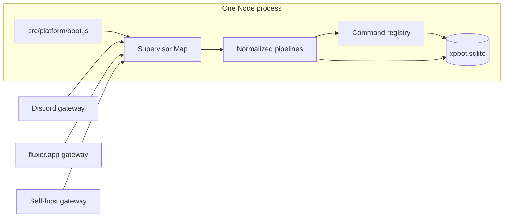
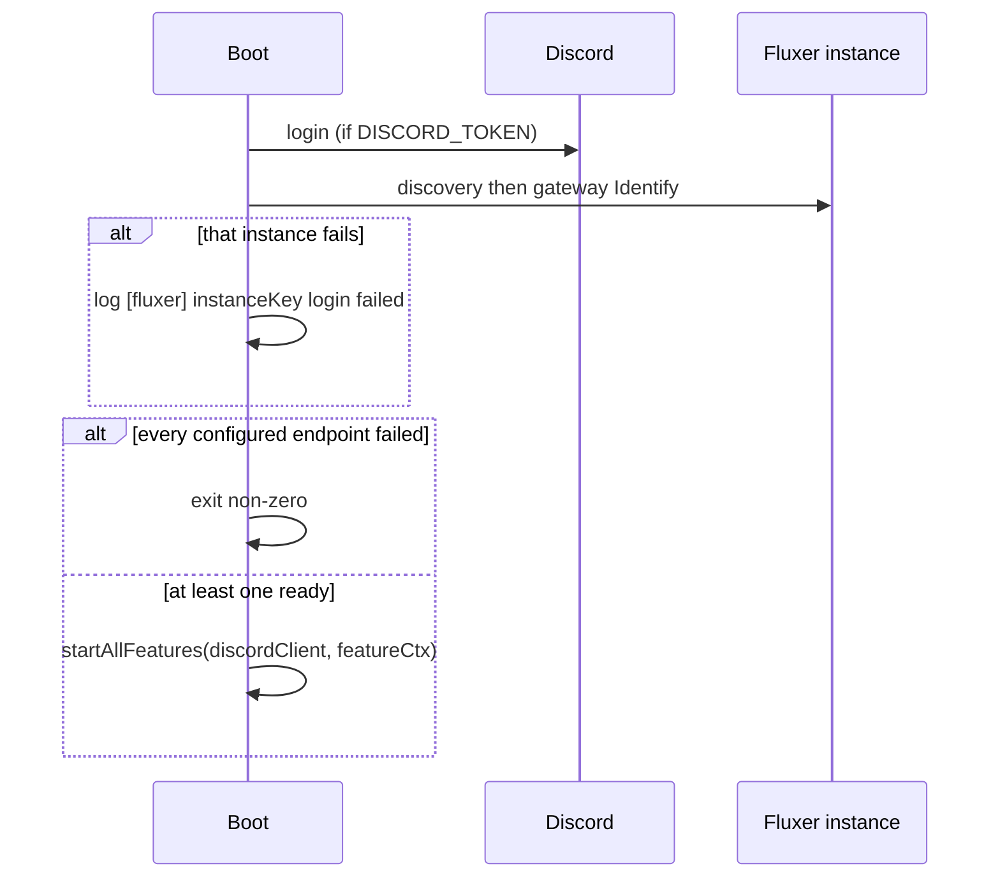

# Discord and Fluxer as service endpoints

| | |
|---|---|
| Author | Boiler Snake |
| Date | 2026-09-25 |
| Status | **Shipped — PRs 1–11 landed 2026-09-29 → 2026-10-01 (v1.30.0 / v1.30.1)**. Implementation lives in `src/platform/` (shared `CommandContext`/community/snowflake + `discord/` and `fluxer/` adapters); operator guide is `docs/fluxer.md`. Still open: the § "Phase 0 open items" live-verification list — voice XP and elevated actions (role writes, channel creates, bans) stay flag-gated OFF until their items are recorded. |
| Supersedes | The 2026-09-24 research draft that previously lived in this file. That research is retained; its open decisions (old §9.10) are closed here. |
| Migration id | **Not 031.** `031` is reserved by gork STE (`roadmap/gork.md` §7.20, `roadmap/index.md` §8). Highest shipped migration is `033_gork_summarize_input_tokens`. This work uses the next free id **other than 031**. With the tree as of this date, that file is `src/db/migrations/034_communities.js`. If a higher id has landed and is not 031, use that next integer instead. Do not hardcode 031. **Shipped as `034_communities` (`0980d47`, 2026-09-29).** |

---

## Overview

Boiler Snake is a single Node process with one SQLite file and one Discord.js client (`src/index.js`, `src/client.js`). Every guild-scoped row is keyed by a bare Discord snowflake (`guild_id TEXT`). Fluxer is close to Discord on the wire and not close enough to retarget `discord.js`: there are no slash commands, message components, ephemeral replies, threads, guild scheduled events, or application-command permission overwrites. Snowflakes are unique per deployment, permission masks are unsigned 64-bit decimal strings, and voice is LiveKit.

This spec turns that into an implementable adapter. One process may run the Discord client plus N Fluxer clients (official `https://fluxer.app` and self-hosted instances share one adapter). Product code talks to a `CommandContext` and an outbound client looked up by internal `communities.id`. Discord stays slash commands. Fluxer is prefix-only. Nothing is bridged, and no account is linked across platforms. *(Superseded for linking by [account-linking.md](account-linking.md), 2026-10 — user-driven account linking with mirror sync, scoped to bridge-paired communities. The adapter itself still relays nothing; this statement stands as the adapter's history.)*

`@fluxerjs/core` is not a dependency until a Phase 0 spike proves the pinned build loads from this CommonJS tree and is Apache-2.0. **Proven 2026-09-29: `@fluxerjs/core@3.1.0` loads via both `require()` and ESM `import()` from a CommonJS entrypoint, LICENSE text is Apache-2.0 — K6 gate is OPEN for PR 6.** `ClientCluster` is beta and is not used. The v1 supervisor is a `Map` of clients.

---

## Background & Motivation

### Current state

Boot is one client. `assertRuntimeEnv` in `src/config.js` requires `DISCORD_TOKEN` and nothing else. `src/index.js` constructs that client, registers feature events, registers the ordered pipelines in `src/bot/pipelines.js`, and on `ClientReady` calls `startAllFeatures`. `InteractionCreate` goes to `handleInteraction` in `src/commands/router.js`, which switches on autocomplete, modal submit, button, and chat input. Chat input applies `commandsAllowed` (`src/core/permissions.js`) and then the feature handler.

Handlers take a Discord `ChatInputCommandInteraction`. There is no platform seam. About 56 files under `src/` import `discord.js`. The product core (XP math, repositories, cooldowns, staff-role policy, the scheduler) does not, but every command, ticker post, role edit, and web tier check does.

Guild identity is the snowflake. `users`, `guild_settings`, `staff_roles`, tickets, gork tables, and the web route `/g/:guildId` all use it. `web_sessions.user_id` (`src/db/migrations/028_web_sessions.js`) is a Discord user id with no platform. `getTicketByChannel` (`src/db/repositories/tickets.js`) looks up `channel_id` globally, and `tickets.channel_id` is `UNIQUE`. `src/features/logs/auditLog.js` caches deleted-message bodies by `message.id` alone. Cooldown, gork queue, reaction-role pending, honeypot ban-in-flight, activity backfill, and the web member-fetch queue all key in-memory maps by that same bare guild snowflake.

Web login (`src/web/auth/login.js`) is Discord OAuth: `identify` + `guilds` + `guilds.members.read`, no PKCE, no refresh. The access token is stored encrypted on the session (`030_web_session_tokens.js`) and is expected to die with the 7-day absolute session cap. `guildAccess.js` already compares permission masks with `BigInt` because `/users/@me/guilds[].permissions` is a decimal string. That helper is the right shape for Fluxer masks. The scope it depends on, `guilds.members.read`, does not exist on Fluxer.

### Pain

A Discord server and a Fluxer community are different guilds even when the snowflake matches. Discord and Fluxer share the 2015-01-01 epoch and the `>> 22` shift, so collisions are possible across platforms, not only across two self-hosts. A second client pointed at the same tables would merge XP, notes, and tickets. Pointing `discord.js` at a Fluxer base URL fails closed on the first interaction, component, or unsafe integer mask (see Alternatives).

### What this design does not redo

The draft's API research (2026-09-24) is the source for Fluxer behavior cited below. Where this spec names an HTTP path, it was re-read on 2026-09-25 from the public API reference because the draft omitted the path. Live bot behavior is still unproven. Phase 0 is a spike, not a product release.

---

## Goals & Non-Goals

### Goals

- A Discord-only `.env` (today's `DISCORD_TOKEN` plus optional vars) boots and behaves as it does now, including `npm test` and `npm run register`.
- Boot requires at least one platform. Discord and each Fluxer instance log in independently. One failed login does not kill the others. The process exits only when every configured endpoint failed, or when a migration throws.
- Official fluxer.app and a self-host use the same adapter. The official instance is the deployment whose configured origin is `https://fluxer.app`.
- Settings, XP, staff data, tickets, and web sessions do not cross `(platform, instance_key)`.
- Prefix commands on Fluxer call the same handlers as Discord slash commands, through `CommandContext`, for the command set named in this spec.
- Sensitive replies that are ephemeral on Discord are DMed on Fluxer. A failed DM does not fall back to posting the body.
- Operator docs in `docs/` are written only after the phase they describe has shipped, and do not relative-link outside `docs/`.

### Non-goals

- Bridging or mirroring messages between Discord and Fluxer, or between Fluxer instances.
- One Boiler Snake user identity that spans platforms. No account linking. *(Superseded by [account-linking.md](account-linking.md), 2026-10 — user-driven account linking with mirror sync. There is still no merged identity: links are 1:1 rows between community-scoped accounts, and XP mirrors as separate rows. Original non-goal preserved as design history.)*
- Playing audio into Fluxer voice. Lavalink stays Discord-only. `@fluxerjs/voice` is not a v1 dependency.
- Emulating slash pickers, ephemerals, buttons, selects, or modals on top of plain messages.
- Retargeting `discord.js` `RESTOptions.api` at Fluxer.
- Running or fully documenting a Fluxer server (upstream operator guide covers that).
- Changing Discord slash command behavior, picker visibility, or the Discord OAuth login flow, except where a shared schema column gains a default (`platform=discord`) or an optional slash option is added (`leaderboard` `page`).
- A compatibility read that treats a bare snowflake as a guild key once two platforms can exist.

---

## Key Decisions

| # | Decision | Rationale |
|---|----------|-----------|
| K1 | Fluxer prefix defaults to `!`, overridable with `FLUXER_COMMAND_PREFIX`. A leading `/` is accepted only when the operator sets it. | A future Fluxer application-command implementation would collide with `/`. Discord is unaffected and stays slash commands. |
| K2 | Output that is ephemeral on Discord is sent by DM on Fluxer. If DMs are disabled or the DM send fails, the channel reply is the specific error and **does not** contain the sensitive body. | Fluxer has no ephemeral flag (message flags are `SUPPRESS_EMBEDS`, `SUPPRESS_NOTIFICATIONS`, `VOICE_MESSAGE`). Posting notes, warning detail, userinfo, or `/warn export` in channel is a leak. `/xp` is ephemeral today (`handleXp` → `replyEphemeral` in `src/features/xp/index.js`), so it follows this rule even though the draft called it a public channel reply. Leaderboard and ticker posts are not ephemeral and stay in channel. |
| K3 | Internal `communities.id` (`INTEGER PRIMARY KEY AUTOINCREMENT`) is the only guild key repositories accept. There is **no** ongoing read that resolves a bare snowflake. | A fallback that accepts either form makes the "two communities, one snowflake" test a lie: the snowflake path returns whichever row was inserted first. Prefixed strings (`fluxer:origin:id`) avoid a migration and then live in every query forever. The cutover is one PR, before any Fluxer write. |
| K4 | One process, N clients, one SQLite file. Two containers are an ops choice and require two data directories. Do not point two processes at one SQLite file. | Matches the product goal. WAL across two processes on one file is corruption, not isolation. |
| K5 | Discord stays slash commands (`SlashCommandBuilder`, `src/commands/register.js`). Fluxer dispatch is prefix only and is not registered with Discord. | Fluxer has no application-command API. `npm run register` stays a Discord REST client. |
| K6 | `@fluxerjs/core` is not added to `package.json` until Phase 0 passes. The supervisor is `Map<instanceKey, handle>`, not `ClientCluster`. | The SDK is ESM; this package is CommonJS (`package.json` has no `"type": "module"`, engines `node >= 22.22.2`). `ClientCluster` is documented as beta. A failing spike must not leave the dependency in tree. |
| K7 | Event reminders and music are Discord-only. Their jobs no-op for Fluxer communities. They must not throw. | No guild scheduled events. Voice is LiveKit; Lavalink cannot speak it (`src/features/music/`). |
| K8 | Elevated Fluxer actions (role add/remove, channel create, permission overwrites, bans, and therefore level roles, ticket channels, honeypot bans) ship behind a per-instance flag set from Phase 0. If a bot is subject to `TWO_FACTOR_REQUIRED`, those actions stay off and message XP still runs. Voice XP ships only if Phase 0 shows other members' voice states include channel id and mute/deafen. Otherwise the voice job skips Fluxer communities. | Both facts are unverified. Guessing "bots are exempt" and assigning roles that 400 is worse than a named fallback. Guessing "mute is false" would farm voice XP. **Phase 0 status (2026-09-29): voice unrecorded (window skipped) and MFA unexercised (test community `mfa_level: 0`) — both flags stay unset: voice tickers skip Fluxer, elevated actions stay OFF. Open items 1–3 in the Phase 0 results list close these.** |
| K9 | Web admin Fluxer login is a second provider, not a change to the Discord grant. Cookie `web_session` stays the Discord session. Fluxer uses `web_session_fx`. Scopes are `identify` and `guilds` only. PKCE S256. Refresh rotates before the 7-day access expiry. Staff tier does not call `guilds.members.read`. | Fluxer's scope registry has no member-role scope. Discord's shipped login (`src/web/auth/login.js`, migration 030) has no refresh and must not gain one as a side effect. |
| K10 | The Fluxer adapter consumes a structured mentions array. It does not scrape Discord markup `<@id>`, `<@&id>`, `<#id>` out of content. `sanitizeAnswer` (`src/features/gork/sanitize.js`) remains the outbound rewrite for gork. | Mention syntax was not verified from this repo. Scraping Discord tokens will mis-parse a platform that uses different content. |
| K11 | One Fluxer web session at a time. The only Fluxer cookie is `web_session_fx`. Logging into a second Fluxer instance rotates that session (new opaque id, old row deleted) and does not touch Discord's `web_session`. There is no per-instance cookie. | Simultaneous Fluxer identities in one browser are not a v1 requirement. One cookie keeps CSRF and logout on the existing single-session path. N cookies (`web_session_fx_<slug>`) are out of scope. |

---

## Proposed Design

### Topology



```
src/platform/
  boot.js                  # assert at least one endpoint; start each; exit if all fail
  context.js               # CommandContext, ReplyPayload, OutboundClient typedefs
  community.js             # ensureCommunity / getCommunity; the only external-id lookup
  snowflake.js             # snowflakeTimeMs(id, platform) — shift 22, epoch 1420070400000 for both today
  discord/client.js        # move of src/client.js; src/client.js re-exports
  discord/context.js       # CommandContext from a real ChatInputCommandInteraction
  discord/outbound.js      # OutboundClient over discord.js
  discord/normalize.js     # discord.js Message / Reaction → normalized events
  fluxer/discovery.js      # GET {origin}/.well-known/fluxer
  fluxer/client.js         # dynamic import of @fluxerjs/core; one client per instanceKey
  fluxer/context.js        # CommandContext from a normalized Fluxer message
  fluxer/commands.js       # prefix parse → registry command JSON
  fluxer/outbound.js       # send text / embeds / files; wire format owned here
  fluxer/permissions.js    # bigint channel permission mask
  fluxer/normalize.js      # gateway dispatch → normalized events
```

`src/client.js` remains a re-export of `createClient` so existing tests and `src/index.js` keep working until boot moves. Feature modules do not import `@fluxerjs/core`. The only production importer is `src/platform/fluxer/client.js`, and that file does not exist until Phase 0 passes.

### Boot

`assertRuntimeEnv` (`src/config.js`) today throws unless `DISCORD_TOKEN` is set. Replace that rule:

1. `FLUXER_INSTANCES` unset, empty, or `[]`, and `DISCORD_TOKEN` set: Discord-only. Identical to today.
2. `FLUXER_INSTANCES` malformed JSON, a missing `origin`, a missing `token`, a duplicate `instanceKey`, or an illegal URL: throw at boot even if `DISCORD_TOKEN` is set. Do not ignore a broken Fluxer block.
3. No `DISCORD_TOKEN` and zero valid Fluxer instances: throw `Missing a platform credential: set DISCORD_TOKEN or FLUXER_INSTANCES`.
4. `npm run register` (`src/commands/register.js`) is unchanged. It still requires `DISCORD_TOKEN` and `CLIENT_ID` and talks only to Discord. It does not read `FLUXER_INSTANCES`.

Per Fluxer entry:

| Field | Rule |
|---|---|
| `origin` | Absolute `http:` or `https:` URL. `http:` is rejected unless the host is loopback or `FLUXER_ALLOW_INSECURE=1`. This is the discovery origin, not a guessed API host. |
| `instanceKey` | Optional. Defaults to the normalized origin (lowercased host, explicit port kept, trailing slash stripped, path kept only if the operator wrote one). |
| `token` | Required, non-empty. Sent only as `Authorization: Bot <token>` to the discovered `api_public`, and inside the gateway Identify payload. Never logged. Format `<application_id>.<secret>` is not enforced. |
| `clientId` / `clientSecret` | Optional. Required only for the web login button for that instance. |
| `label` | Optional button label. Falls back to the origin. |

Discovery (`GET {origin}/.well-known/fluxer`, no credential, no token header):

- Require `endpoints.api_public` and `endpoints.gateway`.
- `api_public` scheme must be `http:` or `https:`. `gateway` scheme must be `ws:` or `wss:`. Anything else (`file:`, `javascript:`, missing scheme) is a hard failure for that instance.
- Join paths without dropping a prefix: if `api_public` is `https://example.com/api`, routes are under that prefix. Do not invent sibling hosts. Do not hardcode `api.fluxer.app`.
- A different host than `origin` is allowed. On the hosted service, `api` and `api_public` are different hosts. Log the instance key and the discovered API host and gateway host at info. Do not log the token, the discovery body beyond those two URLs, or query strings.
- Cache the document for the process lifetime. A failed discovery fails that instance's login only.

Login sequence:



Feature `start` / `registerEvents` stay isolated per feature (`src/features/load.js` already logs `[features] <name>.<hook> failed` and continues). Through PR 6 the first argument stays the Discord client, including `null` when Discord is not configured. PR 7 is what switches that argument to the supervisor, in the same change that updates every `start` / `registerEvents` body (see Scheduler and the PR plan). A Fluxer gateway error after boot is logged and reconnects that client only. It must not call `process.exit` and must not disconnect Discord.

Ready delivers unavailable guild placeholders. The adapter lazy-loads each guild before a ticker walks it. A guild that is still unavailable is skipped for that tick with one log line per guild per process (`[fluxer] <instanceKey> guild <externalId> still unavailable`). Phase 0 records the lazy-load request. Commands do one fetch and, on failure, reply with that error.

### Supervisor

```js
/**
 * @typedef {object} Supervisor
 * @property {import("discord.js").Client|null} discord
 * @property {Map<string, FluxerHandle>} fluxer  // instanceKey → handle; not ClientCluster
 * @property {(communityId: number) => OutboundClient|null} clientForCommunity
 */
```

`clientForCommunity` loads the `communities` row and returns the Discord outbound wrapper or `fluxer.get(row.instance_key)`'s outbound wrapper. A missing client returns `null`. Callers log and skip. They do not throw out of a scheduler tick (the scheduler already logs `[scheduler] <name> tick failed:` if they do; do not rely on that for an expected Fluxer gap).

`featureCtx` keeps the Discord client until the PR that updates every remaining reader (PR 7). Before that PR the object is:

```js
featureCtx = {
  client,                     // Discord client, or null when this process has no DISCORD_TOKEN
  supervisor,                 // added in PR 6; supervisor.discord === client
  registry,
  ensureHoneypotWarning,
}
```

`src/index.js` today builds `{ client, registry, ensureHoneypotWarning }` and passes that same `client` as the first argument of `registerAllFeatureEvents` / `startAllFeatures`. `load.js` calls `feature.start(client)` and `feature.registerEvents(client)`. Music handlers read `ctx.client` (`requireReady`, `playQuery`, `handleMusic` in `src/features/music/index.js`). Gork reads `const { client } = ctx` (`src/features/gork/index.js`). The integration harness builds the same shape (`test/helpers/harness.js`) and `test/integration/music.test.js` asserts `/play` starts a player. Deleting `client` or passing a supervisor into `start` / `registerEvents` before those call sites move breaks Discord boot and that test. PR 6 does not do either.

PR 7 is the cutover. After it, `featureCtx` is `{ supervisor, registry, ensureHoneypotWarning }` and the first argument to `start` / `registerEvents` is the supervisor. Every hook that touches that argument is updated in the same diff, including `src/features/web/index.js`. Music's legacy handlers and `registerEvents` use `supervisor.discord` (null takes the existing "Lavalink not configured" path, and `registerEvents` does not call `client.on` when that is null). Web `start` reads `supervisor.discord` for the existing Discord guild-cache provider, `bindAuditClient`, and `getClient`. It does not read `supervisor.guilds` (a supervisor has no such property; the 2026-09-17 incident is what happens when that lookup becomes `[]`). A null Discord client keeps today's empty-cache fallback. Gork no longer destructures `ctx.client`; that move is PR 5, and PR 7 depends on PR 5. `test/helpers/harness.js` updates `ctx` in PR 7, and `test/integration/music.test.js` stays green. A Fluxer command never reads the Discord guild cache; it uses `commandCtx.outbound` and `outbound.botUserId`.

### Normalized gateway events

One order. The table and the prose are the same order. Discord messages never enter the prefix branch: `parsePrefix` is null for them even when the content starts with `!`.

| Event | Order |
|---|---|
| MessageCreate | 1. message cache. 2. `parsePrefix` (Fluxer only). 3. pending reaction-role emoji **only when `parsePrefix` returned null**. 4. honeypot. 5a. if the line is a prefix command: record channel activity, dispatch, **no gork, no message XP**. 5b. if it is not: gork (detached), channel activity, message XP. |
| MessageReactionAdd | partials (Discord) → honeypot warning strip → reaction-role panels → reaction XP |
| MessageReactionRemove | reaction-role remove |

`handlePendingOptionEmojiMessage` (`src/features/reactionRoles/service.js`) returns `handled: true` for every message from a user who has a session, including text that is not an emoji, and today's pipeline (`src/bot/pipelines.js`) then returns before honeypot, gork, and XP. A Fluxer `!xp` during that 5-minute wait would be stored as a bad emoji. The new order does not call the pending handler when `parsePrefix` returns a command (including a known command with bad arguments). It also **clears** `pendingOptionEmoji` for that `(communityId, userId)` so the session does not eat the next message. A non-command during the wait still goes to the pending handler and can return early, as today.

Honeypot still runs before dispatch. A prefix line in a honeypot channel is a honeypot hit, not a command. That is stricter than Discord, where a slash command is not a message.

Step 5a: do not call `handleGorkMessage`. Do not call `tryAwardMessageXp`. Do call `recordUserChannelMessage` (every human message counts, and a prefix line is one). A usage error is still a command: reply with the usage text, no gork, no XP. `tryAwardMessageXp` also takes `isPrefixCommand` and returns immediately when it is set. That flag is a backstop for a later caller, not the thing that skips gork. Gork is skipped because step 5a never starts it. Today's pipeline fires gork detached and does not await it (`src/bot/pipelines.js`); a check that runs after that call cannot undo it.

A bare prefix (`!` with nothing after it) makes `parsePrefix` return null. It can earn XP and can be swallowed by a pending emoji session.

Fluxer reaction payloads are one object, not `(reaction, user)`. `fluxer/normalize.js` produces a `NormalizedReaction`. It does not hand features a discord.js `MessageReaction`. Phase 0 records the payload's field names; the adapter maps them onto this typedef. If a required field is absent, the reaction pipeline returns without awarding XP and logs the missing field.

```js
/**
 * @typedef {object} NormalizedMessage
 * @property {"discord"|"fluxer"} platform
 * @property {string} instanceKey
 * @property {number} communityId
 * @property {string} externalGuildId
 * @property {string} id
 * @property {string} channelId
 * @property {string} authorId
 * @property {boolean} authorBot
 * @property {string} content
 * @property {{ users: string[], roles: string[], channels: string[] }} mentions
 * @property {{ name: string, url: string }[]} attachments
 * @property {Date|null} createdAt
 */

/**
 * What handleReactionRoleAdd / handleReactionRoleRemove actually read
 * (src/features/reactionRoles/service.js): message id, channel id, emoji
 * identity, and whether the reacting user is a bot. Mutations go through
 * OutboundClient, not reaction.users.remove / message.react.
 * @typedef {object} NormalizedReaction
 * @property {number} communityId
 * @property {string} externalGuildId
 * @property {string} messageId
 * @property {string} channelId
 * @property {string} userId
 * @property {boolean} userBot
 * @property {string} emojiKey   // the panel's emoji_key; unicode or custom id
 */
```

`normalizeDiscordMessage` reads the duck fields the integration mocks already build (`test/helpers/discord.js`: `guild`, `author`, `content`, `id`, `attachments`). `onMessageCreate(outbound, message)` takes the normalized object. The same PR updates call sites and tests. Discord behavior of the pipeline does not change, except that a message is not both a command and a gork trigger, which only Fluxer can do.

### CommandContext

`CommandContext` is a plain object. It is not a subclass of `ChatInputCommandInteraction` and it is not a shim that implements `isButton`, `showModal`, or `memberPermissions.has`. Discord-only router arms (autocomplete, modal submit, button) keep receiving the real interaction and keep using `src/commands/router.js` as they do now.

```js
/**
 * Second argument `required`: when true and the option is missing, throw
 * `Error("Missing required option: <name>")` before the handler body continues.
 * That is what discord.js does for `getUser("user", true)` and the rest.
 * Migrated call sites keep the flag. The Fluxer parser already rejects a
 * missing required option; the throw is the same backstop the router catches.
 *
 * @typedef {object} ResolvedUser
 * @property {string} id
 * @property {string} username
 * @property {boolean} bot
 *
 * @typedef {object} CommandOptions
 * @property {(name: string, required?: boolean) => string|null} getString
 * @property {(name: string, required?: boolean) => number|null} getInteger
 * @property {(name: string, required?: boolean) => number|null} getNumber
 * @property {(name: string, required?: boolean) => boolean|null} getBoolean
 * @property {(name: string, required?: boolean) => ResolvedUser|null} getUser
 * @property {(name: string, required?: boolean) => { id: string }|null} getRole
 * @property {(name: string, required?: boolean) => { id: string, type: number }|null} getChannel
 * @property {() => string|null} getSubcommand
 * @property {() => string|null} getSubcommandGroup
 */

/**
 * @typedef {object} ReplyPayload
 * @property {string} [content]
 * @property {NormalizedEmbed[]} [embeds]
 * @property {{ name: string, data: Buffer, contentType?: string }[]} [files]
 * @property {{ parse: never[] } | { users?: string[], roles?: string[] }} [allowedMentions]
 * @property {boolean} [sensitive]  // true → Discord ephemeral; Fluxer DM policy (K2)
 */

/**
 * @typedef {object} CommandContext
 * @property {"discord"|"fluxer"} platform
 * @property {string} instanceKey
 * @property {number} communityId
 * @property {string} externalGuildId
 * @property {string} channelId
 * @property {string} userId
 * @property {ResolvedUser} user          // the invoker; /xp uses getUser("user") ?? user
 * @property {string} commandName
 * @property {string|null} subcommandGroup
 * @property {string|null} subcommand
 * @property {CommandOptions} options
 * @property {bigint} channelPermissions   // channel-scoped mask; see Permissions
 * @property {string[]} memberRoleIds
 * @property {boolean} guildOwner
 * @property {boolean} deferred
 * @property {boolean} replied
 * @property {(payload: ReplyPayload|string) => Promise<void>} reply
 * @property {(payload: ReplyPayload|string) => Promise<void>} editReply
 * @property {(payload: ReplyPayload|string) => Promise<void>} followUp
 * @property {(opts?: { sensitive?: boolean }) => Promise<void>} defer
 * @property {OutboundClient} outbound
 */
```

`NormalizedEmbed` is `{ title, description, url, color, fields: [{ name, value, inline }], footer, timestamp, author: { name } }`. The Discord adapter maps that to `EmbedBuilder`. The Fluxer adapter maps it to the wire shape Phase 0 confirms. Handlers stop constructing `EmbedBuilder` once they are migrated. Until a handler is migrated it is Discord-only (see handler migration below) and may keep `EmbedBuilder`.

#### How handlers use Discord today (grouped)

Inventory of `interaction.*` and `ctx.client` across feature handlers. Not a file list.

| Group | What the code does | CommandContext |
|---|---|---|
| Identity | `guildId`, `guild`, `channelId`, `channel`, `user`, `member`, `member.roles.cache`, `commandName`, `client` / `ctx.client` | `communityId` + `externalGuildId` + `channelId` + `user` (`{ id, username, bot }`) + `memberRoleIds` + `outbound`. Contextual handlers use `outbound`, not `ctx.client`. `featureCtx.client` stays until PR 7 so music and any unmigrated reader keep working. `guild.id` is no longer a repository key. |
| Options | `options.getSubcommand`, `getSubcommandGroup`, `getUser(name, true)`, `getString(name, true)`, `getInteger`, `getBoolean`, `getChannel(name, true)`, `getRole`, `getNumber`. Then `target.bot` / `target.username` (`handleGrantXp`, `handleAdd` in staff notes, warnings, userinfo, gork, ticket create). | Same getters, including the required flag. `getUser` returns `{ id, username, bot }`. `bot` is a boolean from the gateway user object or from `fetchUser` before the handler (see Prefix grammar). It is never left `undefined`, so `if (target.bot)` still skips bots. |
| Reply | `reply`, `editReply`, `followUp`, `deferReply({ flags: 64 })`, `replyEphemeral` / `MessageFlags.Ephemeral` / `flags: 64` | `reply` / `editReply` / `followUp` / `defer`. `sensitive: true` replaces the ephemeral flag. |
| Files | `AttachmentBuilder` for the leaderboard PNG (`src/features/xp/index.js`) and `/warn export` markdown (`src/features/warnings/handlers.js`) | `files: [{ name, data }]`. |
| Embeds | `EmbedBuilder` / `baseEmbed` on settings, warns, userinfo, audit | `embeds: NormalizedEmbed[]`. |
| Mentions | `allowedMentions: { parse: [] }` (gork, reaction-role panels) or a role id on YouTube/Twitch/GitHub pings | Same object. The adapter applies it. |
| Permissions | `memberPermissions.has(ManageGuild)`, then `memberHasStaffRole(guildId, roleIds)` | `channelPermissions` bigint plus `memberRoleIds`. Gates in `src/core/permissions.js` gain `*FromContext` variants. The interaction variants stay until every Discord handler has moved. |
| Deferred edit | `deferReply` then `editReply` (github check, twitch add, ticket create, staff sync) | `defer` records intent only (no placeholder message — Fluxer has no deferred ephemeral surface, and a `Working…` message was never shipped). The first `editReply` **is** the reply, sent to the destination the `sensitive` tone selects (DM if sensitive, otherwise the channel); later `editReply` calls PATCH that sent message. Shipped 2026-10-02 via PR #166. |

#### What stays Discord-only

The router keeps these on the real interaction. Fluxer has no equivalent, and v1 does not invent one.

| Router arm | Registry | Examples |
|---|---|---|
| Autocomplete | `registry.autocomplete` | `github`, `youtube`, `twitch`, `eventreminder` |
| Modal submit | `modalHandlers` prefixes | `note:add:`, `note:edit:`, `tk:create`, `tk:snm:`, `er:create:`, `er:edit:` |
| Button | `buttonHandlers` prefixes | `lb:`, `ui:`, `music:`, `tk:open`, `tk:sn:`, `er-recur:` |

There is no select-menu handler in `src/` today. Do not add a Fluxer path for one.

`interaction.deferUpdate` / `interaction.update` exist only on the button arm (leaderboard paging, music controls). They are not `CommandContext` methods.

#### Handler migration rule

Each feature handler is either legacy or contextual:

- Legacy: `(interaction, featureCtx)`, Discord router only, not listed in Fluxer help.
- Contextual: `(commandCtx, featureCtx)`, registered for Fluxer only if the command's Fluxer row in the matrix says yes.

`registry.registerHandler` today stores a bare function (`src/commands/registry.js`, filled by `src/features/load.js`). The flag has to live in the registry or the router has nowhere to read it. Change the signature to `registerHandler(name, fn, { api })` where `api` is `"context"` or `"interaction"`. Default `"interaction"`. `load.js` passes `feature.handlerApi?.[name]`. The registry stores `Map<string, { fn, api }>`. `getHandler` still returns `fn`. `getHandlerApi(name)` returns the string. The router reads `getHandlerApi`. It does not sniff `function.length`. Unflagged handlers keep today's `(interaction, featureCtx)` call. A Fluxer dispatch that reaches `api !== "context"` replies `That command is not available on Fluxer yet.` and does not call it. No wrapper constructs a fake `Interaction`.

#### Outbound client (what tickers need)

```js
/**
 * @typedef {object} OutboundClient
 * @property {"discord"|"fluxer"} platform
 * @property {string} instanceKey
 * @property {(communityId: number) => Promise<{ id: string, name: string, ownerId: string|null, afkChannelId: string|null }|null>} fetchGuild
 * @property {(communityId: number, channelId: string) => Promise<ChannelHandle|null>} fetchChannel
 * @property {string} botUserId   // Ready user id. Not client.user. Tickets and honeypot use this.
 * @property {(communityId: number, userId: string) => Promise<{ id: string, username: string, bot: boolean }|null>} fetchUser
 * @property {(communityId: number, userId: string) => Promise<MemberHandle|null>} fetchMember
 * @property {(communityId: number) => Promise<RoleHandle[]>} fetchRoles
 * @property {(channelId: string, payload: ReplyPayload) => Promise<{ ok: true, id: string }|{ ok: false, error: string }>} sendChannel
 * @property {(userId: string, payload: ReplyPayload) => Promise<{ ok: true, id: string }|{ ok: false, error: string }>} sendDm
 * @property {(ref: { communityId: number, channelId: string, messageId: string }, payload: ReplyPayload) => Promise<{ ok: true }|{ ok: false, error: string }>} editMessage
 * @property {(communityId: number, userId: string, roleId: string) => Promise<{ ok: true }|{ ok: false, error: string, code?: string }>} addRole
 * @property {(communityId: number, userId: string, roleId: string) => Promise<{ ok: true }|{ ok: false, error: string, code?: string }>} removeRole
 * @property {(channelId: string, messageId: string, emojiKey: string) => Promise<{ ok: true }|{ ok: false, error: string }>} addReaction
 * @property {(channelId: string, messageId: string, emojiKey: string, userId: string) => Promise<{ ok: true }|{ ok: false, error: string }>} removeUserReaction
 * @property {(channelId: string, messageId: string, emojiKey: string) => Promise<{ ok: true }|{ ok: false, error: string }>} removeEmojiReaction
 * @property {(args: CreateChannelArgs) => Promise<{ ok: true, id: string }|{ ok: false, error: string, code?: string }>} createChannel
 * @property {(channelId: string, overwrites: ChannelOverwrite[]) => Promise<{ ok: true }|{ ok: false, error: string, skipped: { id: string, reason: string }[] }>} setOverwrites
 * @property {(communityId: number, userId: string, reason: string) => Promise<{ ok: true }|{ ok: false, error: string, code?: string }>} banMember
 * @property {(channelId: string, query: { before?: string, after?: string, limit: number }) => Promise<{ ok: true, messages: NormalizedMessage[] }|{ ok: false, error: string }>} fetchMessages
 */
```

`MemberHandle` is `{ id, username, bot: boolean, roleIds: string[] }`. `RoleHandle` is `{ id, name, position, permissions }` where `permissions` is a **decimal string**, never a JS number. `fetchUser` / `fetchMember` always include `bot`. `ChannelHandle` exposes `id`, `type` (numeric channel type), and `permissionOverwrites` for the mask calculator. Features do not call `channel.send`; they call `sendChannel`.

`ChannelOverwrite` is `{ id: string, kind: "role"|"member", allow: string, deny: string }`. `allow` and `deny` are decimal strings. Do not pass `PermissionFlagsBits` JS numbers into Fluxer once a mask can hold bit 54 (`VIEW_CHANNEL_MEMBERS`). The Discord adapter may still OR `PermissionFlagsBits` locally, because those values fit in a safe integer, and it converts to a decimal string only at the Fluxer boundary. `CreateChannelArgs` is `{ communityId, name, parentId: string|null, type: number, overwrites: ChannelOverwrite[] }`. Ticket create (`src/features/tickets/helpers.js` `guild.channels.create`) and `BOT_ALLOW` in `src/features/tickets/overwrites.js` call `createChannel` / `setOverwrites`. The bot overwrite's `id` is `outbound.botUserId`. Honeypot bans call `banMember`. On the **Fluxer** outbound only, when that community's `elevated_permissions` is 0, `createChannel`, `setOverwrites`, `addRole`, `removeRole`, and `banMember` return `{ ok: false, error, code: "elevated_disabled" }` and do not hit the network. The Discord outbound ignores the column.

`fetchMessages` is the history call activity backfill (`src/features/userActivity/backfill.js`) and gork `read_history` use. `limit` is the page size (backfill uses 100). `before` / `after` are message ids. Each returned message has `id`, `authorId`, `authorBot`, `content`, `createdAt`. Phase 0 confirms the deployment accepts `before` and `after`. If it does not, the method returns `{ ok: false, error }` and backfill stops for that community with that error logged. It is not left as an unnamed `messages.fetch`.

Reaction-role panels call `addReaction`, `removeUserReaction`, and `removeEmojiReaction` instead of `message.react`, `reaction.users.remove`, and `message.reactions.cache`. Emoji identity is `emojiKey`, the same string stored on `reaction_role_options`. A failed react returns `{ ok: false, error }` and the service reports that string the way it already reports a Discord react failure. This is why the feature matrix can mark reaction-role panels as Fluxer v1.

`awardXp` (`src/services/awardXp.js`) today takes `(client, { guild, userId, ... })`, uses `guild.id` as the repository key, and calls `guild.members.fetch` plus `syncMemberRoles`. The communities PR changes that signature. There is no later PR in which Fluxer XP still receives a Discord `Guild`.

```js
awardXp(outbound, {
  communityId,          // assertCommunityId
  externalGuildId,
  userId,
  delta,
  activityKind,
  member: null,         // MemberHandle already in hand, or null
  levelXpFactor: null,
  source: "xp_sync",
})
```

`addXp` / `logActivity` take `communityId`. Role sync uses `outbound.addRole` / `removeRole`. The skip is platform-scoped:

- `outbound.platform === "discord"`: always fetch the member and call `syncMemberRoles`, exactly as `awardXp` does today. Do not read `elevated_permissions`. Backfill leaves that column at 0 on every existing Discord row, and that 0 must not stop Discord level-role grants or removals on message XP, reaction XP, voice, decay, or `/grantxp`.
- `outbound.platform === "fluxer"` and the community's `elevated_permissions` is 0: skip role sync, return `{ newXp, level, changes: null }`, and log once per community: `[fluxer] <instanceKey> role sync disabled: <reason>`. Do not build a Discord `Guild` and do not call `guild.members.fetch`.
- `outbound.platform === "fluxer"` and the flag is 1: role sync runs through the Fluxer outbound.

Message and reaction XP in PR 6 hit the second branch, because new Fluxer rows also start at 0. They do not hit the first.

Services return `{ ok: false, error }`. They do not call `interaction.reply` and they do not throw for expected platform failures (HTTP status, MFA, missing guild). Programmer errors may still throw; the router catches those.

### Prefix grammar

Options are **named**, not positional. `setxp` has six optional integers in declaration order (`message`, `reaction`, `voice`, `msgcooldown`, `reactioncooldown`, `factor` in `src/features/xp/index.js`). A positional parser turns `!setxp message 5` into an integer parse of the token `message`. `warn add` (`src/features/warnings/commands.js`) has required `user` and `reason`, then optional `silent`, `note`, `message`, `evidence`, `expires_days`. A positional parser cannot set `silent` without also consuming `reason`'s followers, and it cannot skip a non-trailing optional. Named pairs are the grammar the tests and the help lines use. There is no `--flag` form and no positional fallback: `!setxp 5` is a usage error because `5` is not an option name.

The command tree is the registry's existing JSON (`registry.commands`, from `SlashCommandBuilder.toJSON()`), plus the Fluxer-only overlay below. Fluxer does not register either with Discord. Subcommand groups and subcommands are still bare tokens, because they are not options. Option names, `required`, `min_value` / `max_value`, `min_length` / `max_length`, `choices`, and `channel_types` come from that JSON.

Fluxer-only overlay (not added to any `SlashCommandBuilder`, so Discord slash JSON gains only `leaderboard`'s `page`):

| Command | Extra or tightened options |
|---|---|
| `help` | Synthetic. Not in the registry. Matched in step 4, then step 4b. Step 6 does not run. |
| `userinfo` | Slash JSON has only required `user` (`src/features/userinfo/index.js`). Overlay adds optional `view` (string choice `overview` \| `notes` \| `warnings` \| `activity-channels` \| `activity-categories`, default `overview`), optional `window` (string choice `a` \| `7` \| `30` \| `90`, the same set as `normalizeWindow` in `src/features/userActivity/service.js`, default `a`), optional `page` (integer, min 1, default 1). Activity views still call `requireSeniorStaff`. These names are not "undeclared"; the overlay is part of the grammar. |
| `note add`, `note edit` | Slash `content` is optional, and `handleAdd` calls `showModal` when it is null (`src/features/staffNotes/index.js`). On Fluxer the overlay sets `content` **required**. The parser rejects a missing `content` before the handler, so the modal branch is never taken. Discord behavior is unchanged. |

Algorithm:

1. Trim leading whitespace. If `content` does not start with the configured prefix (case-sensitive, literal, not a regex), return null. Default prefix `!`. `FLUXER_COMMAND_PREFIX` is 1–8 characters, must not contain whitespace, and must not contain `<` or `>`. `/` is valid only as an explicit value.
2. Strip the prefix. Empty remainder → null (not a command).
3. Tokenize on ASCII whitespace. A double-quoted span is one token. `\\` escapes the next character inside quotes. An unclosed quote is a usage error only after step 4 has matched a command; otherwise return null.
4. Token 0 is the command name, compared case-insensitively. If it is `help`, it is the synthetic help command (a command: no XP, no gork). `!help` is not looked up in the Discord registry and is not null. Go to step 4b. Do not run steps 5 or 6. Otherwise match a registry name. No match → null (the message can earn XP). Do not reply "unknown command".
4b. Help arguments are bare tokens, never `name value` pairs. Take at most two of them:
    - `!help` — no further tokens. List commands.
    - `!help warn` — token 1 is the command name.
    - `!help warn add` — token 1 is the command, token 2 is the subcommand (or the subcommand group, when that command has groups: `!help honeypot channel` shows the `channel` group and its subcommands).
    A third bare token is allowed only when token 1 is a command that has subcommand groups and token 2 is a group name (`!help honeypot channel add`). A fourth token, or a third token that is not that shape, is not a name/value usage error. The reply is the help line for token 1 (`Unknown help topic.` plus that command's summary when token 1 matched). An unknown command name is the same kind of line (`No command warnx.`), not a usage error and not null. A Discord-only command (`eventreminder`, `play`, `music`, `ticket panel`) prints the Discord-only line. These parses are still the `help` command, so they do not earn XP.
5. If the matched command has a subcommand group, the next token must be that group name. If it has subcommands, the next token must be the subcommand name. A missing or unknown group/subcommand is a usage error (the line **is** a command: no XP, no gork) and the reply is the help block for that command. These tokens are not `name value` pairs. This step does not run for `help`.
6. Remaining tokens are `name value` pairs. This step does not run for `help`. `help` has no options, so a leftover bare token must not be read as an option name. The name is an option `name` from the slash JSON or the overlay, case-insensitive. The value is the next token.
   - An unknown name, a duplicate name, or a trailing name with no value is a usage error.
   - A required option (slash JSON, or the overlay) that was not named is a usage error.
   - An omitted optional is null. Omitting `reaction` while passing `message` is how a non-trailing optional is skipped. There is no skip token.
   - A string value is exactly one token. Multi-word text is quoted (`reason "too many words"`). The rest of the line is **not** consumed, so `silent true` after a quoted reason still parses. `min_length` and `max_length` from the JSON are both enforced (`gork keyword` sets `setMinLength(1)` in `src/features/gork/commands.js`).
   - `integer`: `/^-?\d+$/`, a safe integer, within `min_value` / `max_value`. Out of range names the bound.
   - `number`: finite float, within min/max (`setdecay` percent is the only `addNumberOption`).
   - `boolean`: `true|false|yes|no|on|off|1|0`, case-insensitive.
   - `string` choices: accept a choice `value` or `name` case-insensitively and store the `value`.
   - `user`, `role`, `channel`: see mentions. `channel_types` from the builder (`addChannelTypes` on ticket category vs text, and on `activityconfig ignore`) is checked against the channel's numeric `type` after the id resolves. A type not in the list is a usage error naming the option and the type. Fluxer types that coincide with Discord's enum are text `0`, voice `2`, category `4`. A Fluxer channel whose type is not in the option's list is rejected. If the channel is not cached, `fetchChannel` once; a fetch failure is `Could not resolve channel <id>: <error>`, not a silent accept.
7. A user option's `ResolvedUser.bot` is taken from the mentions entry or the message author when the id is that author. A bare id that is not in the payload is passed through `fetchUser` before the handler. If the fetch fails, reply `Could not resolve user <id>: <error>` and do not call the handler. Do not default `bot` to false. `commandCtx.user` is the author from the gateway event and already has `username` and `bot`, so `!xp` with no `user` option does not fetch.

#### Mentions (K10)

The parser never searches content for `<@id>`, `<@&id>`, or `<#id>`.

`normalize.js` fills `message.mentions` from the gateway payload's structured arrays. Phase 0 writes the actual field names into `roadmap/fluxer.md`. **Recorded 2026-09-29: `mentions` (user objects), `mention_roles` (id strings), `mention_channels` (`{id, name, mention_string, ...}`), `mention_everyone` (bool) — there is no `mention_users` field.** Until those names are known, the normalizer reads, in order, the first of these that is an array: `mentions` / `mention_users` (user ids), `mention_roles` (role ids), `mention_channels` (channel ids). Missing arrays are empty. A token that is only Discord markup is **not** decoded.

For a `user` option the value is the `name`'s value token, resolved as:

1. A bare decimal token of **5–20 digits** (production snowflakes are 17–20; 5 is the same floor as `URL_ID_RE`). `42` is not a user id. Integration-harness ids such as `user-member-1` (`test/helpers/fixtures.js`) are not prefix tokens; prefix unit tests use decimal ids.
2. Or, when the token is not a bare decimal and `mentions.users` is non-empty, the next unused id in that array. The id is stored as the gateway sent it. It is not re-checked against 5–20 digits.

Same rule for roles (`mentions.roles`) and channels (`mentions.channels`). A markup-shaped token (`<@123>`) with an empty mentions array is a usage error: `Pass a user id. This bot does not read mention markup in the command text.` The parser does not extract `123` from that token.

#### XP exclusion

Slash commands are not messages, so they never reach `tryAwardMessageXp`. A Fluxer `!xp` would. The MessageCreate order above is the exclusion: step 5a does not start gork and does not call `tryAwardMessageXp`. `tryAwardMessageXp(..., { isPrefixCommand: true })` returns immediately and does not write a cooldown key. That flag is a backstop, not a substitute for skipping gork. `!help` is a command (step 4) and does not earn XP.

#### Command-channel allow-list

`commandsAllowed` (`src/core/permissions.js`) moves to inputs `(commandName, communityId, channelId, isAdmin)`:

- No rows in `allowed_command_channels` for the community → allow.
- Else the channel must be listed.
- `setcommandchannel` is allowed in any channel when `isAdmin` (Manage Guild bit or guild owner). Same lockout escape as today.
- `ticket` is allowed when `getTicketByChannel(communityId, channelId)` returns a row with `archived !== 1`. The lookup is no longer global on `channel_id`.

The Fluxer dispatcher runs this check before the handler and replies in channel, not by DM: `Commands aren't enabled in this channel.` Denial text is the error, not a sensitive body.

#### Help

There is no slash picker on Fluxer. `help` is a synthetic Fluxer command. It is not added to the Discord registry and `npm run register` does not upload it.

- `!help` lists commands the caller may run (public always; staff commands only when the staff gate passes; Manage Guild commands only when the admin gate passes). Each Discord-only command the caller could otherwise run is one line: `eventreminder — Discord only (scheduled events)`.
- `!help <command>` prints subcommands, then each option as `name <type>` (required) or `name [type]` (optional), plus min/max/`min_length`/`channel_types` when set. Example: `setxp — message [integer], reaction [integer], …`. Example: `warn add — user <user>, reason <string>, silent [boolean], …`. If the command is Discord-only, that is the whole reply.
- `!help`, `!help warn`, and `!help warn add` do not earn XP. Step 4 matches `help`, and step 4b consumes the following bare tokens. They are not option pairs, and step 6 does not reject `warn` for having no value.

### Permissions

Discord gives the handler `interaction.memberPermissions`, which is the **channel** permission bitset (admin short-circuit already expanded). Fluxer does not. Compute it.

Constants, same positions the draft confirmed and that `src/web/auth/guildAccess.js` already uses:

- `ADMINISTRATOR = 1n << 3n`
- `MANAGE_GUILD = 1n << 5n` — this is the bit `isAdminOrMod` checks via `PermissionFlagsBits.ManageGuild` (`1 << 5`)

Masks arrive as decimal strings. Parse with the same closed rule as `parsePermissionsBits` in `guildAccess.js`: `/^\d{1,20}$/` then `BigInt`. Never `Number`. A bad mask is `0n` and is logged. Comparing masks with `===` on the string is forbidden (leading zeros, bit 54).

```text
ALL = (1n << 64n) - 1n          # concrete uint64 mask, not a special hasBit case

hasBit(perms: bigint, bit: bigint) -> boolean:
  return (perms & bit) === bit
  # both arguments are bigints. bit is a single-bit mask (MANAGE_GUILD), never a bit index.

computeChannelPermissions(member, guild, channel) -> bigint:
  if member.id == guild.ownerId: return ALL
  everyone = the role whose id is everyoneRoleId(guild)   # Phase 0; not assumed
  perms = bigint(everyone.permissions) if everyone else 0n
  for role in member.roles:
    perms |= bigint(role.permissions)
  if hasBit(perms, ADMINISTRATOR): return ALL    # overwrites do not apply
  apply overwrite whose id == everyoneRoleId, deny then allow
  allow = 0; deny = 0
  for role in member.roles:
    ow = overwrite id == role.id and kind == role
    allow |= ow.allow; deny |= ow.deny
  perms = (perms & ~deny) | allow
  apply overwrite whose id == member.id and kind == member, deny then allow
  return perms
```

`hasBit` takes two bigints. `hasBit(1n << 54n, 1n << 54n)` is the call. `hasBit("18014398509481984", 54n)` is not a supported signature. `MANAGE_GUILD` is `1n << 5n`, so the admin test is `hasBit(channelPermissions, MANAGE_GUILD)`.

`everyoneRoleId` is **not** taken from the draft. The draft confirms shared bit positions and that overwrites exist. It does not say the `@everyone` role id equals the guild id. Phase 0 records whether a ready guild has a role whose id equals `guild.id` and whether that role's mask is the base. Until that bullet is yes, the Fluxer staff gate does not ship (same block as overwrite `kind` integers). If the answer is no, the spike writes the actual id rule into this algorithm before the permission PR merges, and a missing everyone role still uses base `0n` rather than a guessed mask. **Phase 0 ANSWER (2026-09-29): YES — the ready guild has a role with `id === guild.id`, name `"@everyone"`, position 0, `permissions` = decimal string base mask (`18014536052624961` on the test community). `everyoneRoleId(g) = g.id`; the staff-gate block is lifted.**

Overwrite `allow` / `deny` are decimal strings. Role and member `kind` values are recorded by Phase 0. Until that line is written, do not ship the Fluxer staff gate. Do not guess Discord type 0 / type 1 in production code before the spike fills the line. Tests of the algorithm may pass `kind` in explicitly. **Phase 0 ANSWER (2026-09-29): the wire field is named `type`, not `kind` — `{id, type, allow, deny}` with `type: 0 = role, 1 = member`, `allow`/`deny` decimal strings, confirmed by round-trip on a created channel. Implementation code and tests use `type`.**

`hasBit(channelPermissions, MANAGE_GUILD)` is the admin gate. It replaces `memberPermissions.has(ManageGuild)`. Owner and administrator both return `ALL`, and `hasBit(ALL, MANAGE_GUILD)` is true because every bit of the uint64 mask is set. There is no second sentinel.

Staff and senior are unchanged in policy (`src/core/permissions.js`, `staff_roles.level`):

- `isAdmin` = `hasBit(channelPermissions, MANAGE_GUILD)`. Owner and administrator already expanded into `ALL` inside `computeChannelPermissions`.
- `isStaff` = `isAdmin` OR `memberHasStaffRole(communityId, memberRoleIds)`.
- `isSeniorStaff` = `isAdmin` OR `memberHasSeniorStaffRole(communityId, memberRoleIds)`.
- Junior passes `isStaff` and does not pass `isSeniorStaff`. Junior does not get ticket overwrites or userinfo Activity. Same as `listSeniorStaffRoles` in `src/features/tickets/overwrites.js`.

Manage Guild-only commands stay Manage Guild-only on both platforms: `/grantxp`, `/staff role add|remove|setlevel`, `/setcommandchannel`, `/honeypot exempt`. `/staff syncpermissions` is not offered on Fluxer (see matrix).

Cache misses, fail closed:

1. Member not in the instance cache: `outbound.fetchMember`. Phase 0 must show this works after Ready without a privileged intent. On failure the handler is not called. The channel reply is `Could not resolve your member record: ${error}`.
2. Member present but role objects missing: `outbound.fetchRoles`. If that fails, `channelPermissions` is `0n` (not admin) and the staff-role table is still consulted **if** `member.roles` ids were on the member payload. If role ids are also missing, deny with `Could not resolve your roles: ${error}`.
3. The Phase 0 everyone role is missing from the role list: its base mask is `0n`, log `[fluxer] <instanceKey> everyone role missing guild=<externalId>`, and continue. Do not invent permissions. Member role bits still apply. This fails closed for an admin bit that lived only on `@everyone`, and it also drops permissions that exist only there. That is why the staff gate waits for the Phase 0 id check instead of assuming `guild.id`.
4. A timed-out member is not given an extra bit strip in v1. Phase 0 records whether a timeout clears `MANAGE_GUILD`. The gate uses the mask the algorithm produced.

`/staff syncpermissions` and `src/features/commandPermissions/` stay Discord-only. On Fluxer the install-time bot role (the `bot` scope, one role named after the application, the requested mask) is the only permission grant. The prefix command, if typed, replies `Slash-command visibility sync is Discord-only. On Fluxer the bot role from the install is the permission grant.`

### Scheduler jobs

Jobs are registered in `start(client)` and close over that Discord client today. PR 6 does not change the first argument: `start(client)` and `registerEvents(client)` still receive the Discord client (`null` only when `DISCORD_TOKEN` is unset). PR 7 changes the first argument to the supervisor and updates every `start` / `registerEvents` body in the same PR. A tick then resolves the client per community. Overlap skipping in `src/core/scheduler.js` stays as it is.

| Job | Registered in | How the client is chosen | Fluxer |
|---|---|---|---|
| `voice` | `src/features/voice/index.js` `runVoiceTick` | For each ready outbound client, list guilds that are not unavailable placeholders. Resolve `communityId`. Build the normalized states below. Call `awardXp(outbound, { communityId, ... })`. Do not pass a Discord `Guild`. | Run only when `voiceStatesComplete` is 1. Otherwise skip the community. No XP when mute bits are unknown. If `afkChannelId` is null, skip the AFK check. Still require ≥2 eligible humans. |
| `decay` | `src/features/decay/index.js` | `clientForCommunity` for each community row that has users. `fetchGuild` by external id. | XP math always runs. Role re-sync runs for every Discord community. On Fluxer it runs only when `elevated_permissions` is 1. |
| `youtube` | `src/features/youtube/ticker.js` | Row's `communityId` → client. `sendChannel` to `youtube_notification_channel_id`. | Yes, when the client is ready. Missing client: log and skip the row. |
| `twitch` | `src/features/twitch/ticker.js` | Same, `twitch_notification_channel_id`. | Same. |
| `githubReleases` | `src/features/githubReleases/ticker.js` | Same, watch `channel_id`. | Same. |
| `warnings` expiry | `src/features/warnings/ticker.js` | `clientForCommunity(warn.community_id)` for the DM and the log channel. | DM failure is logged with the instance key and does not abort the rest of the tick. |
| `eventReminders` | `src/features/eventReminders/ticker.js` | Today `client.guilds.fetch(row.guild_id)` and `guild.scheduledEvents`. | If `community.platform !== "discord"`, continue. One info line per process, not per row: `[eventReminders] skipping N non-Discord communities`. No throw. |
| `honeypotSweep` | `src/features/honeypot/index.js` | Per client that has the guild in cache. | Reaction strip runs on both platforms. Ban-role enforcement always runs for Discord. On Fluxer it runs only when `elevated_permissions` is 1. |
| `xpCooldownSweep` | `src/features/xp/index.js` | Process-local maps. No client. | Keys include `communityId` so two communities do not share a cooldown. |
| `messageCacheSweep` | `src/features/logs/auditLog.js` | Process-local. | Key is `${communityId}:${messageId}`. |
| music Lavalink | `src/features/music/index.js` `start` | `supervisor.discord` only. | If `supervisor.discord` is null, log the existing "Lavalink not configured" style line only when Discord is absent **and** someone expected music; otherwise the current `LAVALINK_HOST` check stands. Never construct a player for a Fluxer community. |

`runVoiceTick` stops reading `guild.voiceStates.cache` and `guild.afkChannelId` directly. It reads this object, which the Discord adapter fills from the discord.js voice state (`selfMute`, `serverMute`, `selfDeaf`, `serverDeaf`, `channelId`, `member.user.bot`) and which the Fluxer adapter fills from the fields Phase 0 actually observed. "Guild mute" / "guild deaf" in the draft map onto `serverMute` / `serverDeaf`, the names `isMutedOrDeafened` already checks. If Phase 0's payload uses different names, the adapter translates them here. If it cannot fill any of `channelId`, `selfMute`, `serverMute`, `selfDeaf`, `serverDeaf`, or `bot`, `voiceStatesComplete` stays 0 and the tick does not run for that community.

```js
/**
 * @typedef {object} NormalizedVoiceState
 * @property {string} userId
 * @property {string|null} channelId
 * @property {boolean} bot
 * @property {boolean} selfMute
 * @property {boolean} serverMute
 * @property {boolean} selfDeaf
 * @property {boolean} serverDeaf
 *
 * @typedef {object} NormalizedVoiceGuild
 * @property {number} communityId
 * @property {string|null} afkChannelId
 * @property {NormalizedVoiceState[]} states
 */
```

`isMutedOrDeafened` stays `selfMute || serverMute || selfDeaf || serverDeaf`. Eligible humans are states with a non-null `channelId`, `bot === false`, not muted, and `channelId !== afkChannelId` when `afkChannelId` is non-null. Count per `channelId`. Award only when that count is ≥ 2.

`registerEvents` for bans, kicks, scheduled events, and `VoiceStateUpdate` (music) bind to the Discord client only. Fluxer ban/kick gateway events are wired in the elevated-permissions PR, and only if Phase 0 captured the event name. Until then, Fluxer bans the adapter itself performs are logged from the REST result of `banMember`, not from a guessed event.

### Embeds and attachments

Handlers pass `ReplyPayload`. They do not build multipart bodies.

`OutboundClient.sendChannel` / `sendDm` / the Fluxer command reply path all call one adapter function:

```js
/**
 * @param {object} args
 * @param {string} [args.channelId]
 * @param {string} [args.dmUserId]
 * @param {string} [args.content]
 * @param {NormalizedEmbed[]} [args.embeds]
 * @param {{ name: string, data: Buffer, contentType?: string }[]} [args.files]
 * @param {object} [args.allowedMentions]
 * @returns {Promise<{ ok: true, id: string }|{ ok: false, error: string }>}
 */
function sendFluxerMessage(args) { /* implementation owns the wire format */ }
```

Phase 0 confirms which of these the deployment accepts: JSON with an embed array plus a multipart file, or a presigned upload when discovery `features.presigned_attachment_uploads` is true (the media endpoint is `endpoints.media`). The interface above does not change either way. A 413 or a rejected embed comes back as `{ ok: false, error }` containing the response status and the API error code, not the token. The command handler replies with that string.

Leaderboard PNG (`renderLeaderboardPng` in `src/render/leaderboard.js`) is a `files` entry named `boiler-snake-leaderboard.png`. `/warn export` is a markdown buffer. Honeypot warning PNG uses the same send path.

`allowedMentions: { parse: [] }` means the adapter attaches **no** mention list on the outbound message and does not ask the platform to parse content. It does not scan the content for Discord tokens. Role pings for YouTube/Twitch/GitHub pass `allowedMentions: { roles: [roleId] }` and the adapter puts that id in the structured mention list Phase 0 records. If Phase 0 finds no mention list on create-message, a role ping degrades to the role's name in the content and `{ ok: true }` still returns; the log line says the ping was dropped.

### Gork mentions and history

`sanitizeAnswer(text, { roster, guild })` in `src/features/gork/sanitize.js` rewrites `<@id>`, `<@!id>`, `<@&id>`, and `<#id>` to display names before the reply is sent, and the reply uses `NO_PING_MENTIONS`. That function stays the rewrite. On Fluxer:

- The roster is built through `outbound.fetchUser` / the member handle, not `client.users.fetch` (`src/features/gork/roster.js`).
- Role and channel names come from the Fluxer role/channel cache on the outbound handle. The regexes stay, because they clean model output that echoed Discord-shaped tokens from the prompt. They are not the inbound command parser.
- The send goes through `sendFluxerMessage` with `allowedMentions: { parse: [] }`.

`read_discord` (`src/features/gork/tools/readDiscord.js`) stays the Discord tool: `https://discord.com/channels/<guild>/<channel>/<message>`, `<#channel>`, bare channel id, ViewChannel parity, open-ticket blackout, guild isolation. On a Fluxer community the model is given `read_history` instead, with the same windows (channel: 50 newest; message: 40 before / 10 after) and the same blackout, compared on `communityId`. Accepted inputs are a bare channel id and a bare message id. Discord URLs in a Fluxer community are rejected with `Could not read target: that link is a Discord link and this community is not Discord.` Do not invent a Fluxer message-link grammar. `memDateFromMessage` (`src/features/gork/trigger.js`) stops inlining `BigInt(id) >> 22n + 1420070400000n` and calls `snowflakeTimeMs(id, platform)`. Both platforms pass the same shift and epoch today. Thread budget scopes (`THREAD_TYPES` 10/11/12 in `src/features/gork/budget.js` and `src/features/gork/channel.js`) do not apply on Fluxer. Channel types there are text 0, DM 1, voice 2, group DM 3, category 4, link 998, personal notes 999. A Fluxer channel is never `isThread()`.

### Error handling

Follow `AGENTS.md`.

- Log `[fluxer] <instanceKey> <what failed>:` plus `communityId`, `externalGuildId`, `channelId`, `userId`, and `commandName` when they exist. `err?.message` only. Never the token, the authorization header, refresh tokens, or PKCE verifiers.
- User-visible replies include the specific cause: `` `Could not post leaderboard: ${err.message}` ``. No "check logs", no "unknown error", no bare "(database error)".
- `safeErrorReply` / `MSG_GENERIC_ERROR` stays the router last resort when a contextual handler throws before it has a cause. Fluxer uses it only in that same spot, and the body is still DM-if-sensitive with the K2 fallback (the generic string is the whole body, so a DM failure may post that generic string in channel — it contains no notes or export).
- Services return `{ ok: false, error }`. Handlers decide the reply.
- Partial bulk work (role sync, ticket overwrite skips) keeps the existing warnings pattern in `src/features/tickets/overwrites.js`: per-item reason, not a silent abort.
- One platform's gateway error, REST 5xx, or rate limit does not disconnect the other platform and does not exit the process. Exit only when boot has zero ready endpoints, or when `runMigrations` throws (current `src/db/migrate.js` behavior).

Rate limits: do not assume Discord buckets. Phase 0 records the headers actually returned on send and on role edit. A 429 becomes `{ ok: false, error: "rate limited, retry after ${n}s" }` using the platform's reset hint. The adapter does not tight-loop. Ticker rows that 429 are skipped until the next tick.

### Component-only and button/modal flows

These are taken from the handlers, not from a guess. "Fluxer v1" means a prefix command. "Discord only" means the router arm stays on the interaction and help says why.

| Flow | Source | Discord UI | Fluxer v1 |
|---|---|---|---|
| Leaderboard paging | `src/features/xp/index.js` buttons `lb:<userId>:<limit>:<page>`, `handleLeaderboardButton`. Page size is `limit` (default 10, min 1, max 20). Fetch is `limit * page + 1` via `topUsers`. Caller-only. | `◀ Prev` / `Next ▶`, `deferUpdate` + `update` | Add optional integer option `page` (min 1, default 1) on the existing builder so one JSON tree feeds both. Fluxer has no buttons. Named options: `!leaderboard limit 10 page 2`. Omitted `limit` is 10 and omitted `page` is 1. The PNG is a channel attachment (not sensitive). Discord buttons stay. Re-register slash commands so Discord sees `page`; omitting it keeps today's behavior. |
| `/xp` | `handleXp`, `replyEphemeral` | Ephemeral text | `!xp` or `!xp user <id>`. DM (K2). Not a button flow. |
| Userinfo card | `src/features/userinfo/index.js`, `src/features/userActivity/render.js` prefix `ui:` | Buttons: `o`/`n`/`w` overview, notes, warnings; `a`/`c` activity channels/categories; window and page ids `ui:aw`, `ui:ap`; backfill `ui:b` | Fluxer overlay, not new slash options: `!userinfo user <id> view notes window 7 page 1`. `view` default `overview`. Choices and the senior-staff check are in the prefix overlay. The `ui:b` backfill button is Discord-only; staff use `!activityconfig backfill`. The card body is sensitive (DM). |
| Note add/edit modals | `src/features/staffNotes/index.js` `note:add:<userId>`, `note:edit:<noteNumber>` when `content` is omitted | `showModal` | `!note add user <id> content "text"`. The overlay marks `content` required, so a missing `content` is a usage error and `showModal` is not called. The note body is sensitive (DM). |
| Ticket panel | `src/features/tickets/constants.js` `tk:open` → modal `tk:create` | Button on the posted panel, then a reason modal | The `panel` subcommand group is Discord-only. Posting the panel message without a button creates a dead panel. `!ticket create reason "text"` is the text path (the slash command already has a reason string, named `reason`). |
| Ticket close staff-note button | `tk:sn:<ticketId>` → modal `tk:snm:` in `src/features/tickets/lifecycle.js` | Button then modal | Discord-only button. The slash `ticket close` already has optional `staff_note` (`src/features/tickets/commands.js`). That string is the Fluxer path. The note body is sensitive. |
| Event reminder create/edit | `src/features/eventReminders/ui.js` `er:create:`, `er:edit:`, button `er-recur:` | Modal (5 components) plus a recurring toggle button | Whole command Discord-only. No guild scheduled events. Help line says so. The ticker no-ops. |
| Music controls | `src/features/music/index.js` button prefix `music:` (`pause`, `skip`, `stop`) | Buttons on the now-playing message | Whole `/play` and `/music` command Discord-only. Lavalink. Buttons stay on Discord. |
| Reaction-role pending emoji | `pendingOptionEmoji` in `src/features/reactionRoles/service.js`, not a component | Next message after the slash command, 5-minute TTL | Port. It is a message, not a button. Key the map by `communityId`. |
| Autocomplete | github, youtube, twitch, eventreminder | Focused option | Discord-only. Fluxer users type the full repo, login, channel name, or (for events) nothing, because the command is absent. |

### Feature matrix

| Feature | Discord | Fluxer v1 | Note |
|---|---|---|---|
| Message XP, reaction XP, cooldowns, decay math | yes | yes | Prefix lines that match a command do not gain message XP. |
| Voice XP | yes | only if `voiceStatesComplete` | Otherwise the job skips the community. |
| Leaderboard PNG | yes | yes, `page` argument | No buttons. |
| Level roles, command channels | yes | yes, roles gated by `elevatedPermissions` | Allow-list itself is database-only and works either way. |
| YouTube, Twitch, GitHub notifications | yes | yes | `sendChannel`. |
| Honeypot | yes | reaction path yes; ban role gated | |
| Gork keyword, memory, budget | yes | yes | No thread scopes. `read_history` instead of Discord links. |
| Notes, warnings, userinfo | yes | text; DM | `/warn mine` is public (no staff gate) and ephemeral today, so it is a DM. `/warn export` file is a DM attachment. |
| Tickets | yes | text subcommands except `panel`; channel create gated | |
| Web admin | yes | Phase 5, interface below | |
| `/staff syncpermissions` | yes | no | |
| Event reminders | yes | no | Ticker no-ops. |
| Music | yes | no | |
| Reaction-role panels (real reactions) | yes | yes | |
| Button, select, modal as the only UI | yes | no | Table above. |

---

## API / Interface Changes

### Environment

```bash
# Discord-only files stay valid.
DISCORD_TOKEN=YOUR_BOT_TOKEN
CLIENT_ID=YOUR_APPLICATION_ID
CLIENT_SECRET=YOUR_CLIENT_SECRET

# JSON array. Official hosted example:
# FLUXER_INSTANCES=[{"instanceKey":"https://fluxer.app","origin":"https://fluxer.app","token":"YOUR_FLUXER_BOT_TOKEN","clientId":"YOUR_FLUXER_OAUTH_CLIENT_ID","clientSecret":"YOUR_FLUXER_OAUTH_CLIENT_SECRET","label":"Fluxer"}]
FLUXER_INSTANCES=

# Prefix. Default "!". Set to "/" only as an explicit opt-in.
FLUXER_COMMAND_PREFIX=!

# Loopback http origins are allowed without this. Any other http origin requires it.
# FLUXER_ALLOW_INSECURE=1
```

Placeholders only. No real token shapes in docs, tests, or this spec.

### Repository boundary

Every function that takes `guildId` today takes `communityId: number` and calls `assertCommunityId`:

- type `number` (not a numeric string)
- `Number.isSafeInteger(communityId)`
- `communityId >= 1` and `communityId <= 2_147_483_647`

A Discord snowflake cannot pass: handlers hold snowflakes as strings, and a coerced snowflake is larger than `2^31-1` and unsafe as a JS integer. Rejection error: `community id required, got <typeof>`. That throw is a programmer error (500-style log), not a user reply.

The only lookup by external id is in `src/platform/community.js`:

```js
function getCommunityByExternal(platform, instanceKey, externalGuildId) { /* ... */ }
function ensureCommunity({ platform, instanceKey, externalGuildId }) { /* insert or return */ }
```

Feature code, web routes, and repositories do not call it. The Discord and Fluxer adapters call it at the edge (interaction, gateway event, ticker row is already a `communityId`).

### Web routes

`/g/:guildId` becomes `/g/:communityId`. The gate is no longer `URL_ID_RE` (`/^[0-9]{5,20}$/` in `src/web/shared/snowflake.js`), which would 404 community id `1`. The community-id gate is `/^[1-9][0-9]{0,9}$/`. A 17-digit snowflake does not match a row in `communities.id` and is a generic 404. There is no redirect from the old snowflake URL. That redirect would be the compatibility read K3 forbids.

`/t/:token` and `/t` stay token/UUID routes (`transcriptPublicUrl` in `src/web/config.js`). They do not embed a snowflake. Transcript HTML that links staff at a user uses `/g/<communityId>/users/<externalUserId>`.

`src/features/web/index.js` `start(client)` today sets `setBotGuildsProvider` to `client.guilds.cache` keys, calls `bindAuditClient(client)`, and `startWebServer({ getClient: () => client })`. The module comment records the 2026-09-17 failure: if `guilds.cache` is missing, the optional chain becomes `[]` and every guild disappears from the console. A supervisor has no `.guilds`, so passing one into today's `start` does that silently (`load.js` will not throw).

PR 7 changes this hook in the same diff as `load.js`. The signature becomes `start(supervisor)`. The Discord provider, `bindAuditClient`, and `getClient` all read `supervisor.discord` (null means the existing empty-cache fallback, not "the supervisor is a Client"). `src/web/routes/shared/discord-cache.js` still receives that Discord client.

PR 10 depends on PR 7. It does not change the argument again. It adds the Fluxer guild provider for that instance's client cache, and `getCommunityClient`, on top of the PR 7 signature. `discord-cache.js` then loads the community and looks up `externalGuildId` on that platform's client. The end state is:

```js
/**
 * @param {number} communityId
 * @returns {{ platform: string, instanceKey: string, externalGuildId: string, outbound: OutboundClient }|null}
 */
function getCommunityClient(communityId) {}
```

After PR 10, `start(supervisor)` registers one provider per platform. Discord login intersection still reads `supervisor.discord.guilds.cache` keys (external snowflakes), the same read PR 7 installed. Fluxer login intersection reads only that instance's client cache. `discord-cache.js` (rename in place; do not leave the snowflake `get` as the only path) loads the community, then looks up `externalGuildId` on that platform's client. `isProvenBot` uses `outbound.botUserId`. A missing client returns the existing id-only fallback; it does not throw and it does not read the other platform's cache.

`src/web/services/memberFetchQueue.js` keys `pending` and `attempted` by `guildId` and then does `client.guilds.cache.get(guildId)`. Change the key to `String(communityId)` and resolve `getCommunityClient(communityId)` before the cache read. `queueMissingMembers` today returns 0 when `guildId` is not a string; the new function takes a number and returns 0 on a failed `assertCommunityId` only after logging, so a missed call site is loud.

### Discord slash surface

One additive optional integer, `page`, on `leaderboard`. No other Discord command JSON changes in this project. `userinfo` `view` / `window` / `page` and the Fluxer-only `note` `content` required bit are a parser overlay, not slash options. Buttons, modals, and autocomplete stay.

---

## Data Model Changes

### `communities`

```sql
CREATE TABLE communities (
  id INTEGER PRIMARY KEY AUTOINCREMENT,
  platform TEXT NOT NULL CHECK (platform IN ('discord', 'fluxer')),
  instance_key TEXT NOT NULL,          -- 'discord', or the normalized Fluxer origin
  external_guild_id TEXT NOT NULL,     -- snowflake that deployment issued
  elevated_permissions INTEGER NOT NULL DEFAULT 0,  -- Phase 0 MFA result, per instance, copied onto rows
  voice_states_complete INTEGER NOT NULL DEFAULT 0,
  created_at INTEGER NOT NULL,
  UNIQUE (platform, instance_key, external_guild_id)
);
```

The two flag columns are instance-wide facts stored on each community row so a tick does not need a second config parse. Backfill and new rows leave both at 0, including every Discord community. Only the Fluxer outbound reads them. A Discord row at 0 still syncs roles. A Fluxer row stays at 0 until Phase 0 says the bot may use elevated permissions, and until then the Fluxer role path no-ops.

### Cutover (exact, one PR, no dual-read)

The migration runs inside a single `db.transaction` from `034_communities.js` (or whatever free id is chosen under the rule at the top). `runMigrations` already runs before login.

1. Create `communities`.
2. Insert one row per distinct `guild_id` found in the guild-scoped tables listed below, with `platform='discord'`, `instance_key='discord'`, `external_guild_id=<that snowflake>`.
3. Rebuild each guild-scoped table. Migration `003_youtube_composite_pk.js` is only the precedent for "new table, `INSERT … SELECT`, drop, rename". It is not a complete template: its `CREATE TABLE` is the whole schema and it has no secondary indexes. A `DROP TABLE` destroys every index and every table-level `UNIQUE` that is not repeated in the new `CREATE TABLE`. For each rebuilt table:
   - The new `CREATE TABLE` repeats every column constraint and every table-level `UNIQUE`, including `tickets.transcript_token`, `tickets` `(community_id, ticket_number)`, `gork_interactions.uid`, `warnings` `(community_id, warning_number)`, `staff_notes` `(community_id, note_number)`, `event_reminder_configs` `(community_id, scheduled_event_id)` and `(community_id, shortname)`, `youtube_channels` `(community_id, channel_name)`, `twitch_channels` `(community_id, login)`.
   - `guild_id` is replaced by `community_id` in those constraints. `tickets.channel_id` is not globally `UNIQUE`; it becomes `UNIQUE (community_id, channel_id)`.
   - `INSERT … SELECT` copies every integer primary key unchanged (`tickets.id`, `staff_notes.id`, `warnings.id`, `event_reminder_configs.id`, `event_reminder_offsets.id`, `gork_interactions.id`, `gork_memories.id`, `admin_audit.id`, `ticket_messages.id`, and any other `INTEGER PRIMARY KEY`). Child rows (`ticket_members.ticket_id`, `ticket_messages.ticket_id`, `event_reminder_offsets.config_id`, `warnings.related_note_id`) keep working without a second mapping. **Live-verified 2026-09-29: foreign keys are NOT off — `src/db/connection.js` sets only WAL and better-sqlite3 enables FKs by default. A `DROP TABLE` under FK enforcement fires the declared `ON DELETE CASCADE` (`ticket_members`, `ticket_staff`, `ticket_messages`, `event_reminder_offsets`) and `ON DELETE SET NULL` (`warnings.related_note_id`) and silently deletes/unlinks child rows. The migration must toggle `PRAGMA foreign_keys = OFF` OUTSIDE the transaction (the pragma is a no-op inside one), restore it in a `finally`, and the integration suite must assert `PRAGMA foreign_key_check` is empty after the cutover.** Without that toggle a drop succeeds and leaves children pointing at reallocated ids.
   - After the rename, re-issue every `CREATE INDEX` with `community_id` in place of `guild_id`. The list to copy is: `idx_activity_recent`, `idx_activity_created_at`, `idx_warnings_user`, `idx_warnings_active`, `idx_warnings_expires`, `idx_tickets_guild_status`, `idx_tickets_creator`, `idx_tickets_creator_created`, `idx_tickets_channel`, `idx_ticket_messages_ticket`, `idx_staff_notes_user`, `idx_staff_notes_active`, `idx_staff_notes_guild_recent`, `idx_gork_interactions_guild`, `idx_gork_interactions_msg`, `idx_gork_interactions_kind`, `idx_gork_interactions_uid`, `idx_gork_interactions_created`, `idx_gork_memories_subject`, `idx_admin_audit_guild_created`, `idx_ucmd_user_day`, `idx_ucmd_user_channel`, `idx_activity_ignore_guild`, `idx_github_watches_channel`, `idx_twitch_channels_broadcaster`, `idx_event_reminder_due`, `idx_event_reminder_offsets_config`, `idx_er_event_optouts_user`, `idx_er_event_optouts_event`, `idx_ticket_panels_guild`. Partial indexes (`WHERE sent_at IS NULL`, `WHERE voided_at IS NULL`, `WHERE deleted_at IS NULL`) are repeated, not dropped. An index that does not mention `guild_id` is recreated verbatim.
4. The same PR changes every repository function and every call site to `communityId`, including `awardXp` (see the signature under Outbound client). Discord adapters call `ensureCommunity` when a guild is first seen and pass the integer inward. The Discord `outbound` wrapper still performs role sync through `discord.js`. Fluxer is not involved.
5. No function, view, or helper accepts a bare snowflake as a guild key after this PR merges. Do not keep the draft's "compatibility read". A half-migrated call throws `community id required`.
6. This PR does not start a Fluxer client and does not write a row with `platform='fluxer'`. The collision test inserts that row through the repository test helper.

SQLite cannot drop a column in place on the versions we use; rebuild is required. Child tables that have no `guild_id` (`ticket_members`, `ticket_staff`, `ticket_messages`, `event_reminder_offsets`) are not rebuilt. They stay valid only because parent ids are copied unchanged.

### Global uniqueness that must die

| Constraint | Why | Replacement |
|---|---|---|
| `tickets.channel_id TEXT UNIQUE` (`010_tickets.js`) | Two communities can share a channel snowflake. `getTicketByChannel(channelId)` would return the wrong ticket and `commandsAllowed` would bypass the allow-list. | `UNIQUE (community_id, channel_id)`. `getTicketByChannel(communityId, channelId)`. |
| `messageCache` key `message.id` | Same, in memory, for delete logs. | `` `${communityId}:${messageId}` `` in `src/features/logs/auditLog.js`. |
| Transcript directory `{DATA_DIR}/ticket-transcripts/{guild_id}/` (`src/features/tickets/transcript.js`) | Two deployments would share a folder. | `{DATA_DIR}/ticket-transcripts/{communityId}/`. The migration moves existing directories and rewrites `tickets.transcript_path`. A failed move for one community is reported and fails the migration transaction only if the DB update cannot be skipped; filesystem moves are done after the DB transaction commits, and a partial move is logged with both paths. The rollback snapshot includes the transcript tree (it lives under `DATA_DIR` next to the DB). |

### Guild-scoped tables

`guild_id` is replaced by `community_id INTEGER NOT NULL` on each of these. Columns that remain external snowflakes are listed. They are meaningful only inside that community.

| Table | External snowflake columns that stay |
|---|---|
| `users` | `user_id` |
| `activity_log` | `user_id` |
| `voice_sessions` | `user_id`, `channel_id` |
| `guild_settings` | `youtube_notification_channel_id`, `youtube_upload_role_id`, `audit_log_channel_id`, `message_log_channel_id`, `warn_log_channel_id`, `event_reminder_channel_id`, `ticket_category_id`, `ticket_archive_channel_id`, `twitch_notification_channel_id`, `twitch_notify_role_id` |
| `level_roles` | `role_id` |
| `role_drop_state` | `user_id`, `role_id` |
| `allowed_command_channels` | `channel_id` |
| `youtube_channels` | none (YouTube `id` is not a chat snowflake) |
| `honeypot_channels` | `channel_id`, `warning_message_id` |
| `staff_roles` | `role_id`, `added_by` |
| `honeypot_ban_roles` | `role_id` |
| `reaction_role_panels` | `channel_id`, `message_id` |
| `reaction_role_options` | `message_id`, `role_id` |
| `event_reminder_configs` | `scheduled_event_id`, channel and role columns already on the row |
| `event_reminder_optouts` | `user_id` |
| `event_reminder_event_optouts` | `user_id`, `scheduled_event_id` |
| `staff_notes` | `user_id`, author id column |
| `warnings` | `user_id`, `issuer_id`, `voided_by`; `evidence_message_url` stays opaque text |
| `tickets` | `channel_id`, `creator_user_id`, `staff_owner_id`, `closed_by_user_id`, `opened_by_staff_id`, `archive_message_id` |
| `ticket_panels` | `channel_id`, `message_id` |
| `user_channel_message_daily` | `user_id`, `channel_id` |
| `activity_ignore` | `target_id` (channel or category snowflake) |
| `user_activity_meta` | `user_id` |
| `guild_activity_settings` | PK becomes `community_id` |
| `user_channel_backfill_cursor` | `user_id`, `channel_id`, `oldest_message_id` |
| `guild_channel_backfill_cursor` | `channel_id`, `oldest_message_id` |
| `guild_command_permission_oauth` | Discord-only tokens; `authorized_by_user_id`. No Fluxer rows. |
| `twitch_channels` | none (`broadcaster_id` is a Twitch id) |
| `gork_user_blocks` | `user_id` |
| `gork_memories` | `subject_user_id`; `source_message_ids` JSON of message snowflakes |
| `gork_budget_rules` | `target_id` when `scope_kind` is `channel` or `category` |
| `gork_usage` | `user_id`, `scope_id` (channel, category, or `'0'` for the guild default) |
| `gork_interactions` | `channel_id`, `message_id`, `user_id`, `reply_to_message_id` |
| `github_watches` | `channel_id`, `role_id` (`repo` is `owner/name`) |
| `admin_audit` | `actor_user_id`, `target_id` (target may be a snowflake or another id; still scoped by `community_id`) |

### Identity outside a guild

| Store | Rule |
|---|---|
| `web_sessions.user_id` | Stays the external user id. Add `platform TEXT NOT NULL DEFAULT 'discord'` and `instance_key TEXT NOT NULL DEFAULT 'discord'`. Backfill both to `discord`. Identity is `(platform, instance_key, user_id)`. A Discord snowflake is never matched to a Fluxer `sub`. |
| OAuth subject | Fluxer `GET {api_public}/v1/oauth2/userinfo` field `sub` (documented equal to `id`) under scope `identify`. Stored as `user_id` with the session's platform and instance key. |
| `web_sessions` tokens | Existing `access_token_enc`, `token_expires_at`, `scopes`, `guild_snapshot` stay. Add nullable `refresh_token_enc` and `refresh_expires_at`. Discord rows leave them NULL. Discord does not grow a refresh flow. |
| Cookie | Opaque id only, unchanged for Discord (`web_session` in `src/web/auth/sessions.js`). |

### In-memory maps

These are process-local and must include `communityId` (or, for the web role cache, platform + instance + external guild) before a second platform can run. The communities PR changes the key helper even though only Discord is live, so the collision test's in-memory cousin cannot be "fixed later".

| Module | Today | Required key |
|---|---|---|
| `src/core/cooldowns.js` `key()` | `` `${guildId}:${userId}` `` | `` `${communityId}:${userId}` ``. Callers: `msgCooldown` and `reactionCooldown` in `src/features/xp/index.js`. |
| `src/features/gork/queue.js` | cooldown `` `${guildId}:${userId}` ``; `guilds` Map by `guildId` | `communityId` for both. One in-flight gork job per community, not per snowflake. |
| `src/features/logs/auditLog.js` `messageCache` | `message.id` | `` `${communityId}:${messageId}` `` |
| `src/features/reactionRoles/service.js` `pendingOptionEmoji` | `` `${guildId}:${userId}` `` | `communityId` |
| `src/features/honeypot/index.js` `honeypotBanning` | Set of `` `${guildId}:${userId}` `` | `communityId` |
| `src/features/userActivity/backfill.js` `guildJobs` | Map by guild id | `communityId` |
| `src/web/auth/guildAccess.js` `memberRoles` | `` `${userId}:${guildId}` `` | `` `${platform}:${instanceKey}:${externalGuildId}` `` |
| `src/web/services/memberFetchQueue.js` | Map by guild snowflake, then `client.guilds.cache.get` | `communityId`, then external id on the resolved client |

`pendingGorkWork` in `src/features/gork/trigger.js` is a set of promises, not ids. The guild identity it waits on is the queue above. Voice state is not a process map; it is `guild.voiceStates.cache` on whichever client owns the guild. `awardXp` must receive the `communityId` resolved from that client, not `guild.id`.

---

## Web admin Fluxer login

Phase 5 may ship after the bot. The interface and the schema columns above land with the communities migration so a later PR does not reopen guild identity. This section does not restate the shipped Discord design in `roadmap/web-admin.md` except where the new provider touches a shared function.

Discord login stays `GET /auth/login` → `https://discord.com/oauth2/authorize` with `identify guilds guilds.members.read`, cookie `web_session`, no PKCE, no refresh (`src/web/auth/discordApi.js`, `src/web/auth/login.js`). A Fluxer login must not write that cookie and must not read it.

### Authorize URL

For each configured instance that has `clientId` and `clientSecret`, the home page shows one button, label = `label` or the origin.

```text
GET {endpoints.api_public}/v1/oauth2/authorize
  ?response_type=code
  &client_id={clientId}
  &redirect_uri={PUBLIC_BASE_URL}/auth/fluxer/{instanceSlug}/callback
  &scope=identify%20guilds
  &state={signedState}
  &prompt=consent
  &code_challenge={challenge}
  &code_challenge_method=S256
```

`endpoints.api_public` comes from that instance's discovery document, path-joined. Scope separator is `%20`, not `+`, matching the care already taken in `buildAuthorizeUrl`. Scopes are `identify` and `guilds` only. Do not send `email`, `connections`, `bot`, or `guilds.members.read` (the last one is not in the registry and will fail the grant).

`instanceSlug` is the first 16 hex chars of SHA-256 of the normalized `instanceKey`, not the origin in the path (origins contain slashes and would make a broken route). The redirect URI is registered on **that** instance's OAuth application. Two instances do not share a redirect.

### PKCE and state

- `code_verifier`: 32 bytes from `crypto.randomBytes`, base64url, no padding (43 characters). Method is `S256` only. Never `plain`.
- `code_challenge`: base64url(SHA-256(verifier)).
- The verifier is **not** stored in `usedNonces` (`src/features/commandPermissions/oauthState.js`). That map is an in-memory replay set written inside `verifyOAuthState` after the signature check. Inserting the verifier there before the redirect makes the callback look like a replay and return null. The map also dies on process restart while the signed state blob does not. It is the wrong store.
- Add `PURPOSES.WEB_LOGIN_FLUXER = "web_login_fluxer"` next to `cmd_perms` and `web_login`. `createOAuthState` throws `Unknown OAuth state purpose` for anything else, and `verifyOAuthState` returns null for an unknown purpose. Without this constant the redirect cannot be minted.
- Persist the verifier in SQLite, created in the communities migration (or the web PR if that PR owns a later migration id that is still not `031`):

```sql
CREATE TABLE fluxer_oauth_transactions (
  nonce TEXT PRIMARY KEY,          -- the nonce already inside the signed state
  code_verifier TEXT NOT NULL,
  instance_key TEXT NOT NULL,
  expires_at INTEGER NOT NULL      -- min(state exp, now + 10 minutes)
);
```

- Write the row before the 302. The signed blob still carries purpose, nonce, and expiry only. It does not carry the verifier.
- On the callback, `verifyOAuthState` checks signature, expiry, and purpose `web_login_fluxer`. For this purpose it does **not** insert the nonce into `usedNonces`. Single use is `DELETE FROM fluxer_oauth_transactions WHERE nonce = ? AND expires_at > ? RETURNING code_verifier, instance_key` inside the exchange transaction. Zero rows means the login link is invalid or already used. Delete runs on both success and failure so a failed exchange cannot be retried with the same code.
- State purpose `web_login` (Discord) and `web_login_fluxer` are not interchangeable. A command-permissions state is not accepted here, same rule as today's callback. Discord verification still marks `usedNonces` exactly as it does now.

### Token exchange and refresh

```text
POST {endpoints.api_public}/v1/oauth2/token
Content-Type: application/x-www-form-urlencoded
Authorization: Basic base64(clientId:clientSecret)
grant_type=authorization_code
code=...
redirect_uri=<byte-identical to authorize>
code_verifier=...
```

The response is an access token (`expires_in` 604800), a refresh token (30 days), and `scope`. Store both encrypted with the same AES-256-GCM envelope `src/web/auth/tokens.js` already uses for the access token. The plaintext is never written and never logged.

Refresh when `token_expires_at - now < 24h` and the session row is still live, on the next request that needs the token (no background ticker required for v1):

```text
grant_type=refresh_token
refresh_token=<current>
```

Fluxer consumes the presented refresh token and returns a new pair. Persist the new access token, new refresh token, and new expiries in one SQLite transaction **before** using the new access token. If the process dies after Fluxer rotates and before the commit, the grant is dead: do not retry the old refresh token. Mark the session `reauth`. Access tokens minted earlier stay valid until their own expiry; we only store the latest.

Discord sessions do not enter this branch (`refresh_token_enc IS NULL`).

Fluxer session absolute cap is 30 days from the latest successful refresh (the refresh-token horizon), not the Discord 7-day cap. Sliding idle TTL stays `WEB_SESSION_TTL_HOURS` (default 12, `src/web/config.js`). A failed refresh with `invalid_grant` is the existing `reauth` status in `guildAccess.js`.

`computeExpiry` in `src/web/auth/sessions.js` is `min(now + TTL, createdAt + ABSOLUTE_CAP_MS)` with `ABSOLUTE_CAP_MS` fixed at 7 days, and `touchSession` always calls it. A Fluxer row run through that function is clamped back to 7 days on the next sliding touch. Branch it:

```js
function computeExpiry(createdAt, now, session) {
  const idle = now + getSessionTtlMs();
  if (session.platform === "fluxer") {
    const horizon = session.refreshExpiresAt ?? createdAt + 30 * 24 * 60 * 60 * 1000;
    return Math.min(idle, horizon);
  }
  return Math.min(idle, createdAt + ABSOLUTE_CAP_MS); // Discord, unchanged 7d
}
```

`createSession` and `touchSession` pass the row's `platform` and `refreshExpiresAt`. Discord rows never take the Fluxer branch. A Fluxer touch must not call the current two-argument function.

### Session columns and cookies

Shared table `web_sessions`. Fluxer rows set `platform='fluxer'` and `instance_key` to the normalized origin. `user_id` is `sub` from userinfo.

Cookie name `web_session_fx`. Attributes match `buildSessionCookie`: `Path=/`, `HttpOnly`, `SameSite=Lax`, `Secure` iff the public base URL is https, `Max-Age` from the sliding TTL. `src/web/middleware/session.js` reads both cookies. It attaches `req.discordSession` from `web_session` and `req.fluxerSession` from `web_session_fx`. Logout on `/auth/logout` clears `web_session` only. Logout on `/auth/fluxer/logout` clears `web_session_fx` only.

On `/g/:communityId` and every mutation under it, the guild middleware loads the community and then sets `req.webSession` and `req.user` from the session whose `platform` and `instance_key` equal that community. The other cookie is ignored for that request. `src/web/middleware/audit.js` throws `AUDIT_ANONYMOUS` without `req.user`; with both cookies set, a Fluxer mutation must be audited as the Fluxer subject, not the Discord user. CSRF (`src/web/middleware/csrf.js`) derives its token from **that same** session id, and the shell embeds that token. It does not pick "whichever cookie happened to parse first". A Discord cookie presented to a Fluxer community is anonymous for that route (`req.user` null, generic 404 from the resolver), even if `req.discordSession` is live. Routes that are not under a community (the login buttons, `/`) may read either session for display and must not write `admin_audit` as the wrong user.

One Fluxer session per browser (K11). Logging into instance B rotates the Fluxer session (new opaque id, old row deleted), the same rotation `login.js` already does, and does not touch the Discord session. You cannot be logged into two Fluxer instances at once. Do not add a cookie per instance.

A Discord session cannot open a Fluxer community. `resolve` loads the community by integer id, then requires `session.platform === community.platform` and `session.instance_key === community.instance_key`. Mismatch is the same generic 404 the Discord resolver already uses for "not in your list" (no guild enumeration).

### Guild intersection and staff tier

1. `GET` the List-current-user-guilds operation on `{api_public}` with the bearer token. **The path is a Phase 0 deliverable**, copied from that deployment's OpenAPI (`GET {api_public}/v1/openapi.json`, operation granted by the `guilds` scope). Do not ship the web PR with a guessed `/users/@me/guilds`. The interface is fixed now:

```js
/**
 * @returns {Promise<Array<{ id: string, name: string|null, icon: string|null, owner: boolean, permissions: string|null }>>}
 */
function listCurrentUserGuilds(accessToken) {}
```

2. Intersect by external guild id with the communities this process has for **this** `instance_key` whose Fluxer client is in the guild cache. Another instance's community with the same snowflake is not a match. Cap 200, same as `MAX_SNAPSHOT_GUILDS` in `login.js`.
3. Snapshot shape stays `{ id, name, icon, owner, permissions }`. `permissions` is a decimal string or null. `buildGuildSnapshot` must tolerate a missing permissions field (store `null`, do not `Number()` it).
4. Admin fast path reuses `snapshotGrantsAdmin`: owner, or `MANAGE_GUILD`, or `ADMINISTRATOR`, bigint. If Phase 0 finds the guilds list has no permissions bitset, only `owner === true` takes the admin fast path.
5. Staff and senior do **not** call a member-role scope. `outbound.fetchMember(communityId, session.userId)` with the **bot** token returns role ids. `staffRoleTierFor` / `memberHasStaffRole` / `memberHasSeniorStaffRole` run on `communityId`, uncached, same as the Discord resolver. Cache the role-id list under `` `${platform}:${instanceKey}:${externalGuildId}` `` for `WEB_TIER_CACHE_TTL_MS`.
6. If the bot member fetch fails, admin-via-snapshot still stands. Otherwise the tier is deny, `degraded: true`, and the shell says the member fetch failed and names `err.message`. The user is not treated as staff. That is the same fail-closed matrix `guildAccess.js` already documents for a failed `guilds.members.read`, with the bot fetch in place of that call.

---

## Alternatives Considered

### Retarget `discord.js` via `RESTOptions.api`

Rejected. The library would still speak Discord interactions. Concrete gaps this bot hits on the first day:

- `src/commands/register.js` `PUT`s application commands. Fluxer has no such route. `InteractionCreate` never fires. `handleInteraction` is dead.
- `MessageFlags.Ephemeral` and `flags: 64` are not ephemeral flags on Fluxer.
- Buttons and modals (`lb:`, `ui:`, `tk:open`, `note:add:`, `er:create:`, `music:`) have no component model to land on.
- `interaction.memberPermissions.has` expects a bitfield object, not a decimal string. Bit 54 (`VIEW_CHANNEL_MEMBERS`) is past `Number.MAX_SAFE_INTEGER`.
- Gateway intents are ignored, but `discord.js` still sends them and still waits for Discord's Ready shape. Bots receive unavailable guild placeholders and must lazy-load; the Discord client does not know that handshake.
- `src/features/eventReminders/` calls `guild.scheduledEvents`. Not a resource.
- `src/features/music/` speaks Lavalink. Fluxer voice is LiveKit.
- `src/features/commandPermissions/` writes application-command permission overwrites. Not a resource.
- Snowflakes are not globally unique. A second Fluxer client in the same `discord.js` process would still key caches by snowflake and alias two guilds.
- OAuth `guilds.members.read` is not a Fluxer scope. Web tier checks would 400.

A thin REST base-URL change does not remove any of those. It hides them until a guild snowflake collides.

### Prefixed snowflake strings as the permanent key

Rejected as the ongoing key. `fluxer:https://fluxer.app:123` touches fewer tables on day one and then every repository, cooldown, URL gate, and new feature must remember the prefix. `URL_ID_RE` and `STRICT_SNOWFLAKE_RE` (`src/web/shared/snowflake.js`) reject the colon form, so the web console would need a second grammar on every route. The collision bug becomes "one call site still passes the raw id", which is the bug class this codebase already has (`getTicketByChannel`, `messageCache`). An integer primary key makes the mistake a thrown type error. The migration is one PR. The prefix tax is permanent. Prefixes also embed the instance origin in every row, so a hostname change splits the community. `instance_key` lives on one row.

### One process per platform

Rejected as the product model. The requirement is one process, N endpoints, one SQLite file, no bridging. A process-per-platform deployment cannot share settings and cannot be what a single operator's `docker compose up` runs when they set both tokens.

Allowed as an ops choice: two containers, two `DATA_DIR` volumes, two `.env` files. They must not mount the same volume. Document that next to the existing WAL warning in `docs/` when operator docs are written. Do not add a second compose service in this project.

### Fake `discord.js` Interaction shim

Rejected. The first `showModal`, `deferUpdate`, `isAutocomplete`, or `memberPermissions.has` on a Fluxer message either throws or silently does the wrong thing. `CommandContext` is an explicit, smaller surface. Discord-only arms keep the real interaction in `src/commands/router.js`. Legacy handlers are called with the real interaction until their feature PR flips `handlerApi`, not through a shim.

---

## Security & Privacy

| Threat | Severity | Mitigation |
|---|---|---|
| Sensitive staff data posted in a Fluxer channel because there is no ephemeral flag | High | K2. DM. On failure, error text only. Test: channel mock does not contain the body sentinel. |
| Snowflake collision merges XP, notes, tickets, or web tier | High | K3. `communities.id` only. No bare-snowflake read. Web 404s unknown integers. Session platform must match the community. |
| Discovery document sends the bot token to an unexpected host | High | Operator chooses `origin` (they already trust it). Well-known fetch is unauthenticated. Token is attached only after `api_public` / `gateway` pass the scheme allow-list. Never log the token. Do not copy the token onto a URL that failed validation. `http:` origins rejected except loopback or `FLUXER_ALLOW_INSECURE`. |
| PKCE downgrade or verifier leaked in the query string | Medium | S256 only. Verifier stored server-side on the state nonce. Not in logs. |
| Refresh-token replay | Medium | Fluxer rotates on every refresh. Single-use. Lost response → reauth, no retry of the old token. Encrypted at rest like the Discord access token. |
| Discord session cookie reused as a Fluxer session | Medium | Distinct cookie name. Resolver checks `platform` and `instance_key`. |
| SSRF via `FLUXER_INSTANCES` origin | Medium | The process already holds a bot token the operator provided. Scheme allow-list is the control. Do not fetch non-http(s) discovery URLs. |
| Staff gate uses a JS number and drops bits, or treats a failed member fetch as "not admin but we'll allow it" | Medium | Bigint. Fail closed. Staff-role grant still requires role ids actually present on the member. |
| MFA bypass assumed | Medium | `elevated_permissions=0` until Phase 0 says otherwise. Role and channel writes do not run. |
| Gork pings someone by echoing markup | Medium | Existing `sanitizeAnswer` plus outbound `parse: []` with no structured mention list. |
| Logs contain tokens | High | Log lines listed in Error handling. Review the spike script the same way: it must not print `process.env` values. |

Web deny remains a generic 404 for authorization failures, as `guildAccess.js` specifies, so a caller cannot enumerate communities. The Fluxer member-fetch failure banner is shown only after the community id has already resolved for that session.

---

## Observability

- Boot: one info line per ready endpoint, `platform`, `instanceKey`, discovered API host. One error line per failed endpoint with `err.message`.
- Commands: on Fluxer failure, `[fluxer] <instanceKey> command <name> failed community=<id> user=<externalUserId>: <message>`.
- Ticks: keep `[scheduler] <name> tick failed:`. Add `community=<id>` inside feature logs that already include a guild id (`[voiceTicker]`, `[decay]`, `[youtube]`).
- Suppressed features: one info line per process when event reminders skip non-Discord communities, and one when voice XP is off because `voice_states_complete=0`. Not per tick.
- Rate-limit responses: log status and retry hint, not the request body.
- Metrics: no new metrics system. `scheduler.snapshot()` remains the dashboard source. Phase 0 writes the observed rate-limit header names into the spec so a later metrics PR does not guess.
- The public HTTP server's generic 500 (`src/features/tickets/httpServer.js`) stays generic for unauthenticated callers. Fluxer OAuth callbacks may show `invalid_grant` / `invalid_client` as the OAuth error code only, never `error_description` if it could echo a token. Follow the Discord callback page, which already avoids echoing `code` and state.

---

## Rollout Plan

1. **Phase 0 spike** merges first, or merges as a docs-only result. No product behavior. If ESM or license fails, the dependency is not added and later PRs do not start.
2. **Communities migration** merges next, before any Fluxer write. Discord-only. Operators with an existing volume take a snapshot first (below). After this PR, Discord slash commands, web `/g/<new integer id>`, and transcripts use `communityId`. Old `/g/<snowflake>` bookmarks 404. Say that in the PR body and, when docs ship, in `docs/web-admin.md`.
3. **CommandContext** migrates feature by feature. Each PR leaves `npm test` green. Fluxer dispatch is not wired until the commands it calls are flagged `handlerApi: "context"`.
4. **Fluxer client** enables only instances whose Phase 0 flags are set. Default flags are off for elevated actions and voice XP. Message XP, prefix `xp` / `leaderboard` / `help`, and reaction XP can run with flags off.
5. **Staff text commands**, then **elevated actions** if the flag is on, then **web login**.
6. **Operator docs** in `docs/` after the behavior is on `main`. Absolute GitHub URLs for anything outside `docs/`. Then `npm run docs:build`.

Feature flags are the `communities` columns `elevated_permissions` and `voice_states_complete`, plus "no Fluxer token means no Fluxer client". There is no second flag framework.

### Discord-only compatibility

- `.env` without `FLUXER_INSTANCES` passes `assertRuntimeEnv` as long as `DISCORD_TOKEN` is set.
- `npm run register` unchanged.
- Docker Compose (`docker-compose.yml`) does not gain a service. `env_file: .env` already injects new variables. `DATA_DIR=/data` and the `bot-data` volume stay. Lavalink stays for Discord music. This is an env-only compose change: none, unless a comment is added later in docs. Do not add a Fluxer sidecar.

### Rollback of the communities migration

Migrations in this repo are forward-only (`up` only, `src/db/migrate.js`). There is no `down`. The new process cannot be rolled back onto the old schema by restarting, and the old image cannot read `community_id`.

Before the new image starts against a real volume:

1. Stop the bot so WAL is quiescent. Optionally `PRAGMA wal_checkpoint(TRUNCATE)` using `sqlite3` on `/data/xpbot.sqlite` (Docker: the `bot-data` volume mounted at `/data`).
2. Copy **all** of `xpbot.sqlite`, `xpbot.sqlite-wal`, and `xpbot.sqlite-shm`, plus `ticket-transcripts/`. Copying the main file alone drops commits that are still in the WAL.
3. Deploy. The migration runs in one transaction. A throw rolls that transaction back; the snapshot is still the recovery path if the process dies mid-checkpoint.

To roll back: stop the bot, restore the three SQLite files and the transcript tree from the copy, start the **previous** image. Do not start the new image on the old files (it will migrate them again) and do not start the old image on the new files (unknown columns / missing `guild_id`).

Two containers must not share that volume during the rollback either (K4).

---

## Risks

| Risk | Severity | Mitigation |
|---|---|---|
| `require("@fluxerjs/core")` throws because the package is ESM | High | Phase 0 tries `require` from a CJS file with no `"type": "module"`. If that fails, try `await import()` inside an async factory, which CJS supports on Node 22. Record which one worked. If both fail, do not add the dependency, do not set `"type": "module"` on this package, and stop the project. |
| License is not Apache-2.0 on the pinned version | High | Read that version's `LICENSE` in the spike. Mismatch → dependency not added. Talking to an AGPL Fluxer server over HTTP does not relicense this MIT bot; do not vendor server code. |
| `TWO_FACTOR_REQUIRED` on bot role/channel/ban calls | High | K8. Flag stays 0. Fallback reply: `Fluxer refused the role edit: TWO_FACTOR_REQUIRED. Level roles, ticket channels, and honeypot bans are off on this instance.` Message XP continues. |
| Voice-state events omit mute/deafen for other members | High | K8. Voice XP does not run. Awarding XP without a mute bit would violate the voice rules in `AGENTS.md`. |
| Ready leaves guilds unavailable and tickers see an empty cache | Medium | Lazy-load before the walk. Skip and log if still unavailable. Commands fetch once and reply with the error. |
| Rate limits differ from Discord and a ticker tight-loops | Medium | Phase 0 records headers. Adapter returns `retry after Ns` and waits for the next scheduled tick. |
| Discovery points `api_public` at an attacker host | High | Scheme allow-list, token never on the well-known request, token never logged. The origin is operator-configured; a malicious well-known file on an origin they set is in their trust boundary. Still do not follow a non-http(s) or non-ws(s) URL. |
| Communities PR is large and a missed `guild_id` call site writes a snowflake into an integer column | Medium | `assertCommunityId` throws. Grep the PR for `guild_id` and `guildId` passed into `src/db`. Integration suite is the net. |
| Filesystem transcript move succeeds and the DB transaction rolls back, or the reverse | Medium | DB transaction first. Directory move after commit, logged per community. Rollback doc says restore both the SQLite trio and `ticket-transcripts/`. |
| `/xp` DM-only surprises operators who expected a channel reply | Low | Called out in K2 because the handler is ephemeral. Not a special case. |
| Adding `page` to `/leaderboard` requires `npm run register` | Low | Optional argument. Old clients still open page 1. Document in the PR. |

---

## Tests

Harness stays `createIntegrationEnv` in `test/helpers/harness.js`, with mocks in `test/helpers/discord.js` and temp SQLite in `test/helpers/env.js` (`loadDb`). Integration tests call `onMessageCreate` / `runVoiceTick` / feature handlers directly. They do not open a gateway.

### Existing suites

`npm test` (unit `test/*.test.js` plus integration `test/integration/*.test.js`) must stay green without `@fluxerjs/core` installed. The default test run must not `import` or `require` that package. `src/platform/fluxer/client.js` is the only importer, and unit tests load `fluxer/commands.js`, `fluxer/permissions.js`, `fluxer/discovery.js`, and `fluxer/normalize.js` with a fake transport. `package.json` does not list the SDK until the spike PR that is allowed to add it.

`createIntegrationEnv` grows `communityId` for `IDS.guild` (`platform=discord`, `instance_key=discord`). Existing tests use that integer at repository boundaries. Discord mock interactions still carry the external snowflake; the router test resolves it.

### New tests

| Test | Proves |
|---|---|
| Two communities, same `external_guild_id`, `instance_key` `https://a.example` and `https://b.example`. `addXp` on one. `getXp` on the other is 0. Notes, warnings, and `allowed_command_channels` follow. | Isolation. |
| `getXp("123456789012345678")` and `getXp(Number("123456789012345678"))` throw `community id required`. | No compatibility read. |
| Prefix parser, named pairs only, except `help`. Accept: `!setxp message 5`, `!setxp message 5 factor 100` (the omitted integers stay null), `!warn add user 100000000000000042 reason "reason here"`, `!warn add user 100000000000000042 reason "reason here" silent on`, `!userinfo user 100000000000000042 view notes window 7 page 1`, `!note add user 100000000000000042 content "hello"`, `!leaderboard limit 10 page 2`, `!help`, `!help warn`, `!help warn add`. The last three render help; they are not usage errors, and step 6 does not run. Reject as usage errors (still commands, no XP): `!setxp 5`, `!warn add user 42 reason "x"` (`42` is under 5 digits), `!note add user 100000000000000042` (overlay makes `content` required), `!gork keyword keyword ""` (`min_length` 1), `!warn nope`, a channel id whose type is not in `channel_types`. `!help nosuch` is still the help command (no XP) and replies with the unknown-command help line, not a usage error. Reject as **not** a command (null, may earn XP): `!notacommand`. | Grammar matches the slash JSON plus the overlay. |
| A `user` option whose value token is not a decimal, with `mentions.users = ["123"]`, binds `123` from the array. The same `<@123>` token with an empty mentions array does not scrape. A prefix line that parses as a command clears `pendingOptionEmoji` and is not stored as the emoji. | K10, and the pipeline order. |
| `hasBit(1n << 54n, 1n << 54n)` is true. `hasBit(parsePermissionsBits((1n << 54n).toString()), 1n << 54n)` is true. `hasBit(parsePermissionsBits((1n << 54n).toString()), MANAGE_GUILD)` is false. `Number.isSafeInteger(Number((1n << 54n).toString()))` is false, so that `Number` is not a mask. `hasBit(ALL, MANAGE_GUILD)` is true with `ALL = (1n << 64n) - 1n`. Administrator short-circuit ignores a channel deny. A channel deny of the send bit clears it for a non-admin. The everyone role's mask is unioned before member roles. | One `hasBit(bigint, bigint)`. |
| Sensitive reply with DM send returning `{ ok: false, error: "direct messages disabled" }`. The channel send's content equals that error and does not contain the fixture body `SECRET_NOTE_BODY`. | K2. |
| Event-reminder tick with one Discord community and one Fluxer community calls `scheduledEvents` only for the Discord guild. | No-op, no throw. |
| `assertRuntimeEnv` accepts Discord-only env and rejects empty env. | Boot rule. |

### Fake Fluxer fixture

`test/helpers/fluxer.js` exports `createFluxerFixture(script)`. No sockets. No SDK.

```js
{
  instanceKey: "https://fluxer.test",
  origin: "https://fluxer.test",
  discovery: {
    endpoints: {
      api_public: "https://api.fluxer.test",
      gateway: "wss://gw.fluxer.test"
    }
  },
  events: [
    { t: "READY", d: { user: { id: "1", username: "bot" }, guilds: [{ id: "99", unavailable: true }] } },
    { t: "GUILD_CREATE", d: { id: "99", name: "Test", roles: [], channels: [] } },
    { t: "MESSAGE_CREATE", d: {
        id: "50", channel_id: "7", guild_id: "99",
        author: { id: "5", bot: false },
        content: "!xp",
        mentions: []
    } }
  ],
  rest: {
    "GET /.well-known/fluxer": { /* discovery */ },
    "POST /channels/7/messages": { id: "51", channel_id: "7" }
  }
}
```

The normalizer and the outbound fake consume this object. A test that awards XP, hits the cooldown map, and receives `!xp` runs with `supervisor.discord === null`. Schema rejection tests (bad gateway scheme `file:`, token not present in any log string the fake recorder captured) live next to discovery unit tests.

---

## Phase 0 spike checks — results (recorded 2026-09-29)

**Status: RUN.** These are not product questions. They are pass/fail checks; the answers below are the record. Implementation PRs that depend on a check must read its recorded line. Executed by `scripts/fluxer-spike.js` against the operator's live self-host `https://chat.metalspork.xyz` — server `X-Fluxer-Version: 2026.924.204848`, `api_code_version: 1`, API base `https://chat.metalspork.xyz/api/v1` (from `GET /.well-known/fluxer`; there is **no** `/api/v1/instance` route — 404 by design, the path is `/.well-known/fluxer` on the site origin). Test community `1554590611015729152` ("Bot Test", 2 members, `mfa_level: 0`); bot app `1554590243921854464` ("Boiler Snake"), integration role `1554594214874972161` permissions `"8"` (ADMINISTRATOR); `users/@me/guilds` mask `"18446744073709551615"` (2⁶⁴−1). Four runs; full JSON reports under `.tmp/fluxer-spike-run[1-4].json` (local, not committed). **PASS** = confirmed live. **DOC** = docs/OpenAPI-confirmed, not exercised live.

- **PASS** Login `Authorization: Bot <token>`, Ready, `MESSAGE_CREATE` with content, reply, edit, delete: validity proof is `GET /v1/applications/@me` → 200 (a well-formed **fake** token also passes `/gateway/bot` 200 — shape check only, per docs:2). Gateway `wss://…/gateway?v=1&encoding=json`: Hello op10 (`heartbeat_interval`) → Identify op2 (raw token, no prefix) → READY (`s=1`, `session_id`, full d: `guilds, users, private_channels, read_states, relationships, sessions, settings, user, session_id, …`). **Bot READY `guilds` entries are `{id, unavailable:true}` placeholders** followed by GUILD_CREATE — spec §4.6 validated. **Bot-facing GUILD_CREATE fields: `channels, emojis, id, joined_at, member_count, members, online_count, presences, properties, roles, stickers, unavailable, voice_states` — there is NO `name`, `owner_id`, `mfa_level`, `features`, icon, or `meta`.** Guild metadata for tickers must come from REST `GET /v1/guilds/{id}` (200; carries `afk_channel_id`, `afk_timeout`, `mfa_level`, `features`, `owner_id`, `name`). `members` arrives as an **array** (count 1 for a bot-only view). Reply via `message_reference.message_id` → 200 with `referenced_message`; edit `PATCH …/messages/{id}` → 200 + non-null `edited_timestamp`; delete → 204 + `MESSAGE_DELETE {id, channel_id, guild_id?}`.
- **PASS** Embed and a small PNG: `POST /v1/channels/{id}/messages` `multipart/form-data` (`payload_json` + `files[0]`) → 200; attachment wire fields `id, filename, size, url, proxy_url, content_type, ...`; response embed gains `type:"rich"` and proxy fields; content-type that worked: **multipart (inline) and JSON (embeds-only) both accepted**. **Presigned flow works end to end**: `POST /v1/channels/{id}/attachments` → plan `{upload_mode:"singlepart", uploads:[{upload_url, upload_filename}]}` → PUT bytes **with no auth** → claim via message `attachments:[{id:0, upload_filename}]` → 200. Chunked (multipart) plan + size-clamp boundaries remain DOC (docs:11).
- **PASS (with divergence)** DM: `POST /v1/users/@me/channels {recipient_id}` → 200 (channel `type:1`, idempotent); send → 200. Instance flag `direct_messages_disabled=false` (discovery). **Divergence (docs:8 wrong on this build): opening a DM with a *non-existent* recipient returns 200, not 400.** K2 fallback: recipient validity is only provable at send time — surface send-time codes (`CANNOT_SEND_TO_USER` per docs:8); never treat channel-create success as recipient proof.
- **PASS** Role add/remove + channel create + overwrites: `POST /v1/guilds/{g}/roles` → 200 (temp role). `PUT`/`DELETE /v1/guilds/{g}/members/{u}/roles/{r}` → **204 empty, idempotent** (docs:5 confirmed). **Live rule: granting the bot its OWN integration role → 403 MISSING_PERMISSIONS even with the full 64-bit mask** — level-role/ticket sync must never assign the app's own role. Role wire fields: `color, hoist, hoist_position, id, mentionable, name, permissions (decimal string), position` — **no `managed` field**; integration roles are identified via the guild `properties`/icon, not a `managed` bool. Channel create: `POST /v1/guilds/{g}/channels` `{type:0, name, permission_overwrites:[{id, type, allow, deny}]}` → 200; `DELETE /v1/channels/{id}` → 204. **Overwrite wire shape is `{id, type, allow, deny}` with `type: 0 = role, 1 = member` — the wire field is named `type`, NOT `kind`; every implementation PR uses `type`.** `allow`/`deny` round-trip as decimal strings. Run-1 fact: a member-overwrite built from `owner_id` fails `INVALID_SNOWFLAKE_FORMAT` because bot GUILD_CREATE guild objects carry **no** `owner_id` — source member ids from `members`/REST.
  **`@everyone` ANSWER: YES** — the ready guild has a role whose id equals the guild id, name `"@everyone"`, position 0, `permissions` = decimal string `18014536052624961` (the base mask). **The staff-gate precondition (§4.9.2) is satisfied; the block is lifted. `everyoneRoleId(g) = g.id`.**
- **OBSERVED** Ban: `PUT /v1/guilds/{g}/bans/{owner_id}` → **403 MISSING_PERMISSIONS** (banning the guild **owner** is refused by the hierarchy rule; no ban applied). `DELETE /v1/guilds/{g}/bans/{u}` **requires a JSON body**: empty body → 400 `INVALID_FORM_BODY`; body `{}` → 400 with field error `USER_IS_NOT_BANNED` (docs:7's "400 USER_IS_NOT_BANNED" arrives wrapped in the `INVALID_FORM_BODY` envelope with `errors[]`). **204 on ban/unban of a normal member + `GUILD_BAN_ADD` payload: DOC (docs:7) — needs a sacrificial non-owner account.**
- **PASS** Reaction payload shape: `PUT .../reactions/%F0%9F%91%8D/@me` → 204; **`MESSAGE_REACTION_ADD`/`REMOVE` is ONE object**: `{user_id, channel_id, message_id, emoji{name, id?, animated?}, guild_id?, member?}`.
- **SKIPPED** Voice state for another member: not observed (operator skipped the 2-minute window; re-run `--voice-wait 120` with a human in voice). **`voice_states_complete` stays UNSET → Voice XP remains OFF for Fluxer communities (K8 fallback: voice tickers skip Fluxer).** Field names per docs:4 are `channel_id, user_id, mute, deaf, self_mute, self_deaf, self_video, self_stream` — the adapter maps `mute→serverMute`, `deaf→serverDeaf`; fill this line before Voice XP ships.
- **NOT EXERCISED** MFA elevation: the test community is `mfa_level: 0`, so `TWO_FACTOR_REQUIRED` is unobservable there. **`elevated_permissions` stays UNSET → K8 keeps elevated actions OFF by default.** Capture = re-run the role/channel/ban checks in a community with 2FA enforced (`mfa_level: 1`); docs:5 predicts 400 `TWO_FACTOR_REQUIRED`, and bots inherit the app owner's 2FA enrolment.
- **PASS** Arbitrary member resolution: `GET /v1/guilds/{g}/members/{u}` → 200 for a **non-bot** member on the bot token; member fields `accent_color, avatar, banner, communication_disabled_until, deaf, joined_at, mute, nick, roles (array of id strings), user`. There is no privileged-intent concept (docs:2: bots are regular users) — no gate applies.
- **PASS** Message history `before`/`after`: `GET /v1/channels/{c}/messages?limit=100` → array, newest-first (BigInt id order confirmed); `?before=<id>` excludes the anchor and returns strictly older ids; `?after=<id>` strictly newer; `around` accepted; `?limit=101` → 400 (max 100 confirmed). Activity backfill's `limit:100` pages correctly.
- **PASS (schema) / DOC (exchange)** OAuth: the **live OpenAPI** schema `OAuth2UserInfoResponse` carries **`sub`** (+ `id, username, discriminator, global_name, avatar, email, verified, flags`). `GET /v1/users/@me/guilds` → guild objects carry a **decimal-string `permissions`** and an `owner` boolean (observed `18446744073709551615`). **Path copied from the OpenAPI document: `GET /v1/users/@me/guilds` (get).** **Divergence: `/oauth2/authorize` is NOT an API path in the OpenAPI (it is the browser page); the API-side route is `POST /v1/oauth2/authorize/consent` with body `{response_type, client_id, redirect_uri, scope, state, guild_id?, channel_id?, permissions?, code_challenge?, code_challenge_method?}`.** The test instance's frontend serves no `/authorize` page (404) — frontend builds vary; K9 web-login must not assume it. Live code exchange not executed (needs a human-clicked consent); `POST /v1/oauth2/token` shape per docs:9 remains DOC.
- **PASS** SDK: `@fluxerjs/core@3.1.0` (npm, 2026-09-29) **loads from a CommonJS entrypoint via BOTH `require()` and ESM `import()`** (Node 26 runtime; repo engines node ≥22.22.2) — dual-format package, entry resolved from `exports["."]`. **LICENSE file text matches "Apache License Version 2.0" and `package.json` license field = `Apache-2.0`. K6 gate: OPEN — PR 6 may add the dependency.** This spike did not touch `package.json`; probe installs live under `.tmp/`. Note: docs:13 recommends the `Fluxer` umbrella package; `@fluxerjs/core` alone exports the client surface (49+ exports incl. `Client`, `Rest`, `Message`).
- **PASS** Rate-limit header names: successful (2xx) responses on this build carry `x-ratelimit-bucket, x-ratelimit-limit, x-ratelimit-remaining, x-ratelimit-reset, x-ratelimit-reset-after` (+ `x-fluxer-version`). **429 body shape (`RATE_LIMITED`, `retry_after`, bucket headers) and slowmode 400 `SLOWMODE_RATE_LIMITED`: DOC (docs:10) — not exercised.**
- **PASS** Mention field names on `MESSAGE_CREATE`: **`mentions` (user objects), `mention_roles` (id strings), `mention_channels` (`{id, name, mention_string, type, ...}`), `mention_everyone` (bool)**; plus `member` (author's member, `user` stripped), `channel_type`, `guild_id?`, `nicks?`, `mention_here?`. **There is no `mention_users` field.** A bot message sent with `allowed_mentions:{roles:[id]}` arrives with the id in `mention_roles` — the outbound port's `allowedMentions:{roles:[...]}` maps 1:1.
- **PASS** REST surface sanity (live OpenAPI 3.1.0, title "Fluxer API", server `…/api/v1`): every path template the spec uses exists — `/oauth2/token`, `/oauth2/userinfo`, `/users/@me/guilds`, `/users/@me/channels`, `/channels/{channel_id}/messages[/{message_id}]`, `/channels/{channel_id}/attachments[/complete]`, `/guilds/{guild_id}/channels`, `/guilds/{guild_id}/members/{user_id}[/roles/{role_id}]`, `/guilds/{guild_id}/bans/{user_id}`, `/gateway/bot` (underscore parameter names, not `{channel.id}`).

### Phase 0 open items (live-unconfirmed; each gates its implementation PR)

> All implementation PRs have landed behind flags. These items gate **turning the optional features ON** (voice XP, elevated actions) and closing verification gaps — not the shipped core.

1. **Voice** — re-run `node scripts/fluxer-spike.js … --voice-wait 120` with a human in a voice channel; fills `voice_states_complete`. Until recorded: Voice XP skips Fluxer (K8).
2. **Ban 204 + `GUILD_BAN_ADD` on a non-owner member** — owner is un-bannable (403 confirmed live). Needs a sacrificial account. `PUT` needs no body; **`DELETE` requires a body** (empty → 400 `INVALID_FORM_BODY`).
3. **`TWO_FACTOR_REQUIRED`** capture in an `mfa_level: 1` community → sets `elevated_permissions`. Until recorded: elevated actions stay OFF (K8).
4. **429 / slowmode response bodies** (docs:10).
5. **Presigned multipart (chunked) plan** and the 25/50 MiB size-clamp boundaries (docs:11).
6. **Live OAuth code exchange** (userinfo `sub` is schema-confirmed; the exchange needs a human consent click).
7. **Docs:8 divergence recorded**: DM channel creation to a nonexistent recipient → 200. The adapter must not use `POST /users/@me/channels` for recipient validation.
8. **Docs:5 owner-ban rule**: banning the guild owner is 403 MISSING_PERMISSIONS; honeypot/ban flows must expect it for owner-adjacent targets.

## Live E2E verification (recorded 2026-10-02)

Deep automated pass against a real self-hosted instance (`chat.metalspork.xyz`, OpenAPI 1.0.0) with the bot booted Fluxer-only (`FLUXER_INSTANCES`, no Discord). Verified end-to-end: discovery→gateway login; `!xp` + reaction XP accrual with cooldowns; DM-first (K2) private replies; `!help`/`!warn`/`!note`/`!userinfo`/`!leaderboard`; command-channel gating; reaction-role panel creation; ticket create (elevated-off → specific denial; elevated-on in a local test DB → `ticket-1` channel created live); OAuth PKCE login round-trip → `web_session_fx` → `/g/1` console pages 200. Second pass exercised **all 29 registered commands** through the `!` prefix against two independent bots (bridge excluded by request; mutating commands run in a channel with the prod bot denied by overwrite — note: a guild-admin bot bypasses channel overwrites, so both bots executed them; prod DB restored after). `music`/`play`/`eventreminder`/`github check` hit the specific "not available on Fluxer yet" gate. Not covered: YouTube/Twitch/GitHub tickers (no credentials), gork LLM answer loop (no LLM key on the test bot), voice (K8), decay (time-based; unit-covered).

Fixed by this pass (merged):

- **`defer()→editReply()` on the Fluxer command context** (this PR): the shim threw `editReply: has no sent message to edit (reply first)` whenever a handler used the codebase's most common discord.js idiom — confirmed live on current main with two independent bots on `!github watch` and `!twitch add` (9 feature files use the pattern; the DB write landed *before* the crash, so users saw "Something went wrong" on config that had succeeded). The shim now mirrors discord.js: the first `editReply` becomes the reply — honoring the private tone set by `defer({sensitive:true})` — and later calls PATCH it.
- **`/honeypot channel add` warning poster** (this PR): crashed at `ensureHoneypotWarning` (`Cannot read properties of undefined (reading 'channels')`) — it dereferenced `raw?.guild` unconditionally and Fluxer contexts never carry a raw interaction (Contract 6). The warning PNG now posts through `OutboundClient.sendChannel`; pinning stays Discord-only and a failed post degrades to a specific message.

- **Presigned attachment wire shape** (PR #163): plan request key is `attachments` with a client-side `id` per item; plan response items arrive under `attachments` with **per-item** `upload_mode`; claims require the full `ClientUploadedAttachmentRequest` set (`id, filename, content_type, file_size, upload_filename`). The Phase 0 record's `files`/`uploads`/top-level-mode shape 400'd `INVALID_FORM_BODY` on every file send. Live-verified: `!leaderboard` posts the rendered PNG. Open item 5 (chunked) remains open.
- **Fluxer-only web login** (PR #164): `GET /auth/login` no longer 503s when Discord `CLIENT_ID`/`CLIENT_SECRET` are unset (Fluxer buttons render; `?continue=1` explains explicitly); the callback's bot-visibility filter passed the external snowflake to `OutboundClient.fetchGuild(cid: number)` — threw on every login, silently fail-open. Ops note: Fluxer-only installs must set `SESSION_SECRET` **and** `OAUTH_STATE_SECRET` (both fall back to Discord's `CLIENT_SECRET`).
- **Open item 6 is now confirmed**: `POST /oauth2/authorize/consent` with the user's token API session issues the auth code for the registered redirect URI — a full PKCE code exchange + web session was completed **without any browser** (no human click needed against the API).
- Drive-by: `test/bridge-activate.test.js` handle regex fixed to the generator's real Crockford alphabet (was ~1-in-4 flaky on main).

Remaining gaps — **all four closed**:

1. **Jump URLs** (fixed by PR #168): `src/core/jumpUrl.js` builds Fluxer links from the instance's discovered `endpoints.webapp` base (stamped on the client handle → `OutboundClient.webappBaseUrl` at boot) with the same `/channels/{guild}/{channel}[/{message}]` scheme; Discord keeps the `discord.com` scheme; a null base renders no link. All four hardcoded sites now use the helper.
2. **`TODO(fluxer-pr5)` — `reactionRoles/service.js` converted** (this PR): the pending-emoji flow has a Fluxer twin (`handlePendingOptionEmojiMessageFluxer`) wired into the shared pipeline (honeypot-style platform branch), so Fluxer panels can finally receive options and the PR-9 reaction→role grants fire. Sessions are keyed by the **integer community id** (the old external-snowflake key was cross-platform-collision-prone — pinned by test); replies ride `sendChannel` with `message_reference`; custom emojis validate **valid-by-acceptance** (the option reaction POST is the validator; a rejection rolls the option row back and keeps the session open); confirmations use the role **name** (K10: no `<@&id>` markup). `panel deploy`/`edit`/`sync` on Fluxer route to the OutboundClient twins; the Discord arms are byte-identical (the web console depends on the Discord signatures). Known Fluxer limits, all named on the log: the admin's emoji config message stays (no `deleteMessage` surface), stale-reaction cleanup has no reaction-list surface to enumerate, and a non-404 presence-probe failure never deletes a live panel's config. `syncMemberReactionRoles` (decay-triggered resync) stays Discord-only per the PR-6 decision (needs `fetchMember().roleIds` + K8-gated `removeRole` — separate follow-up).
3. **Docs** (fixed by PR #168): `docs/web-admin.md` now states Fluxer-only installs must set `SESSION_SECRET` **and** `OAUTH_STATE_SECRET`.
4. **Gork Q&A audit on Fluxer-only installs** (fixed by PR #168): the audit writers duck-type the Fluxer `OutboundClient`, key the audit-channel lookup on the numeric `communityId`, and serialize `EmbedBuilder` payloads for the Fluxer wire; the Fluxer trigger passes its real outbound as `auditClient` (trigger-level test pin added).

Verified live on prod (`chat.metalspork.xyz`, 2026-10-03, after deploying #168+#169, with `elevated_permissions` temporarily flipped on the prod community and restored after): `!reactionrole panel create` → DM reply carrying a **`chat.metalspork.xyz/channels/…` jump link**; `!reactionrole option add` → prompt naming the **role name** (K10); emoji message → **"Configured 👍 → E2E RR Test (Level 0+, removable)"** confirmation + bot reaction seeded + embed refreshed; user reaction → **role granted**; un-react → **role removed**; `@gork` question → answer in channel + **Gork Q&A audit embed posted to the community audit channel** with webapp-base Jump fields. All E2E artifacts (channel, role, messages, panel rows) deleted; `elevated_permissions` back to 0; audit channel back to NULL; no new `.err` lines. Fix: fall back to the Fluxer `OutboundClient` (per-community instance) when no Discord client exists — same pattern as PR #166's honeypot warning arm.

---

## Open Questions

None. The Fluxer web-session question is K11: one `web_session_fx` cookie, rotated on a second Fluxer login. Discord's `web_session` stays independent. Prefix, DM policy, and `communities.id` are K1–K3.

---

## References

- `roadmap/fluxer.md` — research draft this spec locks (2026-09-24).
- `roadmap/index.md` — item 9; feature files are authoritative; do not squat migration `031`.
- `roadmap/web-admin.md` — shipped Discord console. Fluxer login is specified above; Discord login is not redesigned.
- `roadmap/gork.md` §7.20 — migration `031` STE.
- `docs/architecture.md` — boot, pipelines, gates, scheduler.
- `AGENTS.md` — error-handling rules, Discord intent and staff-gate intentions, docs link rule, secrets.
- `src/index.js`, `src/client.js`, `src/config.js`, `src/commands/router.js`, `src/commands/registry.js`, `src/bot/pipelines.js`.
- `src/core/permissions.js`, `src/core/interaction.js`, `src/core/cooldowns.js`, `src/core/scheduler.js`.
- `src/features/load.js`, `src/features/index.js`.
- `src/services/awardXp.js`.
- `src/web/auth/login.js`, `src/web/auth/discordApi.js`, `src/web/auth/guildAccess.js`, `src/web/auth/sessions.js` (`web_session`).
- `src/features/tickets/overwrites.js`, `src/features/tickets/transcript.js`, `src/db/repositories/tickets.js` (`getTicketByChannel`).
- `src/features/xp/index.js`, `src/render/leaderboard.js`.
- `src/features/gork/sanitize.js` (`sanitizeAnswer`), `src/features/gork/queue.js`, `src/features/gork/tools/readDiscord.js`, `src/features/gork/trigger.js` (`memDateFromMessage`).
- `src/features/logs/auditLog.js` (`messageCache`).
- `src/db/migrations/001_base_schema.js` through `033_gork_summarize_input_tokens.js`. Migration `003` is the table-rebuild precedent.
- `test/helpers/harness.js` — `createIntegrationEnv`.
- Fluxer, re-read 2026-09-25 for paths the draft omitted: [OAuth2](https://docs.fluxer.app/http-api/oauth2/) (`GET /v1/oauth2/authorize`, `POST /v1/oauth2/token`, `GET /v1/oauth2/userinfo`, PKCE S256, 7-day access, rotating 30-day refresh), [Instance discovery](https://docs.fluxer.app/http-api/instance/) (scheme rules, `api_public` vs `api`, `presigned_attachment_uploads`, `direct_messages_disabled`).
- Draft sources that this spec does not overturn: permissions, snowflakes, channels, messages, Fluxer.js prefix and multi-instance guides. Re-read them at the start of Phase 0; the API is moving.

---

## PR Plan

Each PR is independently reviewable. `npm test` stays green on a Discord-only checkout after every merge. No PR ports every feature. The spike PR does not add `@fluxerjs/core` if any check fails. The communities migration is its own PR and merges before any Fluxer client can write a row.

**All eleven PRs merged 2026-09-29 → 2026-10-01; shipped in v1.30.0 / v1.30.1.** Post-release live hardening: `c4acb90` (034 migration on legacy DBs), `c751eb3`, `54c2e32` (crash fixes), `785980b` (real SDK wire shapes), `4ca8e3a` (`!leaderboard` in-channel replies), `1caf683` (message XP awarding + attachment delivery).

### PR 1 — `docs: record Fluxer Phase 0 spike`

- **Status: DONE 2026-09-29** — script `scripts/fluxer-spike.js` landed; checklist executed live against `https://chat.metalspork.xyz` (four runs); results recorded in § "Phase 0 spike checks — results" above. `@fluxerjs/core@3.1.0` passed load+license; the dependency was NOT added here (PR 6 adds it on a green gate). Voice window and MFA capture were skipped by the operator and are recorded as open items, not failures.
- **Files:** `scripts/fluxer-spike.js` (manual; not referenced by `npm test`), `roadmap/fluxer.md` (results written under the Phase 0 checklist), `.gitignore` only if the script writes a local log.
- **Depends on:** none.
- **Description:** Run the Phase 0 checklist against one real deployment. Write pass/fail next to each bullet, including ESM load path, license SPDX of the pinned tarball, MFA result, voice-state field names mapped onto `selfMute` / `serverMute` / `selfDeaf` / `serverDeaf`, upload content-type, mention field names, OAuth guild-list path, overwrite `kind` integers, whether `@everyone`'s role id equals the guild id, and rate-limit header names. If ESM or license fails, stop. Do not add the dependency. If both pass, still do not add the dependency in this PR; PR 6 adds it on top of a green spike. Discord CI is unchanged because the script is not in the test graph.

### PR 2 — `feat: communities table and internal guild key`

- **Status: DONE 2026-09-29/30** — `0980d47` (migration `034`), `22867c8` (repositories/services to community ids), `5cc94c4`, `21127ab` (integer community-id contract, tests).
- **Files:** `src/db/migrations/034_communities.js` (id chosen at PR time; never `031`), `src/db/migrate.js`, `src/platform/community.js`, `src/platform/discord/outbound.js` (Discord wrapper only), `src/services/awardXp.js`, every repository under `src/db/repositories/`, every feature and web call site that passes a guild snowflake into the db facade or into `awardXp`, `src/web/shared/snowflake.js` (community-id route gate only), `src/web/routes/**` (`/g/:communityId`), `src/features/tickets/transcript.js`, `src/core/cooldowns.js`, `src/features/gork/queue.js`, `src/features/logs/auditLog.js`, `src/features/reactionRoles/service.js`, `src/features/honeypot/index.js`, `src/features/userActivity/backfill.js`, `src/web/auth/guildAccess.js`, `src/web/services/memberFetchQueue.js`, `src/db/migrations` backfill of `web_sessions.platform` / `instance_key` / nullable refresh columns plus `fluxer_oauth_transactions`, `test/helpers/harness.js`, integration tests.
- **Depends on:** none (can merge in parallel with PR 1; must merge before PR 6).
- **Description:** The cutover in Data Model Changes, including every secondary index and unchanged parent integer ids. Repositories accept only `assertCommunityId`. `awardXp(outbound, { communityId, ... })` lands here. Discord rows are inserted with `elevated_permissions=0`, and the role-sync skip runs only when `outbound.platform === "fluxer"` and that flag is 0. The Discord path still calls `members.fetch` and `syncMemberRoles` and does not read the flag, so Discord XP behavior does not change. No Fluxer client and no Fluxer row written by product code. Collision test and the "snowflake is rejected" test land here. Transcript directories move to `communityId`. In-memory keys switch in this PR. Discord slash behavior is unchanged apart from `/g/` URLs now using the integer id.

### PR 3 — `refactor: CommandContext for xp commands`

- **Status: DONE 2026-09-30** — `1bf83d8` (CommandContext seam + Discord adapters), `0349423` (xp on the seam, normalized MessageCreate), `d272a24` (seam tests + `/leaderboard` page option).
- **Files:** `src/platform/context.js`, `src/platform/discord/context.js`, `src/platform/discord/normalize.js`, `src/commands/router.js`, `src/features/xp/index.js`, `src/bot/pipelines.js` (normalized message, Discord adapter only), `test/integration/commands-xp.test.js`, `test/integration/message-pipeline.test.js`, `test/helpers/discord.js` if the duck fields need a community id.
- **Depends on:** PR 2.
- **Description:** Introduce `CommandContext` and the Discord builder. `registerHandler(name, fn, { api })` and `getHandlerApi`. Router calls xp handlers with `api: "context"`. `getUser` returns `{ id, username, bot }` and honors the required flag. All other handlers stay `(interaction, featureCtx)` with `api: "interaction"`. `featureCtx.client` stays the Discord client. Autocomplete, buttons, and modals are untouched, including `lb:` paging. Add the optional `page` integer on the leaderboard builder; Discord buttons remain. Normalized `onMessageCreate` for the Discord duck type, in the order that skips gork and XP only for a real prefix command (on Discord, `parsePrefix` is always null, so the order matches today). No Fluxer parse yet. A Discord deploy cannot tell the seam landed, other than the new optional slash option after re-register.

### PR 4 — `refactor: CommandContext for staff text commands`

- **Status: DONE 2026-09-30** — `1752f4a` (context gate variants, `commandsAllowedFromContext`, `showModal` bridge), `92eaa42` (staff text commands on the seam), `a19a25e` (direct-call suites drive migrated handlers).
- **Files:** `src/core/permissions.js` (context variants of `requireStaff` / `requireAdmin` / `commandsAllowed`), `src/features/staffNotes/`, `src/features/warnings/`, `src/features/userinfo/`, `src/features/staffRoles/` (not the OAuth sync path), `src/features/settings/`, `src/features/commandChannels/`, `src/features/decay/`, `src/features/levelRoles/`, `src/features/logs/index.js`, corresponding integration tests.
- **Depends on:** PR 3.
- **Description:** Move these handlers to `CommandContext`. `sensitive: true` maps to today's ephemeral flag on Discord, so Discord replies do not change. Modals (`note:add:`, `note:edit:`) and `ui:` buttons stay on the interaction arm. Fluxer still has no dispatcher; the flag only marks the handlers as eligible.

### PR 5 — `refactor: CommandContext for integrations, tickets text, gork commands`

- **Status: DONE 2026-09-30** — `905fb94` (integration features), `a6e3e94` (moderation, tickets, gork), `651c547` (direct-invocation suites through the seam).
- **Files:** `src/features/youtube/`, `src/features/twitch/`, `src/features/githubReleases/index.js` (not the ticker yet), `src/features/honeypot/index.js` command handler, `src/features/reactionRoles/index.js`, `src/features/tickets/` command handlers, `src/features/gork/handlers.js`, `src/features/gork/index.js` (stop destructuring `client` from `featureCtx`), `src/features/userActivity/index.js`.
- **Depends on:** PR 4.
- **Description:** Same seam for the remaining text commands that Fluxer v1 will call. `ticket panel`, `eventReminders`, and `music` stay legacy on purpose and are not flagged. `read_discord` is unchanged. `awardXp` is already the community-id signature from PR 2; this PR only moves these handlers onto `commandCtx.outbound`. Gork and tickets read `outbound.botUserId` instead of `ctx.client`.

### PR 6 — `feat: Fluxer discovery, prefix dispatch, message XP`

- **Status: DONE 2026-09-30** — `2cf972d` (adds `@fluxerjs/core@3.1.0`, K6 gate green), `fa7d0ba` (discovery, prefix config, SDK client, boot supervisor), `3d83405` (prefix parser, normalizer, outbound, dispatcher), `5ae1bcb` (test suites).
- **Files:** `src/config.js`, `src/index.js`, `src/platform/boot.js`, `src/platform/fluxer/discovery.js`, `src/platform/fluxer/client.js`, `src/platform/fluxer/commands.js`, `src/platform/fluxer/normalize.js`, `src/platform/fluxer/context.js`, `src/platform/fluxer/outbound.js`, `src/platform/snowflake.js`, `package.json` / lockfile (`@fluxerjs/core` pinned to the version PR 1 recorded), `test/helpers/fluxer.js`, new unit tests for parser, discovery scheme checks, and the no-SDK-import guard (a test that fails if `test/**` or non-fluxer `src/**` requires the package).
- **Depends on:** PR 1 (pass), PR 2 (`awardXp` community-id signature), PR 3 (xp on CommandContext). PR 4 and PR 5 are not required for this PR's command list.
- **Description:** Boot rules and a supervisor `Map`, dynamic import of the SDK inside `fluxer/client.js` only. `featureCtx.client` remains the Discord client. `start` / `registerEvents` still receive that client as their first argument (`null` only when Discord is not configured). This PR does not retarget music handlers, gork's `ctx.client`, or ticker `start(client)` bodies, and it does not edit `test/helpers/harness.js`. Named prefix grammar, including `!help`, `!help warn`, and `!help warn add` via step 4b, plus `!xp` and `!leaderboard limit <n> page <n>`. Message and reaction pipelines call `awardXp(outbound, { communityId, ... })` with a Fluxer outbound. The role-sync skip runs because `platform === "fluxer"` and the flag is 0. It does not run for Discord, and the call does not build a Discord `Guild`. K2 for `/xp`. Command-channel allow-list. A parsed prefix clears `pendingOptionEmoji` and does not start gork. Logging prefix `[fluxer]`. One failed Fluxer login does not stop Discord. `snowflakeTimeMs` replaces the inline decode in `memDateFromMessage`. This PR does not edit roles. Reaction-role mutations wait for PR 9's outbound methods; this PR only awards reaction XP from `NormalizedReaction`. Discord boot and `test/integration/music.test.js` stay green.

### PR 7 — `feat: route notification tickers by community`

- **Status: DONE 2026-09-30** — `947e468` (supervisor-first lifecycle hooks), `8d3202b` (tickers routed by community), `7a8cffa` (tests pass supervisors to hooks/tickers).
- **Files:** `src/features/load.js`, `src/index.js` (drop `featureCtx.client`), `src/features/web/index.js` (`start` only: read `supervisor.discord`), `src/features/youtube/ticker.js`, `src/features/youtube/index.js` `start`, `src/features/twitch/ticker.js`, `src/features/twitch/index.js` `start`, `src/features/githubReleases/ticker.js`, `src/features/githubReleases/index.js` `start`, `src/features/decay/index.js`, `src/features/warnings/ticker.js`, `src/features/warnings/index.js` `start`, `src/features/voice/index.js`, `src/features/eventReminders/ticker.js`, `src/features/eventReminders/index.js` `start`, `src/features/eventReminders/events.js`, `src/features/honeypot/index.js` (`start`, `registerEvents`, sweep), `src/features/music/index.js` (handlers, `registerEvents`, and `start`), `src/features/logs/index.js` `registerEvents`, `src/features/tickets/index.js` `registerEvents`, `test/helpers/harness.js`.
- **Depends on:** PR 2, PR 5, PR 6.
- **Description:** This is the PR that removes `featureCtx.client` and passes the supervisor into `start` / `registerEvents`. Every hook that uses the argument is in this diff. The full set of `start` exports is `decay`, `voice`, `music`, `logs`, `youtube`, `twitch`, `githubReleases`, `honeypot`, `eventReminders`, `commandPermissions`, `warnings`, `xp`, and `web`. The ones that use the client and are updated here are decay, voice, music, youtube, twitch, githubReleases, honeypot, eventReminders, warnings, and web. `logs` `start()` takes no argument (the sweep does not). `xp` `start` and `xp` `registerEvents` ignore the argument (`void client`). `commandPermissions` `start(_client, _ctx)` ignores it. Those three stay unedited. `registerEvents` bodies that call `client.on` are logs, tickets, honeypot, event reminders, and music; each is listed and binds `supervisor.discord` (no `.on` when that is null). Web `start(supervisor)` passes `supervisor.discord` to `setBotGuildsProvider`, `bindAuditClient`, and `getClient`. It does not add the Fluxer provider and it does not replace `getClient` with `getCommunityClient`. Music's legacy handlers use `supervisor.discord`; null takes the existing Lavalink-not-configured path. The harness `ctx` changes here, and `test/integration/music.test.js` stays green. Each tick uses `clientForCommunity`. YouTube, Twitch, and GitHub post on Fluxer. Decay calls `awardXp`. Discord communities always re-sync roles. Fluxer communities re-sync only when `elevated_permissions=1`. Voice XP runs only when `voice_states_complete=1`, and `runVoiceTick` reads `NormalizedVoiceGuild` (`channelId`, `selfMute`, `serverMute`, `selfDeaf`, `serverDeaf`, `bot`, `afkChannelId`). If the adapter cannot fill those fields, the tick skips the community. Event reminders skip non-Discord communities without throwing. Warning-expiry DMs use K2's failure behavior (log the error, do not dump the warning into the channel).

### PR 8 — `feat: Fluxer staff text commands and permission masks`

- **Status: DONE 2026-09-30** — `97c0e51` (channel permission masks on dispatch), `57919f5` (file sends through the outbound adapter — warn-export DM), `d9343e1` (staff text commands + gork `read_history`). Phase 0 had answered the overwrite-`type` and `@everyone` id gates, so the staff gate shipped.
- **Files:** `src/platform/fluxer/permissions.js`, `src/platform/fluxer/commands.js` (allow-list), staff handlers already flagged in PR 4 and PR 5, `test/` bigint mask tests and the DM-failure leak test.
- **Depends on:** PR 1 (overwrite `kind` integers, `@everyone` role id, mention field names), PR 4, PR 5, PR 6.
- **Description:** Channel permission algorithm and `hasBit(bigint, bigint)`. Staff gate stays blocked if Phase 0 has not answered overwrite kinds and the everyone-role id. Named prefix forms for the Phase 4 command list, including the userinfo overlay and required note `content`. Warn export file via DM. `getUser(..., true)` and `target.bot` keep working. `staff syncpermissions`, `ticket panel`, `eventreminder`, and `music` reply with the Discord-only line. Gork `sanitizeAnswer` plus `read_history` via `fetchMessages`. No role or channel writes in this PR.

### PR 9 — `feat: Fluxer elevated actions behind the Phase 0 flag`

- **Status: DONE 2026-09-30** — `4288e7c` (ticket create through the `OutboundClient`), `58c91a0` (reaction-role panels + honeypot bans on the outbound). Implemented behind the per-community `elevated_permissions` flag, which stays 0 until an MFA capture records it (see § "Phase 0 open items").
- **Files:** `src/features/levelRoles/sync.js`, `src/features/tickets/overwrites.js`, `src/features/tickets/helpers.js` (channel create), `src/features/reactionRoles/service.js` (react / unreact through the outbound methods), `src/features/honeypot/` ban path, `src/platform/fluxer/outbound.js`.
- **Depends on:** PR 1 (MFA and voice-state results), PR 7, PR 8.
- **Description:** Implement `addReaction`, `removeUserReaction`, `removeEmojiReaction`, `createChannel`, `setOverwrites`, and `banMember` as specified on `OutboundClient`. Overwrite `allow` / `deny` are decimal strings. The bot id is `outbound.botUserId`. The elevated check is Fluxer-only: when `platform === "fluxer"` and `elevated_permissions` is 0, `createChannel`, `setOverwrites`, `addRole`, `removeRole`, and `banMember` return `{ ok: false, error, code: "elevated_disabled" }` and the command replies with that cause. The Discord outbound does not consult the flag. Reaction add/remove is not an elevated permission and ships in this PR even when the Fluxer flag is 0, because panels are in the v1 matrix and do not require `MANAGE_ROLES`. When the Fluxer flag is 1, level roles, ticket text commands that create channels, and honeypot bans run. `setOverwrites` returns the per-item `skipped` list already produced by `getManageableStaffRoleIds` in `src/features/tickets/overwrites.js`. Voice XP stays gated by its own flag in PR 7.

### PR 10 — `feat: web admin Fluxer login`

- **Status: DONE 2026-09-30** — `9ca335f` (OAuth login handlers), `02bb7e2` (web session split: dual cookies, community-matched auth, tier resolution).
- **Files:** `src/web/auth/fluxerApi.js`, `src/web/auth/login.js` (new routes only; Discord function unchanged), `src/web/auth/sessions.js` (`computeExpiry` platform branch), `src/features/commandPermissions/oauthState.js` (`web_login_fluxer` purpose only), `src/features/web/index.js` (add the Fluxer provider only; do not change the `start(supervisor)` argument PR 7 already shipped), `src/web/routes/shared/discord-cache.js`, `src/web/middleware/session.js`, `src/web/middleware/csrf.js`, `src/web/middleware/audit.js` (req.user follows the community session), `src/web/auth/guildAccess.js`, views that render the login buttons, tests under `test/web-auth-login.test.js` and a new Fluxer login test.
- **Depends on:** PR 1 (OAuth guild-list path and whether `permissions` is present), PR 2 (session columns, `fluxer_oauth_transactions`, `communityId` URLs), PR 7 (`start` already receives the supervisor and reads `supervisor.discord`).
- **Description:** The Web admin section. PKCE S256 with the SQLite verifier table, not `usedNonces`. Refresh rotation. `computeExpiry` keeps Discord at 7 days and caps Fluxer at the refresh horizon. One Fluxer cookie, `web_session_fx` (K11): a second Fluxer login rotates that session and does not create another cookie. Discord's `web_session` is untouched. `req.user` and the CSRF token come from the session that matches the community. On the PR 7 `start(supervisor)`, add the Fluxer guild-list provider and `getCommunityClient(communityId)`. Do not rewrite the argument back to a Discord client, and do not leave `getClient` returning the supervisor. Guild intersection stays inside one instance. Staff tier uses the bot member fetch. Discord cookie and Discord refresh behavior unchanged. No account linking. *(Superseded by [account-linking.md](account-linking.md), 2026-10 — user-driven account linking with mirror sync. PR 10 shipped without it, as specced; this statement is preserved as shipped-scope history.)*

### PR 11 — `docs: Fluxer operator page`

- **Status: DONE 2026-09-30** — `6478119` (`docs/fluxer.md`, linked from setup/configuration pages).
- **Files:** `docs/` only (new page plus a short link from `docs/setup.md` or `docs/configuration.md`), after the behavior is on `main`.
- **Depends on:** the PRs whose behavior it documents. Do not document unshipped phases.
- **Description:** Env vars, prefix, DM policy, snapshot/rollback of the SQLite trio plus `ticket-transcripts/`, and the two-container warning. No relative links outside `docs/`. Run `npm run docs:build`.
